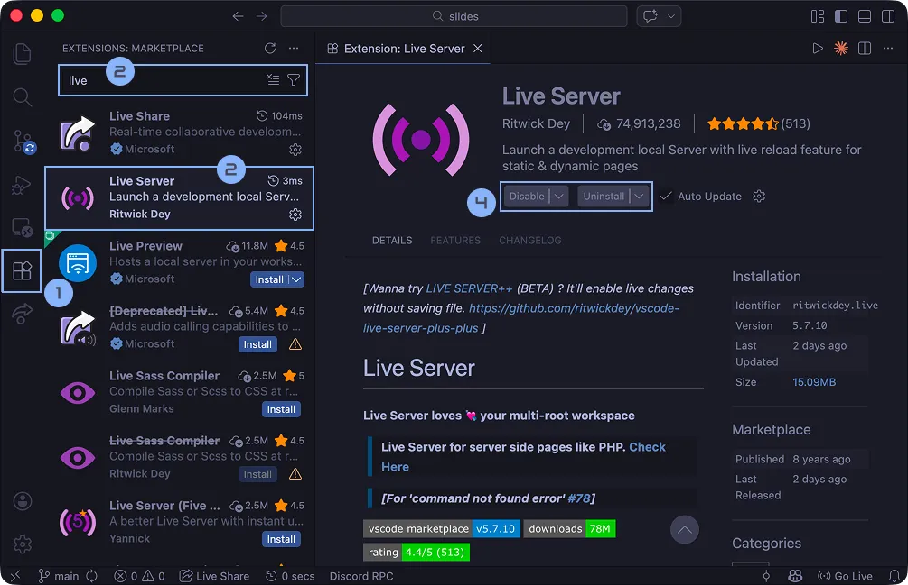
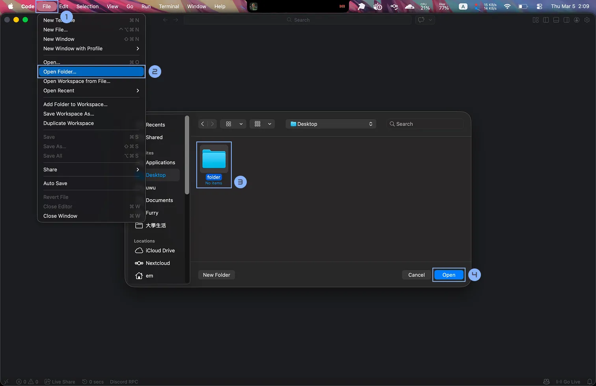
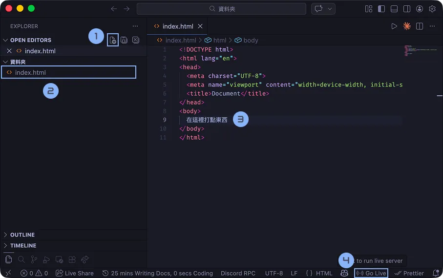
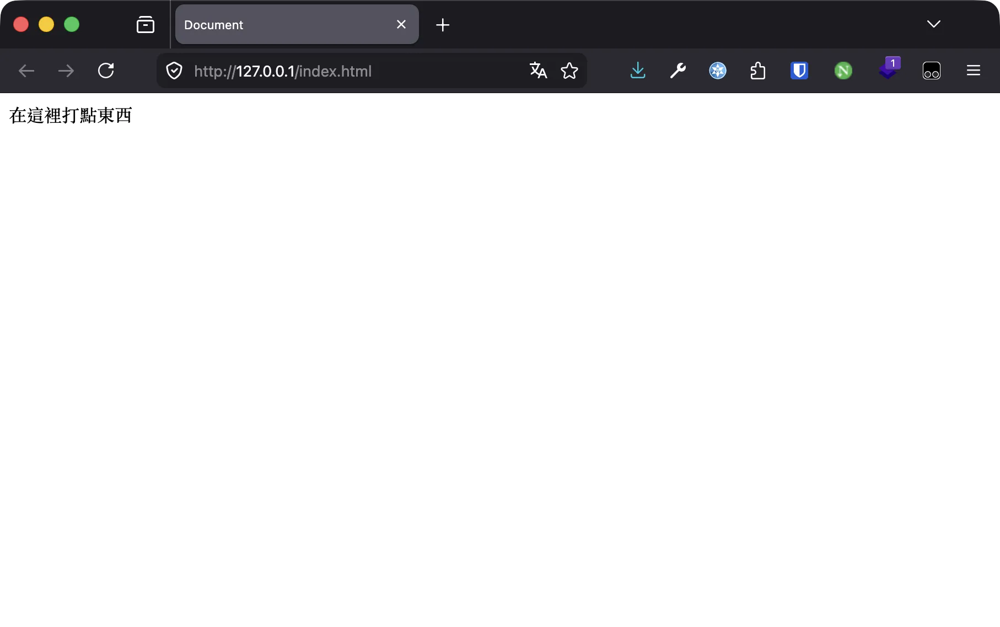

# 環境建置與 HTML 完全指南

# 環境建置

在開始寫程式之前我們會需要先安裝寫程式的工具。我們目前為止寫網站至少需要三個東西：

- 文字編輯器 - 打字的地方
- 終端機 - 黑底白字看起來像駭客的地方，也是把你的網頁程式跑起來的地方
- 瀏覽器 - 寫完網站要看吧

你看這樣我們就至少需要三個 APP 了，如果你有需要其他的工具或套件還需要開一堆軟體，像是檔案總管、GitHub Desktop、~~還有現代 Vibe Coder 必備的 Codex、Claude Code~~。這樣實在需要太多東西太麻煩了，這時候如果有一個整合式的開發環境不是很好嗎？

所以我們要來安裝一個…整合式開發環境（英文叫 IDE），VS Code。

> VS Code 官網：[code.visualstudio.com](https://code.visualstudio.com/)

就是下載…下一步…下一步…下一步…，Mac 就是拖過去，結束。

> 有人會吵說 VS Code 是文字編輯器不是 IDE 因為你需要裝擴充功能才有更多功能 bluh bluh bluh 但就像咖啡是不是豆漿一樣，你開心就好，不爽不要用。

> 如果你有你自己習慣的編輯器（Vim、[噴射腦](https://www.jetbrains.com/)的[網路風暴](https://www.jetbrains.com/webstorm/)）可以繼續用你習慣的就好沒關係。

## 安裝擴充功能

按下 `Ctrl` + `Shfit` + `X` 或是左邊的四個正方形來安裝擴充功能，搜尋「live」來安裝 Live Server



安裝這個東西之後他就會幫你架設好一個靜態網頁，就是你打開網址跟他要檔案他就會給你，而且可以做到你點擊 `Ctrl` / `Cmd` + `S` 就自動完成儲存。

## 安裝 Git

這東西我們之後會用到，可以順手裝一下。

兩個方法，如果你平常有用兩個方法，如果你平常有用套件管理器的話推薦可以直接使用：

Windows Chocolatey:

```bash
choco install git.install -y
```

macOS Brew:

```bash
brew install git
```

> 如果你 MacBook 沒安裝過 brew 的話可以使用以下指令安裝：
>
> ```jsx
> /bin/bash -c "$(curl -fsSL https://raw.githubusercontent.com/Homebrew/install/HEAD/install.sh)"
> ```

推薦你可以使用上面或是類似的方式。如果不行的話跟 VS Code 一樣直接去官網下載下一步下一步下一步也是可以。

> Git 官網：https://git-scm.com/

> 如果你用的是 Linux 的話那應該不用我教吧。（需要的話再叫助教）

> 裝好 Git 之後 VS Code 需要重新打開才會出現他的工具，不過目錢都用不到。

## 開啟資料夾

好啦我們準備好要開始寫程式了，請你先找一個地方建立一個資料夾，接下來我們練習的程式可以放在裡面。接著用 VS Code 打開資料夾。

> 建議你可以創一個大資料夾，裡面有每堂課的資料夾，這樣就不會找不到或很亂了。



# HTML

HTML 叫做超文本標記語言 (Hyper Text Markup Language)。故名思義就是標記一下文字。HTML 主要功能不是為了裝飾，目的是讓**瀏覽器／使用者知道這個是什麼**。比如說 Google 想知道網站標題會去找裡面的 `<h1>` ；而給盲人用的語音閱讀器在看到 `<strong>` 會加重語氣。

這非常重要，裝飾文字是 CSS 的工作（下禮拜就來講）。

不過讓我們先來實際寫寫看 HTML 再來慢慢探討這些大道理。首先我們先創一個檔案（1）叫做 index.html（2）。

打開之後我們點擊 `!` 然後按下 `tab` 會給我們一個 HTML 的模板。先不用看懂沒關係，你只需要知道等一下我們都打在 `<body>` 跟 `</body>` 之間就可以了。



我們先在 body 裡面打點東西（3），然後點擊右下角的 Go Live，你的網站就活起來了！



## HTML 語法

首先這是一段文字。如果你想要讓它成為粗體的話請你在兩邊加入 `<b>` 和 `</b>`。就像 word 一樣，B 代表了 bold。

```html
<!DOCTYPE html>
<html lang="en">
	<head>
		<meta charset="UTF-8" />
		<meta name="viewport" content="width=device-width, initial-scale=1.0" />
		<title>Document</title>
	</head>
	<body>
		在這裡打點
		<b>很粗的東西</b>
	</body>
</html>
```

為了方便操作我們把 VS Code 放到左邊，瀏覽器放到右邊，然後讓我們一次認識所有常見 HTML 吧！順帶一題我也會告訴你這些 HTML 語法原本的英文單字，可能會讓你比較好理解。

## 標題 Heading

首先是標題。標題有六種大小，分別是 `<h1>`、`<h2>`、`<h3>`、`<h4>`、`<h5>`、`<h6>`。

其實你不難可以發現，HTML 就是一個個的 `<文字></文字>`。前面是開頭，後面有個 `/` 就是結束。

```html
<h1>Heading 1</h1>
<h2>Heading 2</h2>
<h3>Heading 3</h3>
<h4>Heading 4</h4>
<h5>Heading 5</h5>
<h6>Heading 6</h6>
```

> 請從 `<h1>` 開始依序做使用，保持完整的架構。比如說 `<h1>` 底下一定會有 `<h2>` 然後才會有 `<h3>` 。

## Emmet

打到這裡你的手應該很酸了對吧（蛤你說你前面都複製貼上？）

你看我們每個元素都需要在那裡打小於、h、1、大於、標題、小於、斜線、大於。我的朋友甚至發現了一個偷吃步就是先打好一堆大於小於，然後再填空。

你知道工程師都是很懶的，所以 Сергей Чикуёнок 發明了 emmet。假如說你想建立一個 `<h1>` 元素你只需要打 `h1` 然後按 `tab` 就可以了。

emmet 還有很多語法我們之後遇到我會再提到。


Сергей Чикуёнок

## 文字裝飾

以下是常的文字裝飾元素。

```html
<p>
	段落
	<b>粗體</b>
	<i>斜體</i>
	<s>刪除線</s>
	<u>底線</u>
	H
	<sup>+</sup>
	CO
	<sub>2</sub>
</p>
```

- `<p>` 元素代表段落區塊 (paragraph)
- `<b>` 是粗體 (bold)
- `<i>` 是斜體 (italic)
- `<s>` 是劃掉 (strike)
- `<u>` 是底線 (underline)
- `<sup>` 是上標 (superscript)
- `<sub>` 是下標 (subscript)

你可以記 super 在上面，而訂閱按鈕 Subscribe 在影片下方等你去按。

**粗體** _斜體_ ~~刪除線~~ 底線 $H^+$ $CO_2$

## 無序清單

無序清單是用 `<ul>` 元素建立的，而清單內的每一個項目都是 `<li>` 元素。

```html
<ul>
	<li>a</li>
	<li>b</li>
	<li>c</li>
</ul>
```

- a
- b
- c

> [!NOTE]
>
> ### 💡
>
> 這裡我們想要 ul 裡面有三個 li 可以打 `ul>li*3` 然後點 `Tab` 即可一次完成。

## 有序清單

有序清單是用 `<ol>` 元素建立的，而清單內的每一個項目都是 `<li>` 元素。

```html
<ol>
	<li>a</li>
	<li>b</li>
	<li>c</li>
</ol>
```

1. a
2. b
3. c

## 巢狀清單

清單裡可以有清單，只要把清單放在 `<li>` 元素裡就可以了。

```html
<ul>
	<li>玉米濃湯</li>
	<li>鮪魚吐司</li>
	<li>
		薯條
		<ul>
			<li>鹽味</li>
			<li>胡椒鹽</li>
			<li>番茄醬</li>
		</ul>
	</li>
</ul>
```

- 玉米濃湯
- 鮪魚吐司
- 薯條
  - 鹽味
  - 胡椒鹽
  - 番茄醬

## 空白與換行

也許你有發現，在 HTML 中一個以上的 tab、空格、換行都視為一個空格，因此你想按幾個 enter 幾個空白都行，來保持程式的簡潔。但是如果你想要換行的話，你可以使用 `` 元素換行，`<hr>` 插入分隔線 (Horizontal Rule)。

```html
橫線
<hr />
換行
<br />
文字
```

這兩個是插入一個元素而不是指定範圍，因此習慣後面會用 `/>` 結尾，但如果你要打 ``或`<hr>` 瀏覽器也看得懂。HTML 是一種「好啦隨便，我看得懂就好」的語言，因此你就算用大寫，或著是屬性引號不加也沒關係，但是為了你以後不會被同學或同事暗殺我還是建議你遵守慣例。

## 格式化程式碼

對了既然講到維持程式碼的簡潔，通常放在裡面的東西會按一個 tab，除非是 `<b>` 這種在段落文字中間的（這種不會換行的元素叫行內元素）。比如說前面的 `<ul>`、`<li>` 之間有一格 tab。

而你的 VS Code 很聰明的可以幫你自己加上。你只需要按 `Alt` + `Shift` + `F` （macOS：`Option` + `Shift` + `F` ）就可以自動完成格式化囉！

## 超連結

假設你想要連結到某個網站，你可以使用 `<a>` (anchor) 元素，並在 `href` (hypertext reference) 屬性中指定連結的網址，而在 `<a>` 元素中間的文字就是連結的文字。

```html
<a href="連結">顯示文字</a>
```

哦出現新語法了！我們講到了屬性。這是 HTML 唯一的一個 feature。格式是：

```html
<元素名稱 屬性="屬性值">
```

比如說我們要連結到 Google 首頁，我們可以這樣寫：

```html
<a href="https://www.google.com">Goolge</a>
```

[Google](https://www.google.com/)

### ID

連結也可以連結到同一個網頁的某個位置。我們可以幫元素建立 id 並只要在 `href` 屬性中指定位置的 id 就可以了，而在 `<a>` 元素中間的文字就是連結的文字。

```html
<a href="#image">跑去圖片</a>
<br />
<br />
<br />
<br />
<br />
<br />
<br />
<br />
<br />
<br />
<br />
<br />
<br />
<br />
<h3 id="image">圖片</h3>
```

[跑去圖片](https://www.notion.so/1-2-03-16-HTML-3257dadd804080e48762de2878c93ef1?pvs=21)

## 圖片

如果你想要插入圖片，你可以使用 `` (image) 元素，並在 `src` (source) 屬性中指定圖片的來源，`alt` ( alternative text) 屬性中填入圖片的敘述。如果圖片無法顯示時就會使用這個替代文字，而 Google 也會透過這個文字了解圖片內容。

```html

```

比如說這個是從 Google 首頁抓下來的圖片，我們可以這樣寫：

```html
" alt="Google" />
```


## 相對路徑與絕對路徑

在程式中要放入圖片等素材或是放網址的時候都可以使用相對路徑或是絕對路徑。

絕對路徑就是 https:// 開頭這種網址，而相對路徑就是「請你往外一個資料夾，然後去某個資料夾找某個檔案」這種像是導航的指示路徑。

比如說我的檔案結構如下：

```css
├── about
│   └── index.html
├── img
│   └── image.png
├── index.html
└── logo.png
```

我現在在首頁的 `index.html` 想要讀 `logo.png`，我可以直接這樣寫。

```html

同個資料夾裡面的 logo.png
```

而如果我想要的是 `img/image.png` 我可以這樣寫：

```html

img 資料夾裡面的 logo.png
```

如果我現在在分頁 `about/index.html` 想要讀放在外面的 `logo.png` 可以寫說請你往外一個資料夾： `../` 。

```html

外面一個資料夾的 logo.png
```

如果你很很深的分頁要讀很外面的東西就是：

```html

好幾層資料夾外面的 logo.png
```

但這樣就很醜很難搞清楚有多少個，所以你也可以從網站根頁面（首頁）開始算：

```html

最外面往裡面的 logo.png
```

---

東西大多都可以包在連結裡面，比如說一張圖片，只要把 `` 元素放在 `<a>` 元素裡就可以了。

```html
<a href="<https://www.google.com/>">
	" alt="Google" />
</a>
```

## 表格

表格是用 `<table>` 元素建立的，而表格內的每一排都是 `<tr>` (table row) 元素，而每一個格子都是 `<td>` (table data) 元素，而表格的標題則是 `<th>` (table header) 元素。

```html
<table>
	<tr>
		<th>國家</th>
		<th>首都</th>
		<th>人口</th>
		<th>語言</th>
	</tr>
	<tr>
		<td>USA</td>
		<td>Washington D.C.</td>
		<td>309 million</td>
		<td>English</td>
	</tr>
	<tr>
		<td>Sweden</td>
		<td>Stockholm</td>
		<td>9 million</td>
		<td>Swedish</td>
	</tr>
</table>
```

<table>
	<thead>
		<tr>
			<th scope="col">國家</th>
			<th scope="col">首都</th>
			<th scope="col">人口</th>
			<th scope="col">語言</th>
		</tr>
	</thead>
	<tbody>
		<tr>
			<td>USA</td>
			<td>Washington D.C.</td>
			<td>309 million</td>
			<td>English</td>
		</tr>
		<tr>
			<td>Sweden</td>
			<td>Stockholm</td>
			<td>9 million</td>
			<td>Swedish</td>
		</tr>
	</tbody>
</table>

你可以使用 `<thead>` (table header), `<tbody>` (table body) 和 `<tfoot>` (table footer) 元素來區分表格的不同部分，這樣有助於瀏覽器和搜尋引擎了解表格的結構。

```html
<table>
	<thead>
		<tr>
			<th>項目</th>
			<th>金額</th>
		</tr>
	</thead>
	<tbody>
		<tr>
			<td>iPhone 11</td>
			<td>$24,900</td>
		</tr>
		<tr>
			<td>AirPods</td>
			<td>$6,490</td>
		</tr>
		<tr>
			<td>iPad Pro</td>
			<td>$25,900</td>
		</tr>
	</tbody>
	<tfoot>
		<tr>
			<th>總金額</th>
			<td>$57,290</td>
		</tr>
	</tfoot>
</table>
```

<table>
	<thead>
		<tr>
			<th scope="col">項目</th>
			<th scope="col">金額</th>
		</tr>
	</thead>
	<tbody>
		<tr>
			<td>iPhone 11</td>
			<td>$24,900</td>
		</tr>
		<tr>
			<td>AirPods</td>
			<td>$6,490</td>
		</tr>
		<tr>
			<td>iPad Pro</td>
			<td>$25,900</td>
		</tr>
	</tbody>
	<tfoot>
		<tr>
			<th scope="row">總金額</th>
			<td>$57,290</td>
		</tr>
	</tfoot>
</table>

### 合併儲存格：colspan 和 rowspan 屬性

合併表格可以利用 `<td>` 和 `<th>` 標籤上的 colspan 和 rowspan 屬性，colspan 是用來水平合併多行 (column) 的儲存格，rowspan 則用來垂直合併多列 (row) 的儲存格。

```html
<table>
	<tr>
		<th>1</th>
		<th>2</th>
		<th>3</th>
	</tr>
	<tr>
		<td>4</td>
		<td>5</td>
		<td rowspan="2">6</td>
	</tr>
	<tr>
		<td colspan="2">7</td>
	</tr>
</table>
```

效果大概長這樣，右邊是我加了一點點 CSS 添加 border 邊框的版本：

<table>
	<tr>
		<th scope="col">1</th>
		<th scope="col">2</th>
		<th scope="col">3</th>
	</tr>
	<tr>
		<td>4</td>
		<td>5</td>
		<td rowspan="2">6</td>
	</tr>
	<tr>
		<td colspan="2">7</td>
	</tr>
</table>

## 輸入框

接下來是輸入框，輸入框是用 `<input>` 元素建立的，而 `<input>` 元素有很多種類，我們可以用 `type` 屬性來指定，比如說我們要建立一個文字輸入框，我們可以這樣寫：

```html
<input type="text" />
```

<input type="text" />

如果給他加入 `value` 屬性，就可以預設輸入框的內容了：

```html
<input type="text" value="Hello World!" />
```

<input type="text" value="Hello World!" />

而如果我們要建立一個密碼輸入框，我們可以這樣寫：

```html
<input type="password" />
```

<input type="password" />

輸入的內容會被隱藏，而且會用星號或圓點代替。

如果我們要建立一個勾選框，我們可以這樣寫：

```html
<input type="checkbox" />
To-do
```

- [ ] To-do

如果我們要建立一個單選框，我們可以這樣寫：

```html
<input type="radio" name="color" value="red" />
red
<br />
<input type="radio" name="color" value="green" />
green
<br />
<input type="radio" name="color" value="blue" />
blue
```

<input type="radio" name="color" value="red" />
red
<br />
<input type="radio" name="color" value="green" />
green
<br />
<input type="radio" name="color" value="blue" />
blue

記住，radio 是只能選一個的，就想你的收音機一樣，你一次只能聽一個頻道。

我們在 HTML 裡面會使用 `name` 屬性來指定一組單選框，這樣瀏覽器才知道這些單選框是一組的。而 value 代表了選擇他的值，比如說我們選擇了 red，那麼瀏覽器就會把 red 的值傳給伺服器。

HTML 還有很多種輸入框，比如說日期、時間、檔案、顏色等等，有興趣可以參考 MDN。

> 延伸閱讀：https://developer.mozilla.org/en-US/docs/Web/HTML/Reference/Elements/input

## 互動元素

最後我們來介紹幾個有趣的互動元素：

### 按鈕

按鈕是用 `<button>` 元素建立的。

```html
<button>Click me!</button>
```

<button>Click me!</button>

現在我們不會寫 JavaScript 所以就把它當作舒壓玩具吧。

### iframe

iframe 是用來嵌入網頁的，比如說我們要嵌入 YouTube 影片，你可以到 YouTube 影片的分享裡面，點選嵌入，然後複製貼上到你的網頁裡面：

```html
<iframe width="560" height="315" src="https://www.youtube-nocookie.com/embed/IxX_QHay02M?si=deCPLpJ2e9ZAZu2F"></iframe>
```

<iframe width="560" height="315" src="https://www.youtube-nocookie.com/embed/IxX_QHay02M?si=deCPLpJ2e9ZAZu2F" title="YouTube iframe 嵌入範例" aria-describedby="frontend-html-iframe-demo-desc"></iframe>

<p id="frontend-html-iframe-demo-desc">影片替代內容：此嵌入僅用來示範 iframe 可以放入 YouTube 播放器；本節重點是 iframe 元素，觀看影片不是理解本段教學的必要條件。</p>

### audio

Audio 是用來播放音樂的，我們可以用 `<audio>` 元素建立，然後用 `src` 屬性指定音樂的網址：

```html
<audio src="https://www.soundhelix.com/examples/mp3/SoundHelix-Song-1.mp3" controls></audio>
```

<audio src="https://www.soundhelix.com/examples/mp3/SoundHelix-Song-1.mp3" aria-describedby="frontend-html-audio-demo-desc" controls></audio>

<p id="frontend-html-audio-demo-desc">音訊替代內容：這是一段純音樂範例，沒有語音、旁白或教學內容；用途是示範 audio 元素加入 controls 後會顯示播放器控制項。</p>

如果加入 `controls` 屬性，就會顯示播放器，讓使用者可以控制音樂的播放。

### video

Video 是用來播放影片的，我們可以用 `<video>` 元素建立，然後用 `src` 屬性指定影片的網址：

```html
<video src="https://cdn.emtech.cc/spinning-fish.mp4" controls></video>
```

<video src="https://cdn.emtech.cc/spinning-fish.mp4" aria-describedby="frontend-html-video-demo-desc" controls></video>

<p id="frontend-html-video-demo-desc">影片替代內容：影片畫面是一隻旋轉的魚，沒有語音或教學旁白；用途是示範 video 元素加入 controls 後會顯示播放器控制項。</p>

如果加入 `controls` 屬性就可以讓使用者控制影片的播放。

### div

我們在建立網站時，通常會把網站分成幾個區塊，比如說標題、導覽列、內容、側邊欄、頁尾等等來方便我們做排版。這時我們可以使用 `<div>` 元素來建立這些區塊，比如說你想建立一個提示框你可以這樣寫：

```html
<div>
	<h2>注意</h2>
	<p>感謝你的注意</p>
</div>
```

再加上一點點 CSS 就可以做到

> [!NOTE]
>
> ### 注意
>
> 感謝你的注意

### HTML5 版面

但是 `div` 元素只是一個區塊，並沒有說明這個區塊是什麼，因此我們可以使用 HTML5 的版面來建立這些區塊。HTML5 新增了 `<header>`、`<nav>`、`<main>`、`<section>`、`<article>`、`<aside>`、`<footer>` 這些元素（其實還有更多並且持續增加中…），我們可以用這些元素來建立版面。比如說我們要建立一個網站的版面，我們可以這樣寫：

```html
<header>
  <h1>網站標題</h1>
</header>
<nav>
  <a href="#">連結 1</a>
  <a href="#">連結 2</a>
  <a href="#">連結 3</a>
</nav>
<main>
  <section>
   <article>
      <h2>第一篇文章</h2>
      <p>文章內容</p>
    </article>
    <article>
      <h2>第二篇文章</h2>
      <p>文章內容</p>
  </section>
  <aside>
      <h2>側邊欄</h2>
      <p>側邊欄內容</p>
    </aside>
</main>
<footer>
  <p>網站頁尾</p>
</footer>
```

這些元素本身都和 `div` 一樣只是把元素群組起來，不會有任何視覺效果。但是可以幫入瀏覽器和搜尋引擎了解這些區塊的用途。盲人跟 Google 會愛你。

### 總結

好啦，今天我們介紹了許多不同的 HTML 元素。這些已經是最常用的元素了，如果你想知道更多的元素，可以到 [MDN](https://developer.mozilla.org/zh-TW/docs/Web/HTML/Element) 查詢。下一週我們要來介紹 CSS 來裝飾我們的網頁。
