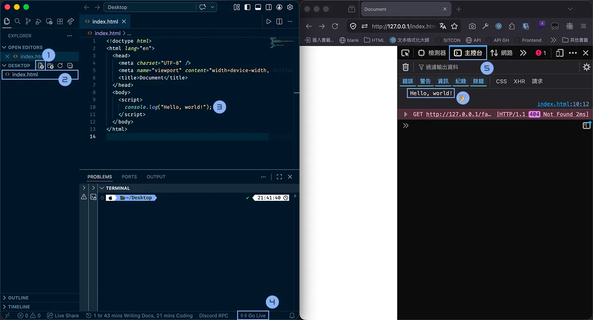

# JavaScript 教學：從入門到精通

JavaScript 是瀏覽器裡最重要的互動程式語言之一。

如果把前端網頁比喻成一間店：

- **HTML**：店裡有哪些東西（結構）
- **CSS**：店裡長怎樣（樣式）
- **JavaScript**：店員會不會動、會不會回應客人（互動）

例如：

- 點按鈕後跳出提示
- 使用者輸入內容後即時顯示
- 點擊卡片切換展開/收合
- 表單送出前先驗證資料

這些通常都會用到 JavaScript。

## 怎麼把 JavaScript 放進網頁？

最基本有兩種方式：

### 1. 寫在 HTML 裡

```html
<!DOCTYPE html>
<html>
	<head>
		<title>JS Demo</title>
	</head>
	<body>
		<h1>Hello</h1>

		<script>
			console.log("我是 JavaScript");
		</script>
	</body>
</html>
```

### 2. 用外部檔案引入

#### HTML

```html
<script src="main.js"></script>
```

#### main.js

```js
console.log("我是外部檔案中的 JavaScript");
```

### `console.log()` 是什麼？

`console.log()` 是 JavaScript 的 Hello World。它會把東西印到瀏覽器開發者工具的 Console。

```js
console.log("哈囉");
console.log(123);
console.log(true);
```

當你不確定程式跑到哪、變數裡面裝了什麼，先 `console.log()` 再說。

我們現在可以像上一堂 CSS 和上上堂 HTML 一樣先打開一個 Visual Studio Code 的資料夾，然後在 `index.html` 裡引入 `main.js`，打開右下角的 Go Live 之後就可以開始練習 JavaScript 基礎語法囉！

不過不用擔心如果你沒有讀過前兩篇也可以直接跟著這篇練習，JavaScript 的部分會從頭開始講解。

> 回顧：[環境建置與 HTML 完全指南](https://emtech.cc/p/html/)

打開 Live Server 之後你可以點擊 F12 進入開發者工具，接著點擊主控台（Console）就可以看到 `console.log()` 印出來的內容了。之後網頁有錯誤也會在這裡顯示（像是現在底下紅紅的那樣）。



你的瀏覽器開發者工具畫面可能跟我長得稍微有一點點不一樣，因為我是使用 Firefox（我也建議你使用，因為你的隱私很重要，而且狐狸很可愛！）同時 Firefox 有一些很好用的開發者工具。

接下來我們先來認識一下 JavaScript 的基本語法，這樣我們才有工具可以跟網頁互動。

## 變數與資料型別

### 什麼是變數？

變數就是一個有名字的盒子，或是邊條紙，你可以把資料放進去。

```js
let name = "小明";
let age = 18;
```

### `let`、`const`、`var`

JavaScript 裡有三種宣告變數的方式： `let`、`const`、`var`。

- `let` 用在一般的變數，只要在那個括號裡面的東西都可以用。
- `const` 跟 `let` 一樣在同一個括號裡面都能用，但是他不能重新編輯。像是黏了強力膠的樂高一樣。可以比較穩定比較安全。

比如說這個 `let` 可重新賦值。

```js
let score = 60;
score = 80;
```

`const` 這樣不行：

```js
const pi = 3.14;
pi = 100; // 錯誤
```

你的主控台會尖叫說："Uncaught TypeError: invalid assignment to const 'pi'"（你不能把 pi 重新賦值！）。

#### `var`

在有 `let` 和 `const` 之前的原古時代，JavaScript 只有 `var` 可以宣告變數。它的行為比較古怪，現在已經不建議使用了。

```js
var oldWay = "舊寫法";
```

> 初學建議：**優先用 `const`，需要變動時再用 `let`。**

### 常見資料型別

那麼我們可以在變數這盒子裡面放什麼東西呢？這裡舉幾個範例。你不需要特別指定 JavaScript 很聰明會自己辨認！

#### 1. 字串 `string`

```js
const username = "Alice";
const message = "Hello";
```

#### 2. 數字 `number`

```js
const price = 100;
const pi = 3.14159;
```

#### 3. 布林 `boolean`

只有是否，`true` 跟 `false`。

```js
const isLoggedIn = true;
const isAdmin = false;
```

#### 4. `null`

代表「這裡沒有東西」。

```js
const selectedUser = null;
```

#### 5. `undefined`

代表「還沒被指定值」（我不知道這裡是什麼）。

```js
let test;
console.log(test); // undefined
```

#### 6. 物件 `object`

你可以放一個有多個屬性的資料包在一起。比如說這裡創建了一個 user 物件，裡面有 name 跟 age 兩個屬性。

```js
const user = {
	name: "小明",
	age: 18
};
```

#### 7. 陣列 `array`

Aka 清單。其實也是物件的一種，但你可以先把它當成「有順序的資料列表」。

```js
const fruits = ["apple", "banana", "orange"];
```

### `typeof`

`typeof` 可以幫你看看目前這個變數的資料型別。

```js
console.log(typeof "hello"); // string
console.log(typeof 123); // number
console.log(typeof true); // boolean
```

## 運算子與比較

接下來我們要來做一些基本的數學運算。

### 算術運算子

```js
console.log(1 + 2); // 3
console.log(5 - 2); // 3
console.log(3 * 4); // 12
console.log(1 / 2); // 0.5
console.log(10 % 3); // 1
```

`%` 是取餘數，很常拿來判斷奇偶數。

```js
console.log(4 % 2); // 0
console.log(5 % 2); // 1
```

### 字串組合

想要把兩個字串合在一起？簡單，直接 `+` 就可以囉。

```js
const firstName = "王";
const lastName = "小明";
console.log(firstName + lastName); // 王小明
```

### 樣板字串 template literal

如果我們在字串中想要加入好幾個變數，那我們得一直 `+` `+` `+` `+` `+`程式碼看起來就很亂。這時我們其實可以用一個特殊的語法，寫在反引號 `` ` ``裡面來插入變數。

```js
const name = "小明";
const age = 18;
console.log(`我是 ${name}，今年 ${age} 歲`);
```

### 比較運算子

接下來是一些比大小。

```js
console.log(5 > 3); // true
console.log(5 < 3); // false
console.log(5 >= 5); // true
console.log(5 <= 4); // false
console.log(5 == "5"); // true
console.log(5 === "5"); // false
```

#### `==` 與 `===`

你覺得 6 和 "6" 是一樣的嗎？在 JavaScript 裡面，`==` 會偷偷幫你轉型，所以 `6 == "6"` 是 `true`。但是 `===` 就不會轉型了，所以 `6 === "6"` 是 `false`。

- `==`：只比值，會偷偷轉型
- `===`：連型別都一起比

`==` 在 JS 裡面有一些神奇的規則如：

```js
console.log(0 == false); // true
console.log("" == false); // true
console.log(null == undefined); // true
console.log([] == false); // true
```

還有更多更可怕的，因此建議**優先使用嚴格的 `===`**。

### 邏輯運算子

#### `&&` 且

兩個都要成立。

```js
const hasTicket = true;
const hasId = true;
console.log(hasTicket && hasId); // true
```

#### `||` 或

兩個有一個成立就好。

```js
const isWeekend = false;
const isHoliday = true;
console.log(isWeekend || isHoliday); // true
```

#### `!` 反轉

本來是 `true` 就變 `false`，本來是 `false` 就變 `true`。

```js
const isOpen = true;
console.log(!isOpen); // false
```

## 條件判斷

生活中充滿了條件。例如如果你有 18 歲以上就可以進入一些成人場所，比如說交大圖書館。

### `if`

```js
const age = 20;

if (age >= 18) {
	console.log("你已成年，歡迎進入圖書館");
}
```

### `if...else`

那麼如果你沒有 18 歲呢？我們可以加一個 `else` 來處理不符合條件的情況。

```js
const age = 16;

if (age >= 18) {
	console.log("你已成年，歡迎進入圖書館");
} else {
	console.log("未成年請回家寫作業");
}
```

### `if...else if...else`

我們可以添加很多不同的條件，如果一個不成立就去看下一個。比如說我們想把你的成績換算成等第：

```js
const score = 85;

if (score >= 90) {
	console.log("A");
} else if (score >= 80) {
	console.log("B");
} else if (score >= 60) {
	console.log("C");
} else {
	console.log("再加油");
}
```

### `switch`

當你要比很多固定值時，`switch` 有時候可讀性不錯。

```js
const role = "admin";

switch (role) {
	case "admin":
		console.log("管理員");
		break;
	case "editor":
		console.log("編輯者");
		break;
	default:
		console.log("一般使用者");
}
```

> 平常建議**先用 `if...else`，熟悉了再看 `switch`。** 因為 `switch` 的語法比較冗長，初學時可能會覺得很麻煩。

break 是為了讓程式跳出 switch，不然他會繼續往下執行，這也是很多新手第一次看到 switch 會踩到的坑。

比如說如果你忘了寫 break：

```js
const role = "admin";
switch (role) {
	case "admin":
		console.log("管理員");
	case "editor":
		console.log("編輯者");
	default:
		console.log("一般使用者");
}
```

輸出會是：

```
管理員
編輯者
一般使用者
```

> [!NOTE]
>
> ## 小練習 1：條件判斷
>
> 請寫一段程式：
>
> - 如果分數 >= 90，顯示 `優秀`
> - 如果分數 >= 60，顯示 `及格`
> - 否則顯示 `不及格`
>
> ```js
> const score = 75;
> ```
>
> 先自己試試看，不要馬上偷看答案。

## 迴圈

當你有重複的事情要做，你會需要把同樣的程式碼寫很多次。

例如說你想印出 0 到 4：

```js
console.log(0);
console.log(1);
console.log(2);
console.log(3);
console.log(4);
```

這樣非常的不優雅，這時我們就可以用迴圈來幫我們重複執行同一段程式碼。

### `for`

```js
for (let i = 0; i < 5; i++) {
	console.log(i);
}
```

輸出：

```js
0;
1;
2;
3;
4;
```

我們來拆解一下這個語法

```js
for (初始值; 條件; 每圈做什麼)
```

- `let i = 0`：一開始會先做的是，我們先定義了一個變數是 0
- `i < 5`：只要還小於 5 就繼續重複下去
- `i++`：每次加 1

所以你可以看到，當 `i` 是 0 的時候，條件 `i < 5` 是成立的，所以就印出 0，然後 `i++` 變成 1。接著再檢查條件，1 < 5 成立，就印出 1，然後 `i++` 變成 2。一直這樣重複下去直到 `i` 變成 5 的時候，條件 `i < 5` 不成立了，就會跳出迴圈。

### `while`

While 的語法比較簡單，只有一個條件，當條件成立的時候就一直重複下去。

```js
let count = 0;

while (count < 3) {
	console.log(count);
	count++;
}
```

### `break`

我們可以設定一個條件，當滿足的時候就直接跳出迴圈，不再繼續執行。

```js
for (let i = 0; i < 10; i++) {
	if (i === 5) {
		break;
	}
	console.log(i);
}
```

### `continue`

在某些情況我們會想要立即停止本次迴圈，直接進入下一次迴圈。就像是你發現這次段考沒救了就不讀了，直接開始準備下一次。這時候就可以用 `continue`。

```js
for (let i = 0; i < 5; i++) {
	if (i === 2) {
		continue;
	}
	console.log(i);
}
```

## 陣列 Array

我們剛才提到陣列其實就是清單，只是工程師想要聽起來比較酷所以叫做陣列。

陣列就是一包有順序的資料。比如說根據 [Alan Walker 的 The Spectre](https://www.youtube.com/watch?v=wJnBTPUQS5A)，我們直播，我們愛，我們躺下。

```js
const action = ["live", "love", "lie"];
```

### 透過索引取值

這時候我們可以抓出我們要第一個動作還是第幾個動作。

```js
console.log(action[0]); // live
console.log(action[1]); // love
```

索引從 **0** 開始，不是從 1。這是很多新手第一次會踩到的坑。

### 修改陣列內容

我們可以重新指定某個索引的值。你不再躺平了，你立起來了。

```js
const action = ["live", "love", "lie"];
action[2] = "stand";
console.log(action); // ["live", "love", "stand"]
```

### 常見屬性與方法

#### `length`

我們可以抓出陣列裡面有幾個元素。

```js
const action = ["live", "love", "lie"];
console.log(action.length); // 3
```

#### `push()`

加到最後面。比如說你解鎖了新技能可以坐下。

```js
const action = ["live", "love", "lie"];
action.push("sit");
console.log(action); // ["live", "love", "lie", "sit"]
```

#### `pop()`

刪掉最後一個。比如說愛是會消失的對吧？

```js
const action = ["live", "lie", "love"];
action.pop();
console.log(action); // ["live", "lie"]
```

#### `shift()`

刪掉第一個。

```js
const action = ["live", "love", "lie"];
action.shift();
console.log(action); // ["love", "lie"]
```

#### `unshift()`

加到最前面。

```js
const action = ["love", "lie"];
action.unshift("live");
console.log(action); // ["live", "love", "lie"]
```

### 遍歷陣列

架設我們想要把陣列裡面的每個東西都跑一次來一個個印出來：

#### 傳統 `for`

```js
const fruits = ["apple", "banana", "orange"];

for (let i = 0; i < fruits.length; i++) {
	console.log(fruits[i]);
}
```

#### `for...of`

既然我們要做的事情很明確就是全部一個個拿出來，有更好的語法。

```js
const fruits = ["apple", "banana", "orange"];

for (const fruit of fruits) {
	console.log(fruit);
}
```

#### `forEach()`

或是還有一種寫法，不過這就有點超出目前講到的範圍了：

```js
const fruits = ["apple", "banana", "orange"];

fruits.forEach(function (fruit) {
	console.log(fruit);
});
```

也可以寫成箭頭函式：

```js
fruits.forEach(fruit => {
	console.log(fruit);
});
```

> [!NOTE]
>
> ## 小練習 2：陣列
>
> 給你下面的陣列：
>
> ```js
> const numbers = [10, 20, 30, 40];
> ```
>
> 請完成：
>
> 1. 印出陣列長度
> 2. 把 `50` 加到最後面
> 3. 用迴圈把每個數字都印出來

## 物件 Object

物件可以把多個有關聯的資料包在一起。

```js
const user = {
	name: "小明",
	age: 18,
	isAdmin: false
};
```

### 取值方式

那我們要怎麼存取裡面的資料呢？有兩種做法。

#### 點記法

```js
console.log(user.name);
console.log(user.age);
```

#### 中括號記法

```js
console.log(user["name"]);
```

### 修改屬性

我們也可以修改裡面的值。比如說小明長大了變成 20 歲了，然後他變成管理員了。

```js
user.age = 20;
user.isAdmin = true;
```

### 新增屬性

可以直接寫一個不存在的值沒關係。

```js
user.email = "ming@example.com";
```

### 物件裡也可以放陣列

```js
const student = {
	name: "小美",
	scores: [90, 80, 100]
};
```

### 巢狀物件

我可以在物件裡面放一個物件。比如說小華住在台北，郵遞區號是 100。

```js
const profile = {
	name: "小華",
	address: {
		city: "Taipei",
		zip: "100"
	}
};

console.log(profile.address.city);
```

你可以這樣無限包下去，但是包太多層你自己也可能會很亂搞不清楚。

## 函式 Function

今天我們要來算圓形的面積，我們每次都需要帶一次一樣的公式：

```js
console.log(5 * 5 * 3.14);
console.log(10 * 10 * 3.14);
console.log(15 * 15 * 3.14);
```

首先是這樣我們一直在寫重複的 Code，再來是如果我的圓周率想換成 3.1415926 呢？這樣很麻煩很不優雅，這時我們可以把它包裝成一個函式，這樣以後要算圓面積的時候就可以直接叫它來幫我們算了。

函式就是「把一段會重複使用的程式包起來，之後可以叫它來做事」。

### 為什麼需要函式？

如果你有一段程式要重複寫很多次，函式可以幫你：

- 減少重複程式碼
- 增加可讀性
- 增加可維護性

### 函式宣告

```js
function sayHello() {
	console.log("Hello!");
}

sayHello();
```

這樣我們每次 call `sayHello()` 的時候就會印出 "Hello!"。

### 參數 parameter

我們也可以設定參數，就像是數學的函式一樣的寫法。

```js
function greet(name) {
	console.log(`你好，${name}`);
}

greet("小明");
greet("小華");
```

這裡的 `name` 是參數。每次我們都可以根據需求修改。

### 回傳值 `return`

我們不只可以 call function 來做事，還可以請他算完之後把結果交回來給我們。

```js
function add(a, b) {
	return a + b;
}

const result = add(3, 5);
console.log(result); // 8
```

你可以看到：

- `console.log()`：只是印出來
- `return`：把結果交回去，讓外面可以繼續用

### 函式表達式

這是另一種宣告函式的方式，會把函式當成一個值來處理。

```js
const sayHi = function () {
	console.log("Hi");
};

sayHi();
```

### 箭頭函式 arrow function

接下來是 ES6 以後比較新的寫法，叫做箭頭函式。它的語法更簡潔。

```js
const multiply = (a, b) => {
	return a * b;
};
```

如果只有一行可以更短，大括號裡面如果只有一個東西可以省略，

```js
const multiply = (a, b) => return a * b;
```

return 也可以省略：

```js
const multiply = (a, b) => a * b;
```

我很喜歡箭頭函式。除了可以更短以外他長得也很可愛 ><（

這裡再來幾個例子：

### 沒有參數

```js
const welcome = () => {
	console.log("歡迎光臨");
};
```

### 一個參數時可省略括號

```js
const square = x => x * x;
```

> [!NOTE]
>
> ## 小練習 3：函式
>
> 請寫一個函式 `isEven(number)`：
>
> - 如果是偶數，回傳 `true`
> - 否則回傳 `false`
>
> 提示：可以用 `%` 來取餘數。

## 作用域與 hoisting 基礎觀念

這裡比較抽象，先抓大方向就好。

### 作用域 scope

作用域就是「變數活在哪個範圍」。

- 全域變數：外面大部分地方都能用
- 區域變數：只有函式或區塊裡能用

比如說這裡這段程式：

```js
const globalName = "全域變數";

function test() {
	const localName = "區域變數";
	console.log(globalName);
	console.log(localName);
}

test();
// console.log(localName) // 這行會錯
```

之所以會錯是因為 `localName` 是在 `test` 函式裡面宣告的區域變數，只有在 `test` 裡面能用，外面是看不到的。`let` 與 `const` 有區塊作用域。

```js
if (true) {
	const message = "Hello";
	console.log(message); // 這裡顯示沒問題！
}

console.log(message); // 但是這裡就會錯了
```

因為 message 是在 if 區塊裡面宣告的區域變數，外面看不到。

### hoisting

JavaScript 在執行前，會先處理某些宣告。

#### 函式宣告通常可以先呼叫

```js
sayHello();

function sayHello() {
	console.log("Hello");
}
```

#### 但 `let` / `const` 不要這樣玩

```js
// console.log(a)
let a = 10;
```

建議大家盡量**先宣告，再使用。** 不要跟 hoisting 硬碰硬。

## 其他常見語法

### 字串

#### `length`

字串長度。

```js
const str = "hello";
console.log(str.length); // 5
```

#### `toUpperCase()`

轉大寫。

```js
console.log("hello".toUpperCase()); // HELLO
```

#### `includes()`

檢查字串裡面有沒有包含某個子字串。

```js
console.log("javascript".includes("script")); // true
```

#### `trim()`

去掉前後空白。

```js
const text = "  hello  ";
console.log(text.trim()); // "hello"
```

### 陣列

#### `map()`

把每個元素轉換成新陣列。

```js
const numbers = [1, 2, 3];
const doubled = numbers.map(n => n * 2);
console.log(doubled); // [2, 4, 6]
```

#### `filter()`

篩選符合條件的元素。

```js
const numbers = [1, 2, 3, 4, 5];
const bigNumbers = numbers.filter(n => n > 3);
console.log(bigNumbers); // [4, 5]
```

#### `find()`

找到第一個符合條件的元素。

```js
const users = [
	{ name: "A", age: 15 },
	{ name: "B", age: 20 }
];

const adult = users.find(user => user.age >= 18);
console.log(adult);
```

> 新手其實拿 `for`、`forEach`、`map`、`filter` 就很夠用囉！

講了那麼多 JavaScript 的基本語法，接下來我們要來看看怎麼用 JavaScript 跟網頁互動，這也是 JavaScript 最重要的功能之一了。

## DOM 是什麼？

DOM 全名是 **Document Object Model**。

你可以把它理解成：

> 瀏覽器把 HTML 解析後，變成一棵可以被 JavaScript 操作的樹。

例如這段 HTML：

```html
<body>
	<h1 id="title">Hello</h1>
	<button id="btn">Click me</button>
</body>
```

JavaScript 可以透過 DOM：

- 找到 `h1`
- 修改文字
- 幫按鈕加點擊事件
- 新增或刪除元素

這就是前端互動的核心之一。

## 選取 DOM 元素

假設 HTML 長這樣：

```html
<h1 id="title">JavaScript 好好玩</h1>
<p class="desc">這是一段介紹文字</p>
<button id="changeBtn">改文字</button>
```

### `getElementById()`

我們可以用 `getElementById()` 來選取有特定 id 的元素。

```js
const title = document.getElementById("title");
console.log(title);
```

### `querySelector()`

會回傳第一個符合選擇器的元素。可以像是 CSS 一樣用 id、class、標籤名來選取。

```js
const title = document.querySelector("#title");
const desc = document.querySelector(".desc");
const button = document.querySelector("button");
```

### `querySelectorAll()`

會回傳所有符合條件的元素。你會拿到一個類陣列的物件，裡面裝著所有符合條件的元素。

```js
const paragraphs = document.querySelectorAll("p");
console.log(paragraphs);
```

可以搭配迴圈使用：

```js
paragraphs.forEach(p => {
	console.log(p.textContent);
});
```

## 修改 DOM 內容與樣式

既然選取了當然就可以讀寫裡面的內容：

### 修改文字

#### `textContent`

```js
const title = document.querySelector("#title");
title.textContent = "標題被改掉了";
```

### 修改 HTML

不只是可以改文字我們可以直接改整段 HTML：

#### `innerHTML`

```js
const desc = document.querySelector(".desc");
desc.innerHTML = "<strong>這段變粗了</strong>";
```

> 注意：`innerHTML` 會把字串當 HTML 解析。使用時要小心，不要亂塞來路不明的內容。你可能會不小心執行到其他人的 JavaScript！（XSS 攻擊）。

### 修改樣式

我們可以用 JavaScript 直接改變元素的 CSS 樣式：

```js
const title = document.querySelector("#title");
title.style.color = "red";
title.style.fontSize = "40px";
```

### 修改 class

也可以添加以及刪除 HTML class：

#### `classList.add()`

添加 class：

```js
title.classList.add("active");
```

#### `classList.remove()`

刪除 class：

```js
title.classList.remove("active");
```

#### `classList.toggle()`

切換 class（沒有的話添加，有的話拿掉）：

```js
title.classList.toggle("active");
```

可以拿來做：

- 開關選單
- 顯示/隱藏內容
- 切換深色模式 class

> [!NOTE]
>
> ## 小練習 4：DOM 基本操作
>
> 給你這段 HTML：
>
> ```html
> <h1 id="title">原本標題</h1>
> <button id="btn">按我</button>
> ```
>
> 請寫 JavaScript：
>
> 1. 取得 `h1`
> 2. 把文字改成 `我被 JavaScript 改掉了`
> 3. 把字體顏色改成藍色

## 建立與刪除 DOM 元素

我們可以用 JavaScript 來建立新的元素，然後把它插入到畫面中。當然也可以刪除不需要的元素。

### 建立元素

```js
const li = document.createElement("li");
li.textContent = "新的項目";
```

### 插入到畫面中

假設 HTML：

```html
<ul id="list"></ul>
```

JavaScript：

```js
const list = document.querySelector("#list");
const li = document.createElement("li");
li.textContent = "新的項目";
list.appendChild(li);
```

這樣就會在 `ul` 裡面新增一個 `li`，內容是 "新的項目"。

```html
<ul id="list">
	<li>新的項目</li>
</ul>
```

### 刪除元素

從 DOM（HTML）中刪除元素也很簡單，直接 call `remove()` 就好。

```js
li.remove();
```

比如說這裡我們從陣列裡面把每個水過都建立成一個 `li`，然後插入到 `ul` 裡面：

```js
const fruits = ["apple", "banana", "orange"];
const list = document.querySelector("#list");

fruits.forEach(fruit => {
	const li = document.createElement("li");
	li.textContent = fruit;
	list.appendChild(li);
});
```

```html
<ul id="list">
	<li>apple</li>
	<li>banana</li>
	<li>orange</li>
</ul>
```

## 事件 Event 與 event listener

終於來到讓網頁「活起來」的部分了。

### 什麼是事件？

事件就是使用者或瀏覽器發生的某個動作，例如：

- 點擊 `click`
- 輸入 `input`
- 送出表單 `submit`
- 滑鼠移入 `mouseenter`
- 鍵盤按下 `keydown`

我們要能夠抓到這些事件就需要先註冊一個事件監聽器（event listener）在我們想要監聽的元素上。

### `addEventListener()`

基本語法：

```js
element.addEventListener("事件名稱", function () {
	// 事件發生時要做的事
});
```

### 點擊事件 `click`

#### HTML

```html
<button id="btn">點我</button>
<p id="result">還沒被點</p>
```

#### JavaScript

```js
const btn = document.querySelector("#btn");
const result = document.querySelector("#result");

btn.addEventListener("click", function () {
	result.textContent = "按鈕被點了！";
});
```

### 用箭頭函式寫

你看使用箭頭函式寫起來是不是看起來更簡潔！

```js
btn.addEventListener("click", () => {
	result.textContent = "按鈕被點了！";
});
```

### 切換 class 的常見範例

比如說我們有一個盒子，點擊按鈕的時候切換它的 active class：

```js
const button = document.querySelector("#btn");
const box = document.querySelector("#box");

button.addEventListener("click", () => {
	box.classList.toggle("active");
});
```

## 事件物件 event

有時候我們不只想知道這件事情發生了，我們還想知道更多細節。比如說你知道有人點擊了，但是他點了哪裡呢？

很多事件 callback 會收到一個參數，通常叫 `event` 或 `e`。

```js
btn.addEventListener("click", event => {
	console.log(event);
});
```

### `event.target`

代表觸發事件的元素。

```js
btn.addEventListener("click", event => {
	console.log(event.target);
});
```

如果你按的是按鈕，`event.target` 通常就是那顆按鈕。

## 常見事件類型

### `click`

按一下。

```js
button.addEventListener("click", () => {
	console.log("clicked");
});
```

### `input`

輸入框內容一變就觸發。

```js
const input = document.querySelector("#nameInput");

input.addEventListener("input", e => {
	console.log(e.target.value);
});
```

### `change`

通常在輸入完成、失焦，或選單值變動時觸發。

### `submit`

表單送出時觸發。

```js
const form = document.querySelector("#myForm");

form.addEventListener("submit", e => {
	e.preventDefault();
	console.log("表單送出了，但我先擋住預設行為");
});
```

### `keydown`

鍵盤按下時。

```js
document.addEventListener("keydown", e => {
	console.log(e.key);
});
```

## `preventDefault()` 是什麼？

有些 HTML 元素本來就有預設行為，例如：

- 表單送出會重新整理頁面
- `<a>` 連結點了會跳頁

如果你想先用 JavaScript 接管請他冷靜先別做事就可以用：

```js
e.preventDefault();
```

例如表單驗證時很常用，你可以先阻止 HTML 送出表單：

```js
form.addEventListener("submit", e => {
	e.preventDefault();

	if (input.value === "") {
		alert("請輸入內容");
	}
});
```

> [!NOTE]
>
> ## 小練習 5：事件監聽
>
> HTML：
>
> ```html
> <button id="btn">按我</button>
> <p id="text">還沒改變</p>
> ```
>
> 請寫 JavaScript，讓使用者按下按鈕時：
>
> - `p` 的文字改成 `你按下按鈕了`

## 取得 input 的值

```html
<input id="nameInput" type="text" />
<button id="showBtn">顯示名字</button>
<p id="output"></p>
```

```js
const nameInput = document.querySelector("#nameInput");
const showBtn = document.querySelector("#showBtn");
const output = document.querySelector("#output");

showBtn.addEventListener("click", () => {
	const name = nameInput.value;
	output.textContent = `你好，${name}`;
});
```

這裡我們用 `nameInput.value` 來取得使用者在 input 裡面輸入的內容。

我們甚至可以做一點簡單的驗證，看看使用者有沒有真的輸入東西：

```js
showBtn.addEventListener("click", () => {
	const name = nameInput.value.trim();

	if (name === "") {
		output.textContent = "請先輸入名字";
		return;
	}

	output.textContent = `你好，${name}`;
});
```

這裡的 `trim()` 很好用，因為有人會輸入一堆空白，然後看起來像有打字，其實沒有。

## 小專案：待辦清單 mini 版

這裡我們把前面學的觀念組起來做一個小練習吧！

### 功能

- 輸入一段文字
- 點擊新增按鈕
- 把內容新增到清單中

### HTML

```html
<input id="todoInput" type="text" placeholder="輸入待辦事項" />
<button id="addBtn">新增</button>
<ul id="todoList"></ul>
```

### JavaScript

```js
const todoInput = document.querySelector("#todoInput");
const addBtn = document.querySelector("#addBtn");
const todoList = document.querySelector("#todoList");

addBtn.addEventListener("click", () => {
	const text = todoInput.value.trim();

	if (text === "") {
		alert("請輸入待辦事項");
		return;
	}

	const li = document.createElement("li");
	li.textContent = text;

	todoList.appendChild(li);
	todoInput.value = "";
});
```

這裡我們：

1. 先抓到 input、button、ul
2. 監聽按鈕 click
3. 讀取 input 值
4. 檢查是不是空字串
5. 建立新的 `li`
6. 設定 `li` 文字
7. 加進 `ul`
8. 清空輸入框

你可以再繼續嘗試做：

- 點擊項目就刪除
- 每個項目旁邊加刪除按鈕
- 按 Enter 也能新增
- 存到 localStorage

## 常見新手雷點整理

### 1. 把 `=` 跟 `===` 搞混

```js
if (score === 100) {
	console.log("滿分");
}
```

要記得：

- `=` 是賦值（把東西放進變數）
- `===` 才是比較喔！

### 2. 忘記索引從 0 開始

記得陣列的第一個元素是 `arr[0]`，不是 `arr[1]`。

```js
const arr = ["a", "b", "c"];
console.log(arr[0]); // a
```

### 3. `const` 不能重新賦值

```js
const name = "A";
// name = "B" // 錯誤
```

### 4. DOM 還沒載入就先抓元素

如果你的 script 放太前面（如 `<script>` 放在 `<head>` 裡），元素可能還沒出現。

比較安全的方式把 script 放在 `</body>` 前面：

```html
<body>
	<h1>Hello</h1>
	<script src="main.js"></script>
</body>
```

### 5. 忘記事件監聽要傳函式

```js
btn.addEventListener("click", changeText());
```

因為 `changeText()` 這行就是在執行了，這概念是你要給你的隊友手槍結果你直接朝他開了一槍。

正確使用方式是：

```js
btn.addEventListener("click", changeText);
```

或：

```js
btn.addEventListener("click", () => {
	changeText();
});
```

### 6. `innerHTML` 用太爽

雖然方便，但也比較危險，你可能會不小心把使用者給的文字當成 HTML 插進去把你的網站弄壞。純文字優先考慮 `textContent`。

## 總結

如果你第一次接觸程式語言，有許多的新觀念需要同時吸收，可能會覺得有點混亂。這是完全正常的。你只要少用 AI，試著多寫幾次，慢慢地你就會開始有感覺了喔！

而如果你是已經會其他程式語言了，JavaScript 的語法其實不難，重點是要熟悉它的 DOM API，這樣你就可以開始做一些有趣的互動了。

## 練習題解答區

### 練習 1 解答：條件判斷

```js
const score = 75;

if (score >= 90) {
	console.log("優秀");
} else if (score >= 60) {
	console.log("及格");
} else {
	console.log("不及格");
}
```

### 練習 2 解答：陣列

```js
const numbers = [10, 20, 30, 40];

console.log(numbers.length);

numbers.push(50);

for (let i = 0; i < numbers.length; i++) {
	console.log(numbers[i]);
}
```

也可以這樣寫：

```js
numbers.forEach(number => {
	console.log(number);
});
```

### 練習 3 解答：函式

```js
function isEven(number) {
	return number % 2 === 0;
}

console.log(isEven(4)); // true
console.log(isEven(5)); // false
```

箭頭函式版本：

```js
const isEven = number => number % 2 === 0;
```

### 練習 4 解答：DOM 基本操作

```js
const title = document.querySelector("#title");

title.textContent = "我被 JavaScript 改掉了";
title.style.color = "blue";
```

### 練習 5 解答：事件監聽

```js
const btn = document.querySelector("#btn");
const text = document.querySelector("#text");

btn.addEventListener("click", () => {
	text.textContent = "你按下按鈕了";
});
```
