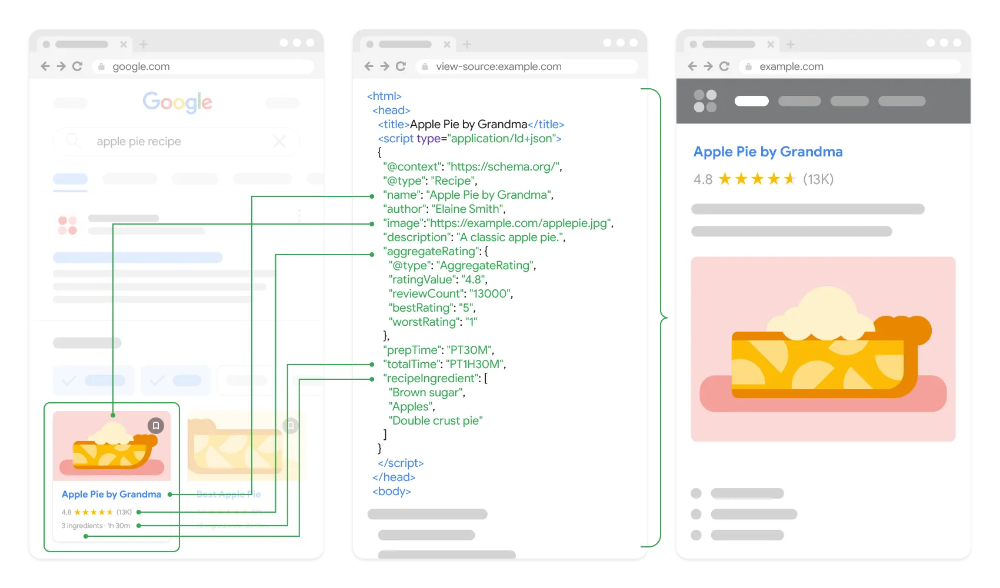
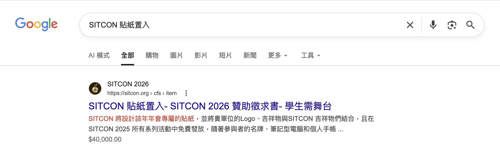
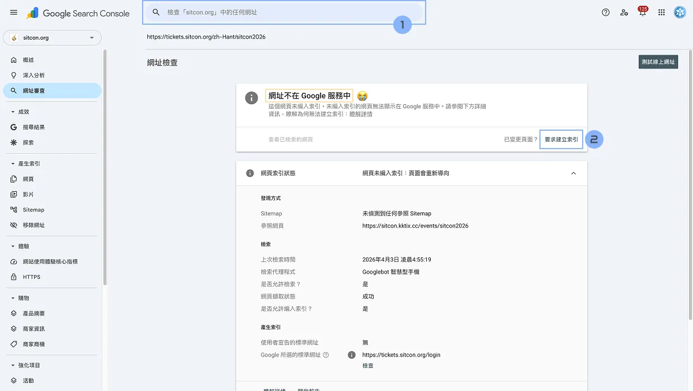

---
title:
authors: elvismao
tags: [SEO]
categories: []
date: 2026-04-04
description: 今天我們要來講怎麼讓你的網站進 Google。
draft: true
---

# 搜尋引擎最佳化 SEO

SEO（**Search Engine Optimization**）搜尋引擎最佳化。就是一個讓你的網站能被 Google 到的行為。

你不要把它想成想辦法騙 Google 把你放在第一個，比較正確的講法是：

> 讓搜尋引擎更容易理解你的網站，也讓真正需要你內容的人更容易找到你。

~~主要是你覺得你一個高中生大學生騙得了一群年薪千萬的工程師？~~

你不太可能靠幾個 meta tag 就把一個爛內容網站送上第一名。**只要你的內容真的有價值，而且網站不要做得太糟，SEO 通常就不會太差。**

但這句話雖然正確，實作上還是有很多細節。因為「內容不錯」跟「Google 看得懂、收得到、判斷得出來」是兩回事。

你可能明明寫得很好，但因為 HTML 亂寫，網站太慢，文章發布後根本沒任何內部連結能導到它，導致 Google 根本找不到或是看不懂你的網站。

所以 SEO 真正的工作，通常不只是做花招，而是把這幾件事做好：

1. 讓搜尋引擎**找得到**
2. 讓搜尋引擎**看得懂**
3. 讓搜尋引擎知道這頁**主題是什麼**
4. 讓搜尋引擎相信這頁**值得被排進結果**
5. 讓使用者真的**願意看、願意留、願意分享**

## 搜尋引擎大致怎麼工作？

首先我們先簡單講一下搜尋引擎的運作流程，這樣你才知道 SEO 是在最佳化哪個環節。

Google 的工作流程可以拆成三步：

### 1. Crawling 檢索

搜尋引擎派機器人來看你的頁面、追你的連結。可能是在網路上逛到（機會低），也可能是你透過某種方式告訴 Google「嘿！歡迎來我家玩！」

### 2. Indexing 索引

看完後決定要不要把內容收進資料庫。如果他覺得這是重複網頁，或是這網站太爛了等等理由，就不會收錄。

### 3. Ranking 排名

當有人搜尋時，系統決定要顯示哪些頁面、排序怎麼排。那麼 Google 是怎麼決定每個網頁排在哪裡呢？

Google 早期之所以厲害，是因為它不只看頁面文字，還看：

- 有多少網站連到你
- 連過來的網站本身有沒有份量
- 連結文字在描述什麼
- 頁面的主題和查詢的吻合程度

而現在 Google 的排名演算法已經非常複雜了，背後有幾百條規則用 AI 最佳化出來的。比如說你的網站的性能好不好，或是大家在你的網頁停留了多久（幾秒後點上一頁回到 Google）等等。其中規則實在太多了你問 Google 工程師他很有可能也講不清楚。

> Google 搜尋團隊會定期做一個「關燈測試」，叫做 One-off Experiment。每次關掉一個模組，看看關掉哪個模組的時候，對搜尋體驗的影響最大。

不過以我的經驗來看，SEO 最重要的還是內容品質。你內容寫得好，網站結構又清楚，Google 就會有好的結果。其他的花拳繡腿技巧主要是讓你在 Google 搜尋結果和社群媒體中更好看。

我們會從幾個面向來講：

1. 寫好內容
   - 使用好的架構和標籤
   - 適當在文字中添加關鍵字
2. 讓你的搜尋結果炫酷的標籤
   - Meta 標籤
   - 結構化資料
3. 做好網站
   - 做好 A11y
   - 做好速度和性能
   - 做好安全性
   - Google 要能讀到你的網頁
4. 去找 Google 加好友
   - Sitemap
   - robots.txt
   - Search Console
   - Analytics

## 一、好好寫內容

### 1. 先決定這頁到底要搶什麼查詢

想想看大家會 Google 什麼，設定成標題和第一段描述就對了。

- `JavaScript closure 是什麼`
- `Vite 專案部署到 GitHub Pages`
- `Tiptap 自訂節點教學`
- `台中火車站附近住宿推薦`

你要先知道這頁要解決的是哪種搜尋意圖：

#### 資訊型查詢

使用者想學東西、找答案。

例如：

- `SEO 是什麼`
- `fetch 跟 axios 差在哪`
- `狗狗可以吃香蕉嗎`

這種內容就要寫得像教學、整理、比較、解釋。

#### 導航型查詢

使用者知道要去哪，只是想用搜尋當捷徑。

例如：

- `facebook login`
- `台大選課系統`
- `pnpm docs`

這種通常不是你文章頁會搶的重點。

#### 交易型或行動型查詢

使用者想買、想註冊、想下載、想預約。

例如：

- `macbook air m4 評價`
- `英文家教推薦 台北`
- `線上 story point poker`

這種頁面就不能只講概念，要有實際比較、價格、方案、CTA。

### 2. 寫出真的能用的內容，而不是湊字數

Google 會從語意中找到真正有用的句子來 highlight。

### 3. 關鍵字

「關鍵字密度」沒什麼用。你不用每 100 個字硬塞 7 次關鍵字。

真正實用的作法是讓主題詞自然出現在重要位置：

- title
- H1
- 前兩段內容
- 部分 H2/H3
- URL
- meta description
- anchor text
- 結構化資料中的對應欄位

例如你寫的是 `Next.js sitemap 教學`，合理的內容可能會長這樣：

- title: `Next.js Sitemap 完整教學：用 App Router 產生 sitemap.xml`
- H1: `Next.js Sitemap 完整教學`
- 第一段：介紹 sitemap 是什麼、什麼情況需要
- H2：`Next.js App Router 怎麼產生 sitemap.xml`
- H2：`動態路由怎麼加入 sitemap`
- H2：`robots.txt 要怎麼設定`

這樣搜尋引擎很容易知道你這頁在講什麼。

### 4. 好好寫 HTML：搜尋引擎看不看得懂你的頁面結構？

搜尋引擎不是人，它很依賴你的 HTML 結構和語意。

同樣一段內容，如果你用對結構，Google 比較容易理解：

- 哪個是頁面主標題
- 哪段是段落
- 哪些是章節標題
- 哪些是導覽
- 哪些是主要內容
- 哪些是文章 metadata
- 哪些是 FAQ
- 哪些是產品資訊
- 哪些是麵包屑

所以 SEO 很大一塊是：用正確的 HTML、清楚的 heading hierarchy、合理的 metadata，把內容表達清楚。

這裡給幾個簡單的建議：

- 依序使用 H1、H2、H3，不要跳著用
- 每頁只用一個 H1，放在最上面
- URL 結構清楚，盡量包含主題詞
- 圖片要有 alt，描述圖片內容
- 適當使用 strong、em 來強調重要字詞，但不要濫用
- 適當使用列表（ul/ol）來組織資訊
- 使用 HTML5 的新標籤如 `<article>`、`<section>`、`<nav>` 來表達語意

例如：

```html
<body>
	<header>
		<nav>...</nav>
	</header>

	<main>
		<article>
			<header>
				<h1>文章標題</h1>
				<p>更新日期、作者</p>
			</header>

			<section>
				<h2>第一章</h2>
				<p>...</p>
			</section>

			<section>
				<h2>第二章</h2>
				<p>...</p>
			</section>
		</article>

		<aside>
			<h2>相關文章</h2>
			...
		</aside>
	</main>

	<footer>...</footer>
</body>
```

不要這樣：

```html
<div class="title">Next.js Sitemap 完整教學</div>
<div class="big-text">什麼是 sitemap.xml</div>
<div class="big-text">Next.js App Router 實作方式</div>
```

這樣畫面看起來可以，但語意很差。

### 5. 圖片 SEO

兩點很簡單：

- alt 描述這是張什麼圖片
- 檔案名稱最好有意義

```html

```

alt 的作用不是拿來塞關鍵字，而是描述圖片內容。它同時對：無障礙、搜尋引擎理解圖片、圖片搜尋都有幫助。

## 二、讓你的搜尋結果炫酷的標籤

### HTML 標籤們

這些標籤請放在 HTML 的 `<head>` 裡面。

#### 1. `<title>`

`<title>` 跟 `<h1>` 一樣都很重要，它是顯示在視窗上面的標題。它通常會直接影響搜尋結果上的標題顯示。

```html
<title>Next.js Sitemap 完整教學：App Router 與動態路由實作 | 毛哥EM資訊密技</title>
```

### 2. Meta Description

`meta description` 常常會出現在搜尋結果摘要中。Google 不一定會直接採用 meta description，可能會改抓頁面其他文字當摘要。但當你把連結貼到聊天軟體或社群媒體時，通常會影響摘要顯示。

```html
<meta name="description" content="這篇文章會從 crawling、indexing、ranking 三個角度，完整說明 SEO 的實際做法，包含 title、meta、schema、sitemap、網站性能與 React 框架常見問題。" />
```

### 3. Open Graph

這些就是控制分享時的顯示：


常見標籤：

```html
<meta property="og:title" content="SEO 是什麼？完整入門指南" />
<meta property="og:description" content="從 crawling、indexing、ranking 到技術實作，一次整理 SEO 的實際做法。" />
<meta property="og:type" content="article" />
<meta property="og:url" content="https://example.com/blog/seo-basics" />
<meta property="og:image" content="https://example.com/og/seo-basics.png" />
```

另外也可以加 Twitter Card：

```html
<meta name="twitter:card" content="summary_large_image" />
<meta name="twitter:title" content="SEO 是什麼？完整入門指南" />
<meta name="twitter:description" content="從 crawling、indexing、ranking 到技術實作，一次整理 SEO 的實際做法。" />
<meta name="twitter:image" content="https://example.com/og/seo-basics.png" />
```

### 4. URL 要短、穩、可讀

好的 URL 應該：

- 可讀
- 穩定
- 盡量短
- 表達主題
- 不要帶一堆無意義參數
- 英文 slug 最常見，也最穩
- 中文 slug 不是不能用，但有時會編碼得很長
- 不要常改 URL
- 如果改 URL，一定做 301 redirect

例如：

```txt
/blog/nextjs-sitemap-guide
/blog/react-vs-vue
/seo/technical-seo-basics
```

不要這樣：

```txt
/post?id=123&category=8&from=list
/blog/article-2026-04-02-final-v2-ok-use-this
/page/seo_教學_新版_真的最終版
```

不過這個我覺得比起 SEO 更重要的是使用者會看到網址一大長串，不是很優雅。

### 5. 結構化資料 Schema

結構化資料不是直接保證排名變高，但它可以讓搜尋引擎更清楚理解你的內容類型，也可能讓你有更豐富的搜尋結果展示。



Google 有非常多種不同的 Schema 可以使用，從普通網站，購物網站，商品，到課程等等都有許多特別的顯示方式。比如說我今年幫 SITCON 的每一項贊助商品都打上價格，你可以發現 Google 從我的 `<title>` 抓到標題（因為太長有被切短），favicon 抓到網站縮圖，og 抓到網站標題，以及從 Schema 抓到價格以及描述。



> 原始碼：[GitHub](https://github.com/sitcon-tw/2026/blob/build/cfs/item/9/index.html)

Schema 有很多種寫法，最常見的是用 JSON-LD。就是在頁面 `<head>` 或 HTML 內插入：

```html
<script type="application/ld+json">
	{
		"@context": "https://schema.org",
		"@type": "Article",
		"headline": "Next.js Sitemap 完整教學",
		"description": "說明如何在 Next.js App Router 中產生 sitemap.xml，包含動態路由與 robots.txt 設定。",
		"author": {
			"@type": "Person",
			"name": "Your Name"
		},
		"datePublished": "2026-04-02",
		"dateModified": "2026-04-02",
		"mainEntityOfPage": {
			"@type": "WebPage",
			"@id": "https://example.com/blog/nextjs-sitemap-guide"
		}
	}
</script>
```

再來一個範例告訴 Google 你有哪些分頁的麵包屑 schema：

```html
<script type="application/ld+json">
	{
		"@context": "https://schema.org",
		"@type": "BreadcrumbList",
		"itemListElement": [
			{
				"@type": "ListItem",
				"position": 1,
				"name": "部落格",
				"item": "https://example.com/blog"
			},
			{
				"@type": "ListItem",
				"position": 2,
				"name": "SEO",
				"item": "https://example.com/blog/seo"
			},
			{
				"@type": "ListItem",
				"position": 3,
				"name": "Next.js Sitemap 完整教學",
				"item": "https://example.com/blog/nextjs-sitemap-guide"
			}
		]
	}
</script>
```

具體寫法，以及 Google 會看的可以參考：[Google 搜尋支援的結構化資料標記 | Google for Developers](https://developers.google.com/search/docs/appearance/structured-data/search-gallery?hl=zh-tw)，裡面有許多神奇的顯示方式。

## 做好網站

前面我們講到 HTML 怎麼寫比較好，這裡我來講一些比較進階的操作。

### 你是不是個正常、可信、可持續的網站？

搜尋引擎不是只看單頁，也會看看：

- 網站是否有一致主題
- 網址規劃是否穩定
- 內容是否大量重複
- 是否有垃圾頁面
- 是否有大量 low quality pages
- 是否經常出現錯誤頁
- 是否有清楚的關於頁、作者資訊、聯絡方式
- 是否被其他可信來源引用

這些都會影響搜尋引擎怎麼看待你的網站。所以不要出現大量錯誤和垃圾內容，也不要動不動就伺服器掛掉。

### Canonical

平常我在 Google 後台最常看到的錯誤就是「這是重複網頁；使用者未選取標準網頁」（等一下會提到怎麼看）。

例如以下網址可能其實是同一頁：

```txt
/product/123/
/product/123
/product/123?ref=homepage
/product/123?utm_source=facebook
/product/123?sort=asc
https://www.example.com/product/123
https://example.com/product/123
```

這時 Google 蒙了，他可能會選不是你想要的那個當成實際網頁，或是把他們重複收錄。這時你可以使用 canonical 告訴搜尋引擎：這些變體裡，哪個才是主要網址。

```html
<link rel="canonical" href="https://example.com/product/123" />
```

記得最好放絕對網址不要放 `/product/123` 這種分頁。

### React、Vue、SPA 這些框架面對 SEO 的挑戰

我們接下來開始學 React 之後你會發現，最後做出來（build）的網頁不會是一個個分頁。就算你有幾百個頁面最後只會出現一個 `index.html`，一個 CSS，還有一個或很多個 JavaScript。他們會在你載入網頁的時候再用 JavaScript 把網頁要顯示的內容插回 HTML。

不過這樣就遇到了一個問題，那些爬蟲機器人在看到你網站的時候很多都不會跑 JavaScript，那麼你的網站內容搜尋引擎就看不到了。比如說大多社群媒體都不會，因此重要內容不該只依賴 client-side render。

所以如果你做的是內容網站、文章站、產品展示、Landing Page，通常比較推薦這幾種策略：

- **SSR**：每次請求在伺服器產 HTML
- **SSG**：建置時產生靜態 HTML
- **ISR**：靜態頁定期重建

這些方式都比純 CSR 更 SEO 友善，因為搜尋引擎一進來就能看到主要內容。這裡我們不會談到實作細節，只需要知道使用 React 如果沒有經過特殊處理可能會遇到這個問題。

你還是能做一些事：

- 用 prerender
- 用 SSR 架構
- 對重要頁做靜態輸出
- 避免重要內容只在 client side 才出現

這也是許多人會使用安裝設定好很多套件的 React - Next.js 來架設網站的原因。

## 去找 Google 加好友

現在我們已經準備好我們酷酷的網站，可以去找 Google 囉！

不過我們最後還有幾個東西要設定，分別是 `Sitemap`、`robots.txt`、與 `noindex`。

#### 1. robots.txt

`robots.txt` 是放在網站根目錄的規則檔，告訴爬蟲哪些路徑不要抓。比如說毛哥EM資訊密技的 Sitemap 在 [emtech.cc robots.txt](https://emtech.cc/robots.txt)

一個 `robots.txt` 可能長這樣：

```txt
User-agent: *
Disallow: /admin/
Disallow: /draft/
Allow: /

Sitemap: https://example.com/sitemap.xml
```

它在說的是：「不管你是用哪個瀏覽器我都歡迎！除了 `/admin/` 跟 `/draft/` 以外其他網站都歡迎你去逛喔！以及如果你需要地圖的話可以去看我的 Sitemap！」

不過這個就像是你在店門口說休息中，你沒辦法阻止有人衝進去然後拍照發到 IG 上分享。所以 **robots.txt 擋爬，不等於一定不會出現在搜尋結果。**

#### 2. meta robots

如果你只是一個特定頁面想設定能不能被收錄的話可以直接在 `<head>` 加入這行 HTML。

```html
<meta name="robots" content="noindex, nofollow" />
```

- `noindex`：不要把這頁收進索引。
- `nofollow`：告訴搜尋引擎不要追蹤這頁上的連結。

而如果像是這樣：

```html
<meta name="robots" content="noindex, follow" />
```

表示這頁不收錄，但連結可以繼續往下追。

### 3. Sitemap

`sitemap.xml` 本質上是一份網址清單，讓搜尋引擎知道你有哪些重要頁面值得看。

它不是保證收錄，但它很有幫助，尤其是：

- 新網站
- 頁面多的網站
- 內部連結不夠完整的網站
- 有大量動態頁面的網站
- 新文章常發布的網站

一個最簡單的 sitemap 長這樣：

```xml
<?xml version="1.0" encoding="UTF-8"?>
<urlset xmlns="https://www.sitemaps.org/schemas/sitemap/0.9">
  <url>
    <loc>https://example.com/</loc>
    <lastmod>2026-04-02</lastmod>
  </url>
  <url>
    <loc>https://example.com/blog/seo-basics</loc>
    <lastmod>2026-04-02</lastmod>
  </url>
</urlset>
```

### 4. Search Console

Search Console 可以讓你看到很多很實際的東西：

- 哪些頁面被收錄
- 哪些頁面沒被收錄，原因是什麼
- 哪些查詢帶來曝光
- 點擊率 CTR 如何
- 哪些頁面點擊高
- sitemap 有沒有吃到
- 行動裝置可用性問題
- 網站效能問題（Core Web Vitals）
- 手動處罰或安全性問題

> 網頁：https://search.google.com/search-console

進到網站之後你會需要先驗證網站是你的。可以透過在網頁根目錄放一個指定的檔案，或是在 DNS 設定。礙於篇幅這裡就先不多提了。

驗證完之後如果你有一個網頁想進 Google 但是沒有的話，你可以直接在上面的網址搜尋，然後點擊要求建立索引即可。



## 常見 SEO 技術檢查清單

最後給大家一個常見簡易的檢查清單：

#### 基本頁面層

- 每頁有獨立且明確的 `<title>`
- 每頁有合理的 meta description
- 每頁有一個主 H1
- h1 h2 h3 有正確使用
- URL 可讀且穩定
- 有 canonical
- 重要圖片有 alt
- 頁面主要內容直接存在 HTML 中
- 404 頁面真的回 404，不是畫面假 404
- 加入 Schema.org 結構化資料

#### 收錄層

- 有 sitemap.xml
- robots.txt 正常
- 重要頁面沒有被 noindex
- 不重要頁面不要亂進 sitemap
- Search Console 已驗證
- 新頁面能被內部連結導到

#### 重複內容層

- www / non-www 統一
- http / https 統一
- trailing slash 規則一致
- query parameter 頁面不亂收錄
- canonical 正確

#### 性能層

- 網頁載入快
- 圖片壓縮
- JS 不要過肥
- 手機版可用
- 伺服器穩定

## 總結

你可以發現 SEO 是一項很綜合的工作。雖然看似有很多操作，但是其實回到本質上還是你的網站多老多有信譽，以及內容有沒有料。希望大家做得好的網站，都可以被適合的人發現。
