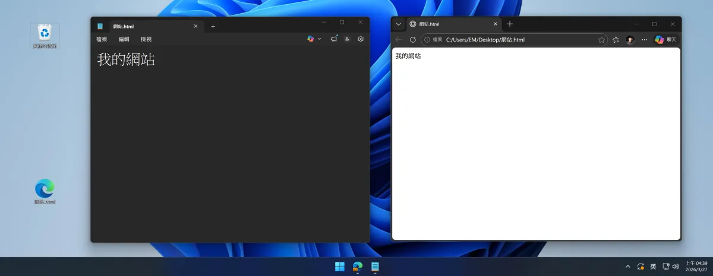
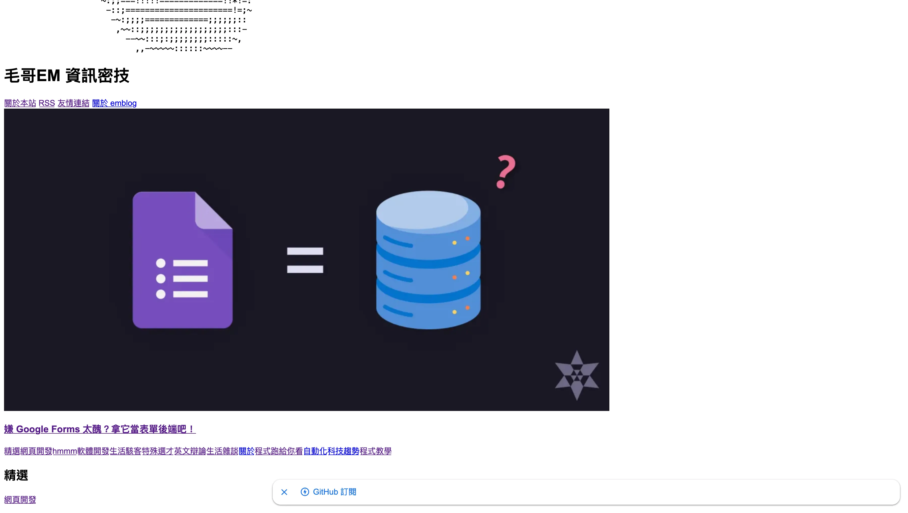
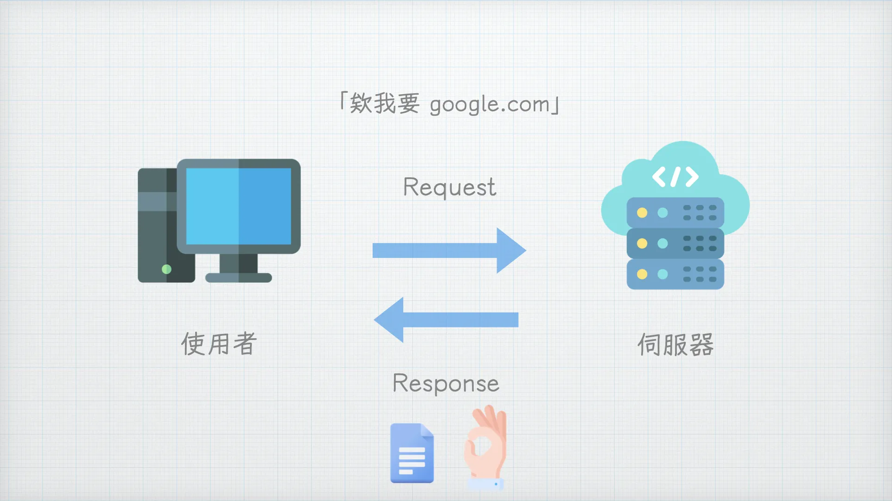
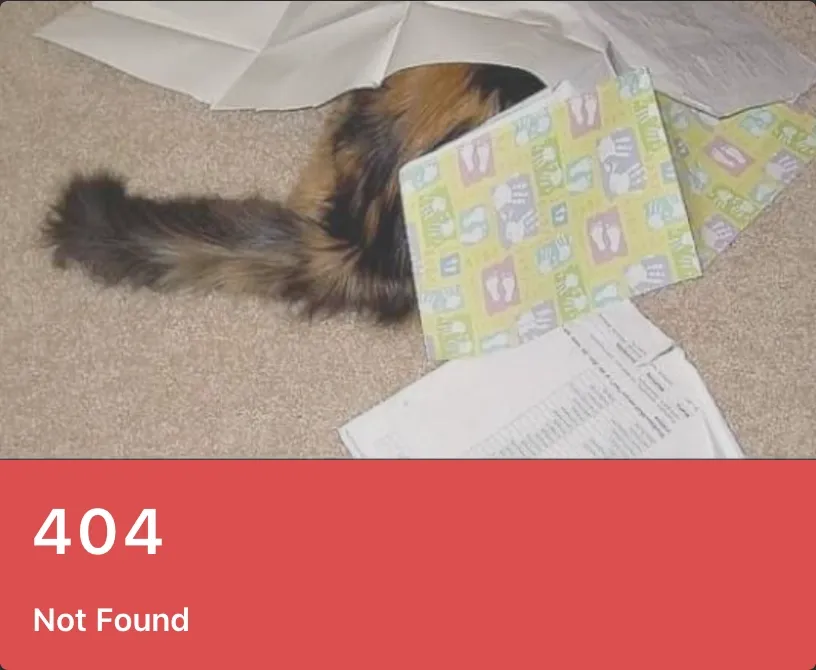
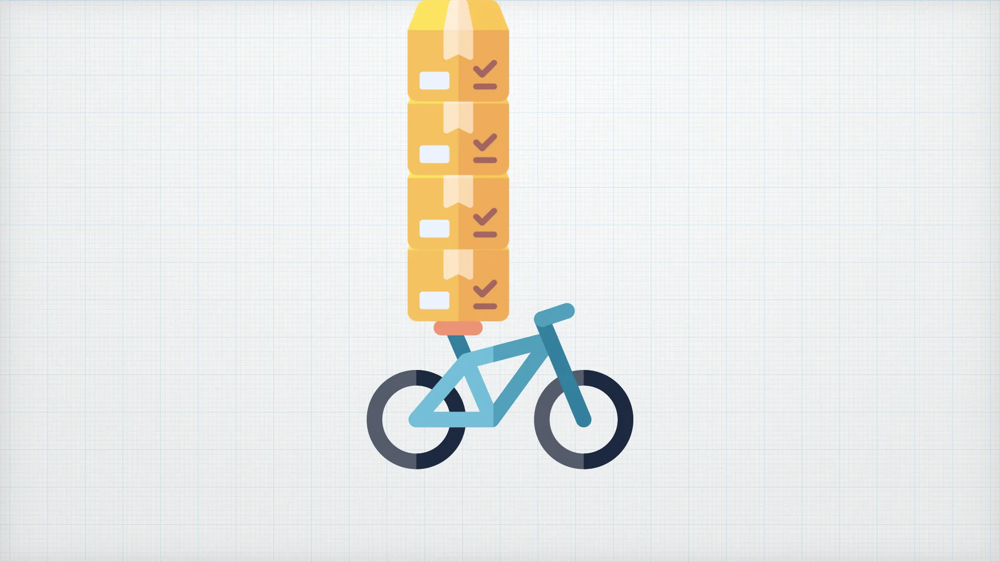
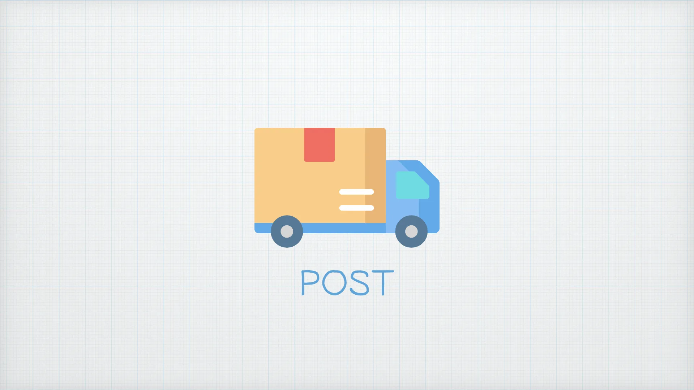
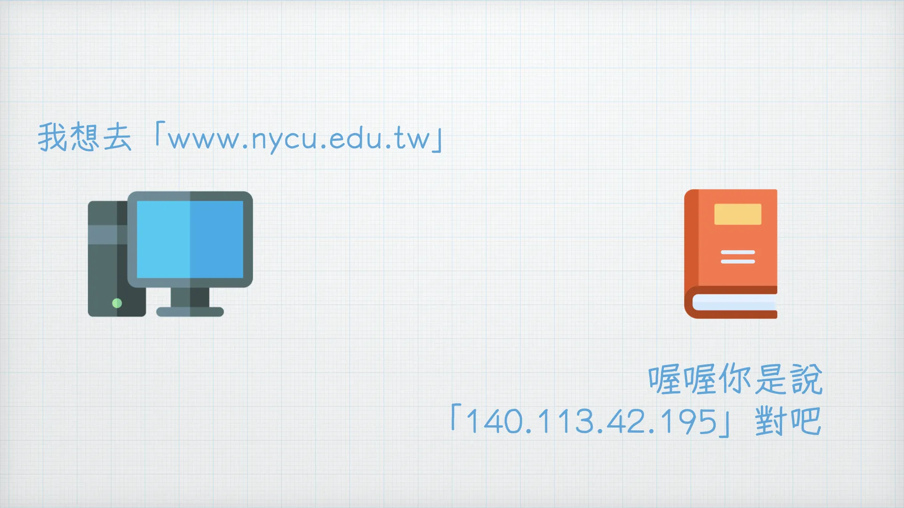
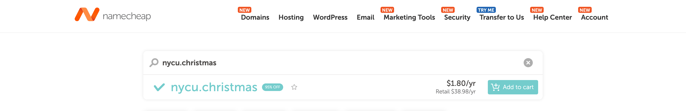

# 什麼是網站？網頁基本原理

如果你修過計算機網路概論或是有使用過 Google（備註：一個搜尋引擎）的話請聽我男性說教一下。

相信大家看過 Word 檔對吧，Word 檔是要用 Microsoft Word 打開的文件，副檔名是 `.docx`。

而網頁是一個要透過「瀏覽器」開啟的文件，副檔名通常是 `.html`。

讓我們來做一個實驗。請你建立一個文字檔案並輸入一些內容，接著把這個檔案的附檔名改成`html`（比如說`a.html`）。雙擊打開之後你看，一個網頁就做好了。

沒錯就是這麼簡單。但是如果只有純文字的話實在是太無聊了，因此一個網頁通常會使用多個檔案及不同的程式語言組成。

和 Word 不一樣的地方是 word 會把所有的圖片、文字格式設定等資料全部包在一個資料夾並且包裝成一個.docx 檔，而網站會把這些檔案們分開存放好讓你可以輕鬆編輯每個項目。

## 網站架構

一個網頁通常是由 HTML、CSS 和 JavaScript 所組成，它們分別有著不同的工作。

假設網頁是一個人的話，

- 💀 HTML 就是他的骨架
- 👕 CSS 就是他的皮膚和衣服
- 🧠 而 JavaScript 就是他的大腦

或是用房子來比喻就是

- 🏗️ HTML 是房子的結構
- 🎨 CSS 是房子的裝潢
- 💡 而 JavaScript 就是房子裡的電器

以我的這個部落格[毛哥EM資訊密技](https://emtech.cc/)為例，如果把網頁的 JavaScript 拿掉，就不能使用複製按鈕了，如果把 CSS 拿掉，整個網頁就會變得很單調且難以閱讀，而如果把 HTML 拿掉，網頁就會整個空白。

而網站中所有的檔案都會放在一個資料夾中，你可以到 [GitHub](https://github.com/elvisdragonmao/emtech/tree/main) 上面查看毛哥EM資訊密技的根目錄，裡面有著許多的檔案，而最後生成出來的 `index.html` 就是這個網站的首頁。

然而這個資料夾如果只是在你自己的電腦裡別人是無法取得的，因此你需要一個人一直站在一個地方，當有人來想要拿檔案的時候就遞給他，而這個人就叫做「伺服器」。

額不是這個東西

](serve.webp)

伺服器其實也就只是一台電腦，平常你也能拿他看 YouTube 玩 Minecraft，他的工作就是當使用者提出請求（Request）的時候給予回應（Response）。記住在網路上伺服器只要你找他他都會回應你（不像你的前男友）。

除了回應檔案或是文字以外伺服器也會回應一個狀態碼。比如說 200 代表成功 (OK)，含有常見的 404 代表找不到頁面 (Not Found)，403 代表不允許 (Forbidden)。除此之外還有很多很多狀態碼。你可以在 [http.cat](https://http.cat/) 或 [http.dog](https://http.dog/) 看看這些程式代表的意義。

## 網站是如何傳遞資料的？

接下來我們來看一下網站是如何傳遞資料的。我喜歡把網路比喻成在寄包裹。今天你想把你的請求傳給伺服器之前，你有幾個東西需要做選擇。

### 交通工具：HTTP Method

首先是你要使用什麼交通工具，不同的交通工具有不同的特性。當我們輸入網址載入網站時使用的交通工具叫做「GET」，我喜歡叫他腳踏車。

腳踏車的特點是他很簡單。你可以什麼都不帶就騎他去找朋友，也可以帶點小東西，資料會放在網址中。以 Google 為例，網址 `google.com/search?q=毛哥EM` 裡面就傳了 q=毛哥EM。也就是我要找（query=）毛哥EM 的意思，而 Google 也把對應的搜尋結果檔案給回傳回來。而且回傳的 HTML 不一定是本來就存在的，也有可能是剛才才建立出來的。

網址技術上可以無限量的傳遞資料，就像腳踏車原則上可以無限往上堆東西，但是我們通常在傳一比較大的資料的時候不會這麼做反之我們會選擇使用 POST 這個交通工具，而我喜歡叫他貨車。

> 除了資料都在網址以外，主流瀏覽器和伺服器都會限制網址的長度，避免額…怕太長你手打太酸？_（開玩笑的 Chrome 支援 2MB、但 Nginx 伺服器那邊預設 8KB ~ 16KB。不然你太長了會把伺服器記憶體灌爆。）_

貨車最棒的地方式是他可以把東西存放在 Body，也就是後面的貨櫃。這樣經過的人除非把你的箱子撬開，不然不會知道裡面裝了些什麼。不會看到你搜尋紀錄就露餡了。

不過其實最主要的是語意問題。GET 是要東西、POST 是建立或給東西、PUT 是整筆資料更新、PATCH 是局部更新、DELETE 是刪除資源。就像你技術上也可以每天開殯儀車上學但使用者、瀏覽器、還有遇到 bug 時的你也都會很問號。

### 交通規則

而接下來我們要來選擇的是我們要走哪一條道路（~~廢話當然是網路~~）。不同的道路有不同的交通規則，而常見的交通規則有 HTTP、FTP、SSH 等等。我們目前最常見的是 HTTPS（就是你網址最前面那個），他是加密過的 HTTP 協定，可以確保傳輸過程中你的貨櫃不會被撬開。

### 送到哪裡？IP、網域、與 DNS

經過這一番努力我們已經準備好要出發了，但是我們要送到哪裡呢？網路上的地址叫做 IP 位址。目前有 IPV4 還有因為地址不夠用了而被發明有英數混合的 IPV6。

比如說 120.126.32.0 就是一個交大的 IP。

但是這一大串數字實在太難記了，因此你可以購買一個網域。這個網域就像是臺北市信義區西村里 8 鄰信義路五段 7 號太難記了，但台北 101 就好記很多。因此會有一個類似電話簿的東西叫做 DNS，他會紀錄所有不同網域對應的 IP 位址。而當我們輸入網址想要去找伺服器之前我們的瀏覽器都會先去 DNS 找看看這個網站實際的地址。

DNS 是大家都可以建立的。比如說中華電信或是 Google 都有他們的 DNS 伺服器可以讓你做使用。

網址的最後會有一個`.com`或`.net`等等的頂級域名，沒什麼意義，你爽就好。

### 伺服器

就像前面說的，當伺服器收到你的請求時，他會根據你的請求去進行處理，並且把處理結果回傳給你，包括狀態碼和各種資料。由此你可以發現要製作一個網頁不只需要有人設計好看的網頁，還需要有人設計伺服器的邏輯，並且把資料存放在伺服器上。前面編寫我們可以直接看到結果的工程師我們叫做**前端工程師**，而編寫後面我們看不到的伺服器的工程師我們叫**做後端工程師**。

我們會從前端開始學習。但是你不用擔心，因為現在已經有很多平台幫你架設好後端，你只需要把你的 HTML, CSS, JavaScript 以及其他檔案上傳到這些平台上，你的網頁就部屬好了。

---

既然現在你已經知道網頁最基本的運作原理了，那我們現在來開始寫 HTML 吧！

> 下一篇：[環境建置與 HTML 完全指南](https://emtech.cc/course/frontend/html/)
