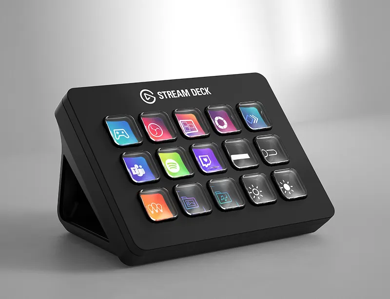
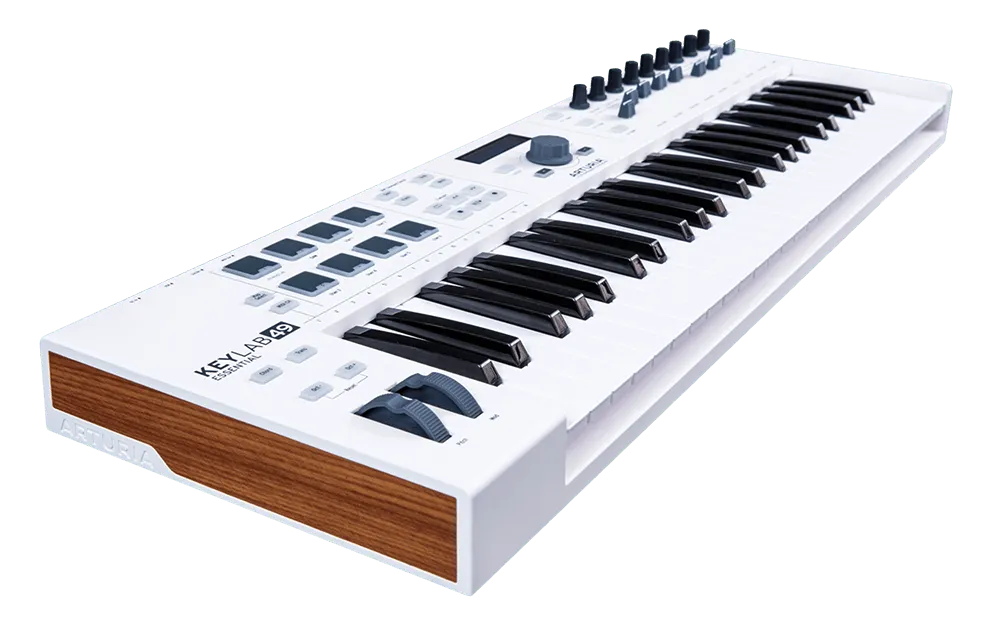

# Launchpad 基礎入門：使用 Ableton Live 做出你的第一首歌

> 這系列的文章為毛哥EM 撰寫之陽明交大創創工坊教育訓練教材，採 [CC BY-SA 4.0](https://creativecommons.org/licenses/by-sa/4.0/) 授權。每月會開設四堂課程，歡迎校內外人數可以至[創創工坊官網](https://ict.nycu.edu.tw/)報名參加。

大家第一次看到 Launchpad 不知道是不是跟我一樣是看到 YouTube 上面這些酷炫的表演：

{{youtube id="JTtdqbbbUlo" title="The Fat Rat - monody (launchpad cover special 50)"}}

我從國一就很想買一塊 Launchpad，誰不會想要一塊閃亮亮的 RGB 按鈕板呢？不過你越看這種影片就覺得越奇怪，他到底在彈什麼？為什麼能發出這種聲音？甚至是他怎麼每次按同一顆按鈕的聲音都不一樣？

有的影片就完全不演了完全就是燈光秀：

{{youtube id="_xK1Rb4xUPE" title="The Chainsmokers - Don't Let Me Down - Launchpad Cover"}}

我就不賣關子了，只是燈光秀或是 DJ 的現場表演而已，可以發社群媒體看起來很帥。不過 Launchpad 確實是一個無論是音樂製作還是現場表演都十分實用的工具喔！

## Launchpad 是什麼？

Launchpad 本質上就是一個 MIDI Controller，白話文就是一個音樂用的快捷鍵盤。就像很多主播會使用 Stream Deck 來快速打開軟體、切換場景、開關麥克風一樣。

> 圖片來源：[Elgato 官網](https://www.elgato.com/ca/en/p/stream-deck)

在一個編曲軟體裡面有一大堆的旋鈕、按鈕、拉桿。如果每個都需要用滑鼠一直點點點拉拉拉的話不但麻煩以外也很難精準控制。

而如果你想要錄製無論是鋼琴、鼓、甚至是口琴的聲音到編曲軟體裡面，除了傳統的錄製 MP3、WAV 這種音檔以外還有另一種常見的方式是錄製 MIDI 音訊。他告訴電腦的不是「我的聲音音波長這樣」而是「我要彈 C4 一秒然後 G3 兩秒」。

這時我們會使用像是 LaunchKey、Arturia KeyLab 等等的 MIDI 鍵盤來彈奏。他們雖然是電子琴，但是他們沒辦法自己發出聲音。而是像是鍵盤或搖桿一樣把訊號傳到電腦的軟體裡面（或是傳統的實體音源器）讓他們來決定發出什麼樂器的聲音。

而我們的 Launchpad 就是像是這台鋼琴一樣的 MIDI 控制器。上面有 64 顆方形按鍵，你想把它每一顆設定成什麼功能都可以。內建常見的用法包括：

- 當鋼琴來彈
- 當鼓來打
- 當拉桿來調整每個樂器的音量
- 即時播放一格格錄好的片段
- 讓燈閃閃閃

而今天我們會先認識 Launchpad 能做什麼，玩一場簡單的 Live Performance；接著從一個空白的 Ableton Live Project 開始，一層一層做出一首簡化版的 **〈Gut Genug〉**。最後讓大家自由創作，可以是剛才歌曲的改編 Remix，或是製作自己想要的音樂，並用 Launchpad 把它現場演出來。

你不需要會彈鋼琴，也不需要懂樂理。你只需要知道怎麼數 1、2、3、4 我們就可以開始了。

## 安裝 Ableton Live

如果你的電腦沒有 Ableton Live 的話你可以到 [Ableton 的官網來下載](https://www.ableton.com/zh-cn/trial/)。這是一個十分有名的編曲軟體，尤其是對於做電子舞曲與現場表演的人來說非常好用（如 Marshmello、Skrillex、Flume）。常見的編曲軟體（或叫做數位音樂工作站、DAW）還有以下幾個，以及我知道喜歡用他的人。

- 好入門、專業也喜歡的 [FL Studio](https://www.image-line.com/)（Martin Garrix、Avicii、Porter Robinson、Frizk）
- macOS 專屬，常見於各種流行音樂的 [Logic Pro](https://www.apple.com/logic-pro/)（FINNEAS、Billie Eilish）
- Windows 的專業老軟體 [Cubase](https://www.steinberg.net/cubase/)（Hans Zimmer）
- macOS 專用，模組化工作流成的 [Reason](https://www.reasonstudios.com/)（Wiwi NiceChord 好和弦）
- 可以免費個人使用的 [REAPER](https://www.reaper.fm/)（熊仔的編曲師 rgry）
- 窮人的免費線上編曲軟體 [BandLab](https://www.bandlab.com/)（不過）
- iOS 內建的 Garageband（Lady Gaga 會當隨手靈感備忘錄）

還有很多很多這裡就不一一列舉了。今天要用的 Ableton Live 是需要付費的，且是有分不同版本不同功能。不過有[免費 30 天試用](https://www.ableton.com/zh-cn/trial/)可以解鎖所有最高級功能，就算時間過了也可以使用，只是不能儲存匯出檔案。

## Live Session

我們先來打開 Ableton Live 內建的 default Demo Set 來玩。如果你是剛安裝好他會自己打開，如果出現是空白的專案的話你可以自己打開：

### macOS

打開 Finder 的 Application 資料夾，對 Ableton Live 點擊右鍵（或是 Ctrl + 滑鼠點擊）然後進到 `Contents/App Resources/Core Library/Lessons/Demo Songs` 然後打開你的軟體的板本。

### Windows

檔案預設在 `C:\ProgramData\Ableton\[Live 版本]\Resources\Core Library\Lessons\Demo Songs`

打開之後你會發現畫面跟你以往熟悉的編曲軟體長得不太一樣，無論你之前有沒有用過編曲軟體都可能會覺得這個 UI 長得有點可怕。不過不用擔心，因為 Ableton Live 有他自己的一套編曲邏輯。

前面我們都還把 Launchpad 當成樂器。

接下來換一種玩法。

打開一個事先準備好的 Ableton Live Session。

畫面裡可能有：

- Drums
- Bass
- Chords
- Piano
- Synth
- Vocal
- FX

每一軌裡又放著好幾段不同的音樂。

按下一顆 Pad。

一段鼓開始播放。

再按一顆。

Bass 加進來。

再加入 Chords。

接著突然把 Drum 關掉，只留下 Vocal。

等一小節。

然後所有東西一起回來。

這時候 Launchpad 已經不只是一件樂器，而比較像是整首歌的控制台。

你可以在現場決定：

> 什麼時候進鼓？什麼時候 Bass 消失？下一段要進副歌還是繼續主歌？Drop 要晚四拍還是現在就來？

這就是 **Live Performance**。

## Launchpad 可以是一套鼓

請你把 Launchpad 插到你的電腦上。Launchpad 本身就是為 Ableton Live 設計的所以我們甚至什麼都不用設定就可以開始使用了。

首先請你在左邊的素材區選擇 Drums 分類，然後選一個你喜歡的鼓組。點一下可以試聽、點兩下就可以選擇。

雙擊選擇之後 Launchpad 上不同的格子，現在分別變成 Kick、Snare、Hi-Hat、Clap 等不同鼓聲。

## 同一塊 Launchpad，也可以變成鋼琴

接著把 Drum Rack 換成 Grand Piano。

剛才還是 Kick 和 Snare 的按鈕，現在全部變成不同音高。

你可以在上面彈：

- 單音
- 旋律
- 和弦
- Bass

甚至可以直接切換八度。

這時候就可以先理解 Launchpad 很重要的一件事：

> **Launchpad 本身沒有固定的聲音。**

它比較像是一個控制介面。

你今天可以讓它是一架鋼琴，下一秒可以變成鼓，之後也可以拿來控制 Synth、效果器，甚至完全不是音樂的軟體。

---

# 彈完之後，還可以把它錄下來

現在打開 Ableton Live 的 Metronome。

你會開始聽到：

> 1、2、3、4 1、2、3、4

跟著節拍，在 Launchpad 上彈一個很簡單的旋律。

按下錄音。

彈完。

停止。

剛才演奏的東西現在出現在 Ableton 裡，而且它可以一直重複播放。

這就是一個 **Loop**。

接著新增一條鼓軌，在它上面再錄一個節奏。

現在我們有兩層：

**Piano**

加上

**Drums**

而且兩個人都不需要真的站在你旁邊演奏。

你自己就是那兩個人。

---

# MIDI 不是錄音

這裡先認識今天第一個重要概念：**MIDI**。

剛剛錄 Piano 的時候，我們並不是把鋼琴的「聲音」錄下來，而是把你演奏的動作記下來。

電腦記住的比較像：

> 第 1 拍，按下 C。第 2 拍，按下 E。這顆按得比較大力。這個音維持了半拍。

所以 MIDI 可以把它想成一份「電子樂譜」。

這帶來一個很方便的能力。

假設你剛才用 Grand Piano 錄了一段旋律，我們現在把 Grand Piano 換成 Synth。

音符完全不用重新彈。

旋律還是一模一樣。

但聲音已經完全不同。

再換成 Organ。

再換成 Pluck。

再換成 Bass。

這也是數位音樂製作非常核心的一件事：

> **演奏什麼，和它最後聽起來像什麼，可以是兩件不同的事情。**

---

---

# 一首歌，到底是怎麼做出來的？

開始製作之前，我們先把一首歌拆開來看看。

音樂製作看起來很複雜，是因為當所有聲音一起播放時，我們會一次聽到很多東西。

但如果把它拆開，大部分流行音樂都可以找到幾個熟悉的角色。

例如：

**和弦。**

它建立歌曲的和聲和情緒。

**旋律。**

它通常是你離開之後還會記得、還會哼的東西。

**鼓。**

它決定 Groove 和節奏。

**Bass。**

它把低頻補起來，同時連接節奏與和聲。

**Synth、Pad、FX。**

它們負責質感、空間，以及很多「這首歌為什麼聽起來是這個樣子」的細節。

這些東西最後再被安排到不同時間出現，就形成一首完整的歌。

所以我們可以把今天的流程想成：

**想法 → Tempo → 和弦 → 旋律 → 鼓 → Bass → 音色 → 編曲**

而今天的想法已經有人幫我們準備好了。

我們要做的是一個簡化版的：

**〈Gut Genug〉。**

---

# Ableton Live 和其他 DAW 最大的差別之一

如果你以前看過 GarageBand、Logic Pro、FL Studio 或其他 DAW，最熟悉的畫面通常是一條從左往右延伸的時間線。

大概像這樣：

> Intro → Verse → Chorus → Verse → Chorus → Outro

時間從左往右走。

你先決定第 0 秒要出現什麼、第 30 秒要出現什麼、第 1 分鐘哪個軌道要進來。

Ableton Live 當然也可以這樣工作，這個畫面叫做 **Arrangement View**。

但 Ableton 還有另一個很重要的畫面：

**Session View。**

Session View 不把音樂想成一條長長的時間軸，而是把音樂切成很多可以隨時啟動的小積木。

例如：

|        | Drums | Bass | Chords | Piano | Synth |
| ------ | ----- | ---- | ------ | ----- | ----- |
| Intro  |       |      | ●      | ●     |       |
| Verse  | ●     | ●    | ●      |       | ●     |
| Chorus | ●     | ●    | ●      | ●     |       |
| Remix  | ●     | ●    | ●      | ●     | ●     |

這裡每一小格叫做 **Clip**。

每一直排叫做一條 **Track**。

每一橫排則可以組成一個 **Scene**。

Launchpad 上的格子，就可以直接對應到這些 Clip。

這也是為什麼 Ableton Live 和 Launchpad 放在一起特別有趣。

在 Arrangement View 裡，你是在回答：

> 「這首歌最後要怎麼排列？」

在 Session View 裡，你是在回答：

> 「我現在想播放什麼？」

一個比較像編曲。

另一個比較像表演。

今天我們會兩種思維都碰到，但主要會使用 Session View，因為這樣做完的每一段音樂，馬上就可以拿來表演。

---

# 先別急著做歌，玩十分鐘

現在打開事先準備好的 Default Session。

裡面已經有很多 Loop。

這十分鐘沒有什麼正式任務。

唯一的規則是：

> **讓音樂不要停。**

試著只播放 Chords。

再加入 Bass。

加入 Drum。

切換不同的 Drum Loop。

把 Piano 拿掉。

突然停止 Bass。

再按下一整排 Scene。

如果你不知道該按什麼，就隨便按。

這十分鐘的目的，就是讓你發現：

**即使所有音符都不是你寫的，你還是可以對音樂做很多決定。**

例如你選擇先放 Piano，再讓鼓進來。

這已經是在編曲。

你在副歌之前突然把所有東西拿掉，只留下 Vocal。

這也是編曲。

你讓 Drop 晚四拍才出現。

還是在編曲。

音樂製作並不只是「寫出新的音符」。

很多時候更重要的，是決定：

> **什麼聲音，什麼時候出現。**

---

# 好，現在真的自己做一首

接下來我們關掉剛才所有現成 Loop。

從一個新的 Project 開始。

今天要做的不是逐軌、逐音色完全重製〈Gut Genug〉，而是一個適合三小時工作坊的版本。

我們會保留它最值得拿來學習的結構，再把細節簡化。

首先設定：

**Tempo：120 BPM**

**拍號：4/4**

今天整首歌會圍繞一組很簡單的和弦：

> **C → D → Em → G**

每一個和弦維持一小節。

所以一輪就是四小節。

如果你完全不知道「小節」是什麼，也沒關係。

先看 Metronome。

它會一直數：

> 1、2、3、4 1、2、3、4 1、2、3、4 1、2、3、4

每一組 1、2、3、4，就是一個小節。

所以我們的和弦是：

> C：1、2、3、4 D：1、2、3、4 Em：1、2、3、4 G：1、2、3、4

然後回到 C。

---

# 第一部分：先做 Intro

Intro 很簡單。

我們先只做兩層：

**Grand Piano 和弦**

以及

**Grand Piano 主旋律**

先從和弦開始。

---

# 建立第一條 Grand Piano

新增一條 MIDI Track。

放入 Grand Piano。

讓 Launchpad 進入 Note Mode。

如果你的 Launchpad 有 Scale Mode，可以把 Key 設到我們今天使用的音階。這會讓畫面上的音符排列更容易彈，也比較不容易碰到完全不相關的音。

接著先不要錄音。

先找到今天的四個和弦。

---

# C Major

C Major 有三個音：

**C、E、G**

三個一起按。

這就是 C Major。

---

# D Major

接著是：

**D、F#、A**

三個一起按。

---

# E Minor

接著：

**E、G、B**

---

# G Major

最後：

**G、B、D**

現在按照順序彈一次：

> C D Em G

如果目前還需要低頭找按鍵，完全正常。

先不要管速度。

再來一次。

熟悉之後，再開啟 Metronome。

---

# 跟著四拍換和弦

現在每個和弦維持四拍。

跟著數：

> C 1、2、3、4

換：

> D 1、2、3、4

換：

> Em 1、2、3、4

最後：

> G 1、2、3、4

如果可以連續跑兩輪，我們就可以錄了。

---

# 第一次錄 MIDI

建立一個四小節的 Clip。

打開 Metronome。

準備。

開始錄音。

> C → D → Em → G

錄完之後，先不要因為有一兩個地方不準就重來。

這反而是認識 MIDI 最好的時候。

打開 MIDI Editor。

你會看到剛才彈的每一個音都變成一個長方形。

如果某一顆太早：

拖回去。

太晚：

拖回去。

長度不夠：

拉長。

如果只是節奏有一點點不整齊，也可以使用 **Quantize**。

Quantize 可以先簡單理解成：

> **把差一點點才對準格線的音，吸回正確的位置。**

這也是數位音樂製作和純演奏很不一樣的地方。

錄音不是考試。

你不需要一次全部彈對。

我們可以：

**演奏 → 錄下來 → 修改 → 再播放。**

---

# 加上 Intro 的主旋律

現在新增第二條 MIDI Track。

一樣放 Grand Piano。

這一軌不再彈和弦，而是彈〈Gut Genug〉Intro 裡最容易辨識的旋律。

這種旋律不適合一次丟給第一次碰樂器的人。

最簡單的方法是拆成一句一句。

老師先彈第一小段。

大家跟一次。

再彈一次。

大家再跟。

確認大家找到正確的 Pad 之後，再往下一句。

最後才把四小節連起來。

如果中途彈錯，一樣不用重新來過。

我們剛才已經知道 MIDI 可以修改。

先把想法錄進去，比追求一次完美更重要。

現在把兩個 Clip 一起播放：

**Chords + Melody**

我們已經有一段 Intro 了。

而且到現在為止，只有鋼琴。

下一步，我們開始把它從「鋼琴 Cover」變成真正的 Production。

---

# 第二部分：做出副歌

副歌我們會一次增加四個重要 Layer：

- Kick
- Piano
- Chords
- Bass

先從最容易聽出差異的東西開始。

**Kick。**

---

# 先來一個四拍 Kick

新增一條 MIDI Track。

放入 Drum Rack。

先什麼都不要管，只找到 Kick。

開啟 Metronome。

我們要打：

> 1、2、3、4

每一拍一個 Kick。

也就是：

> 咚、咚、咚、咚。

這就是非常常見的 **Four-on-the-floor**。

把它錄成一小節。

Loop 起來。

接著讓剛才的 Piano Chords 一起播放。

只加了一個 Kick，音樂的性格就已經完全改變了。

這就是 Rhythm 的力量。

---

# 不要重做和弦，直接拿來用

接著把 Intro 剛才做好的 Chord Clip 複製到 Chorus。

這裡有一個很重要的製作觀念：

> **不是每一段都要重新做。**

很多歌曲的主歌和副歌，甚至整首歌，都可能一直使用很接近的和弦。

真正讓段落聽起來不一樣的，可能是：

- 鼓換了
- Bass 進來了
- Melody 換了
- Synth 變厚了
- 樂器變多了

所以不要看到「新的段落」，就認為所有東西都要重新錄。

可以重複的，就重複。

---

# 接著加入副歌 Piano

建立／使用另一條 Grand Piano。

同樣採取剛才的方法：

先聽一小句。

跟著彈。

分段練。

最後錄進 Clip。

如果你的 Workshop 有準備 Reference MIDI，也可以在所有人完成之後把參考版本打開，比較自己的版本。

重點不是誰的琴彈得最準。

重點是理解：

**這一條 MIDI Track，在整首歌裡扮演什麼角色。**

---

# Bass：直接從和弦找答案

現在新增 Bass Track。

第一次做 Bass，我們完全不需要想複雜的 Bassline。

直接用：

> **C → D → E → G**

為什麼？

因為我們的和弦是：

> C → D → Em → G

所以直接拿每一個和弦的 Root Note，也就是最根本的那個音：

- C Major → C
- D Major → D
- E Minor → E
- G Major → G

這就是最簡單、最不容易出錯的 Bass。

先讓每一個 Bass Note 維持一整小節：

> C—— D—— E—— G——

播放。

如果覺得太空，再試著每一拍彈一次：

> C C C C D D D D E E E E G G G G

你會發現，即使音高完全一樣，只是改變 Bass 的節奏，整首歌的 Groove 就開始不一樣。

---

# 第一個完整的副歌

現在我們應該已經有：

**Kick**

**Bass**

**Chords**

**Piano**

把它們放在同一個 Chorus Scene。

按下 Scene Launch。

四層同時播放。

這通常是整個工作坊第一個非常明顯的瞬間：

> 「欸，真的開始像一首歌了。」

先不要急著下一段。

讓它跑兩次。

試著把 Bass 拿掉。

再放回來。

把 Kick 拿掉。

再放回來。

只留 Chords。

再全部進來。

這時候可以開始注意到：

同一批 Clip，只要控制 Layer 出現的時機，就已經可以開始表演。

---

# 第三部分：主歌不換和弦，只換 Groove

接著做 Verse。

這次我們不需要重新做所有內容。

和弦直接沿用副歌：

> **C → D → Em → G**

但把鼓換掉。

如果副歌是：

> 咚、咚、咚、咚

主歌就不要再用完全相同的感覺。

我們改成一個比較有律動的：

> **ptkt ptkt**

先不要碰 Launchpad。

直接一起念：

> p-t-k-t p-t-k-t

再把每個聲音對應到鼓：

- p：Kick
- t：Hi-Hat
- k：Snare / Clap

於是就得到：

> Kick – Hi-Hat – Snare – Hi-Hat Kick – Hi-Hat – Snare – Hi-Hat

不要一次全部錄。

先錄 Kick。

再疊 Snare。

最後再加入 Hi-Hat。

這就是很常見的 Production 方法：

> **Layer by Layer。**

你很少需要一開始就把所有東西同時做好。

先把最重要的骨架完成，再一層一層加。

---

# 加入 Synth

現在主歌已經有：

**Chords + Drums**

接著加入 Synth。

最簡單的方法不是重新彈一遍。

我們可以複製其中一個已經存在的 MIDI Clip，再換掉它的 Instrument。

例如原本是 Grand Piano。

Duplicate。

然後把 Grand Piano 換成：

**Soft Synth。**

播放。

再換成：

**Pluck。**

再播放。

換成：

**Pad。**

再播放。

你會發現我們根本沒有改 MIDI。

每一顆 Note 的位置都一樣。

但整首歌的質感一直在改變。

這就是為什麼「選音色」本身就是音樂製作的一部分。

同樣四個和弦：

用 Grand Piano，可能像一首鋼琴流行歌。

換成柔軟 Pad，開始變得夢幻。

換成短促 Pluck，可能突然更接近 Dance Music。

換成 aggressive Synth，又可能往另一個 Genre 靠。

你不是只有「彈對音」這件事情可以決定。

你還可以決定：

> **這個音到底要用什麼東西發出來。**

---

# 現在，我們已經有三個 Scene

整理一下 Session View。

大致會變成：

|        | Drum | Bass | Chords | Piano | Synth |
| ------ | ---- | ---- | ------ | ----- | ----- |
| Intro  |      |      | ●      | ●     |       |
| Verse  | ●    | ●    | ●      |       | ●     |
| Chorus | ●    | ●    | ●      | ●     |       |

這三排，其實就已經是一首歌的骨架。

按 Intro。

讓它播放。

下一輪切到 Verse。

再下一輪切 Chorus。

現在我們第一次從頭到尾「演」一次自己的作品。

注意一件事情：

我們甚至還沒有在 Arrangement View 裡排出完整的三分鐘 Timeline。

但是這首歌已經可以從 Intro 演到 Chorus。

這就是 Ableton Session View 很有意思的地方。

你可以先把每一段音樂做好。

真正播放時，再決定整首歌今天要怎麼走。

---

# 到這裡，Cover 已經完成了

如果今天的目標只是「做出一個簡化版 Cover」，其實做到這裡就可以結束。

但真正有趣的地方從現在才開始。

因為我們剛才花了兩個多小時建立的，不只是一首〈Gut Genug〉。

而是一組可以被修改的素材。

所有東西都是 MIDI。

音色可以換。

速度可以換。

鼓可以換。

和弦可以換。

旋律可以換。

所以接下來的任務是：

# 把〈Gut Genug〉變得不像〈Gut Genug〉

---

# Remix 第一招：什麼都不要重錄，只換音色

先選 Chords。

Grand Piano 換成 Electric Piano。

聽一次。

再換成 Organ。

再換 Synth。

再換 Pad。

選一個你最喜歡的。

接著換 Bass。

再換 Drum Kit。

你甚至不需要修改任何音符。

只靠選音色，作品就可能已經和旁邊的人完全不同。

這也是最適合第一次 Remix 的入口。

---

# Remix 第二招：換 Groove

如果你已經比較熟 Launchpad，可以開始改鼓。

原本副歌是四拍 Kick：

> 咚、咚、咚、咚

現在試著故意拿掉其中一顆。

或者讓最後一拍多一個 Kick。

Hi-Hat 改密一點。

Snare 換位置。

同樣的 Piano、Bass、Chords 不變，只換 Drum Pattern。

再播放。

你會發現 Groove 對一首歌的風格影響非常大。

---

# Remix 第三招：改速度

我們剛才一直使用 120 BPM。

現在試試：

**100 BPM。**

整首歌突然慢下來。

再試：

**140 BPM。**

同一批 MIDI 開始變得更有衝刺感。

當然，不是每個速度都一定適合。

這正是 Remix 的重點：

> 試。

不好聽就改回來。

數位製作最方便的地方，就是大部分決定都不是永久的。

---

# Remix 第四招：改和弦

我們今天一直使用：

> C → D → Em → G

現在可以開始動它。

最簡單的方法甚至不是學新的和弦。

先換順序：

> Em → C → G → D

或者：

> G → D → Em → C

播放看看。

旋律可能會開始和原本不一樣。

有些地方會變得奇怪。

有些地方卻可能意外很好聽。

這時候才是真正開始理解：

> 和弦不是一個需要背答案的題目。

它是可以聽、可以比較、可以選擇的材料。

---

# Remix 第五招：把原本旋律關掉

如果想再往前一步，把〈Gut Genug〉原本的 Melody Mute。

只留下：

- Drums
- Bass
- Chords

然後進入 Launchpad 的 Scale Mode。

給自己一個限制。

今天只能用三顆 Pad。

隨便挑三個音。

現在用這三個音做一段四小節 Melody。

限制少，反而比較容易開始。

很多第一次創作的人會卡在：

> 「我到底可以按哪一顆？」

如果答案是：

> 「全部都可以。」

反而什麼都做不出來。

所以先給自己一點規則：

> 三個音。四小節。做一段會重複的東西。

這就夠了。

---

# Remix 不一定是把東西加滿

第一次做音樂很容易一直想：

> 「我還可以再加什麼？」

但很多時候真正有效的做法反而是：

> 「我可以拿掉什麼？」

如果 Chorus 很滿：

在前一段只留 Piano。

如果 Drop 不夠有感：

Drop 前一小節先把 Kick 拿掉。

如果所有東西一直播放：

聽眾就不會知道哪裡比較重要。

音樂裡的「少」，常常是為了讓下一個「多」更有力量。

所以 Remix 的時候，也可以試著設計：

> Piano Only ↓ Piano + Bass ↓ 加 Drum ↓ 突然全部停 ↓ Chorus 全部一起進來

即使所有 MIDI 都沒有改，這已經是一個新的 Arrangement。

---

# 最後，把它演出來

最後十五分鐘，我們不再改 MIDI。

選定你現在的版本。

接下來把 Launchpad 當成舞台上的控制器。

每個人準備一段大約 60 到 90 秒的 Performance。

不用播放完整歌曲。

可以很簡單。

例如：

**0:00**

只播放 Intro Piano。

**0:15**

加入 Verse。

Drum、Bass、Synth 進來。

**0:30**

把 Synth 拿掉。

留下 Groove。

**0:40**

突然停止 Drum。

**0:45**

Chorus 全部一起進來。

**1:00**

切到自己的 Remix Scene。

**1:15**

慢慢拿掉 Layer。

Ending。

這樣就已經是一場完整的小型 Live Performance。

---

# 你今天其實已經走完一次完整的音樂製作流程

三個小時前，我們只是按了 Launchpad 上的一顆 Kick。

接著把 Launchpad 變成鋼琴。

錄了第一個 MIDI Clip。

做出第一組和弦。

加入旋律。

加入鼓。

加入 Bass。

選 Synth。

建立 Intro、Verse、Chorus。

再把它們重新排列。

換音色。

改節奏。

改和弦。

寫自己的 Melody。

最後現場播放。

如果重新整理一次，今天走過的流程其實是：

> **Reference** ↓ **Tempo** ↓ **Chords** ↓ **Melody** ↓ **Drums** ↓ **Bass** ↓ **Sound Design** ↓ **Arrangement** ↓ **Remix** ↓ **Performance**

這其實已經是一條非常完整的 Music Production Workflow。

每一項今天當然都只碰到最基礎的部分。

但你已經知道它們彼此是怎麼接起來的。

---

# 最後只記住五個概念就好

如果三個小時結束之後，Ableton Live 裡那些按鈕你全部忘光了，也沒關係。

至少記得這五個東西。

## Track

一個音樂 Layer。

例如：

Drums、Bass、Piano、Synth。

---

## Clip

一小段可以獨立播放的音樂。

---

## Loop

讓一段音樂重複播放。

---

## Scene

把一組 Clips 組成歌曲的一個段落。

例如 Intro、Verse、Chorus。

---

## MIDI

不是聲音。

而是：

> **什麼時候，演奏什麼音。**

正因為 MIDI 不是聲音，我們才能在演奏完成之後繼續修改音符、改速度、換樂器、Quantize，甚至把原本的 Piano 一秒變成 Synth。

---

# Launchpad 到底是什麼？

現在再回到最開始的問題。

Launchpad 可以拿來打鼓。

可以彈琴。

可以錄 MIDI。

可以啟動 Loop。

可以切 Scene。

可以控制 Mixer。

可以控制效果器。

可以做 Live Performance。

它甚至可以被設定成其他完全不同的 MIDI Controller。

但這些功能背後，其實都指向同一件事情：

> **Launchpad 把電腦裡抽象的音樂資料，變成可以直接用手碰、用手玩、用手表演的東西。**

而 Ableton Live 則讓我們可以先把一首歌拆成一塊一塊，再決定要怎麼重新組合。

所以第一次碰 Launchpad，不需要急著背下所有功能。

也不用先學完整樂理。

先做一個 Loop。

再做第二個。

讓它們一起播放。

拿掉其中一個。

換一個聲音。

然後問自己：

> **下一段，我想讓它變成什麼樣子？**

音樂製作大概就是從這裡開始的。
