# 綠幕虛擬攝影棚與導播機入門：從棚拍到虛擬背景

> 這系列的文章為毛哥EM 撰寫之陽明交大創創工坊教育訓練教材，採 [CC BY-SA 4.0](https://creativecommons.org/licenses/by-sa/4.0/) 授權。每月會開設四堂課程，歡迎校內外人數可以至[創創工坊官網](https://ict.nycu.edu.tw/)報名參加。

當你第一次走進學校的綠幕攝影棚時，第一個感覺可能是設備很多，看起來很專業。

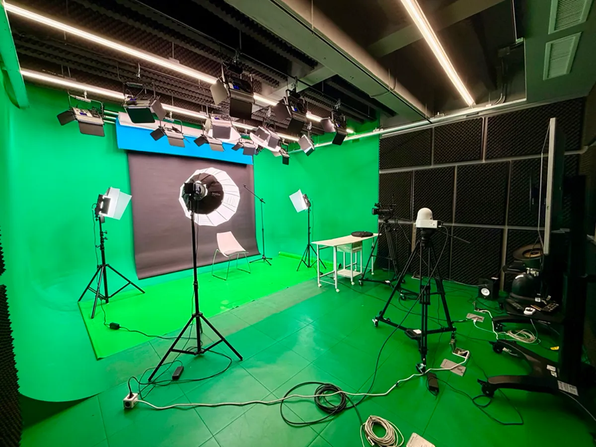

你會看到大片綠色背景、白色、黑色、藍色的升降布幕、攝影機、腳架、各種燈、麥克風、喇叭、導播機、螢幕和一堆線材。這些設備看起來複雜，但是他們的目的都是：

> **把乾淨的影像和聲音送到導播系統，最後錄影或直播出去。**

今天我們要來看看綠幕虛擬攝影棚的基本使用方法，包括不同背景適合什麼用途、燈光要怎麼理解、攝影機畫面如何送到導播機、導播機的 A/B 是什麼、以及最後如何用導播軟體做綠幕去背和虛擬攝影棚效果。

今天的設備範圍都是以陽明交大新竹光復校區工程一管的綠幕攝影棚為例，其他攝影棚或直播間可能會有不同甚至更加專業許多的設備，但基本概念大致相同。

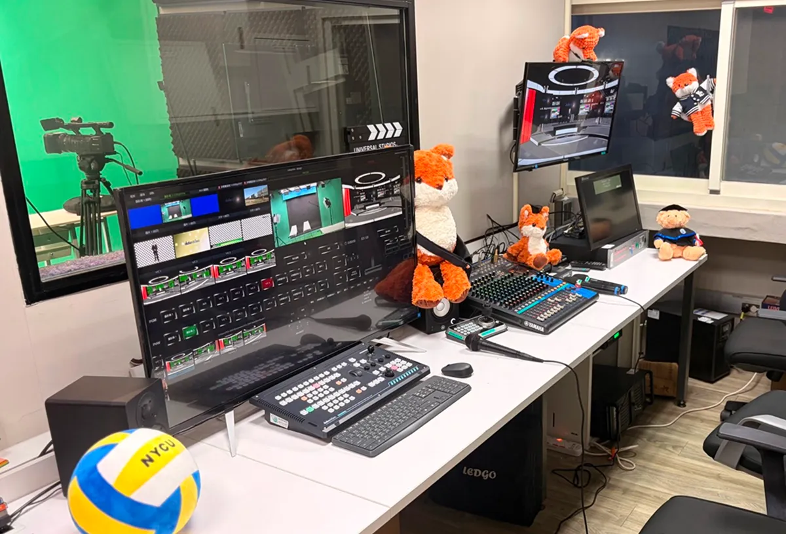

## 這間攝影棚可以做什麼？

綠幕攝影棚不只是拍特效影片的地方。它其實可以依照不同需求，變成很多種拍攝空間。

### 拍攝照片

最簡單的用法，是把背景切換成白色或黑色，做一般棚拍。人物坐在中間，前方架設攝影機，旁邊用燈光補亮，就可以拍形象照、個人照、社團宣傳照、訪談封面，或是課程講師照。這種拍法不一定需要綠幕，也不一定需要複雜的導播設定，只要構圖、燈光和收音穩定，就能得到很乾淨的畫面。

```jsx
燈光 -> 人物 -> 攝影機
```

### 錄製課程或訪談

第二種用法是課程錄影或訪談。這時人物通常會坐在桌前，前方有攝影機，桌上可能有筆電、講稿或麥克風。這種畫面很適合錄製線上課程、老師講解、專題訪談、YouTube 影片或社團簡介。它的重點不是特效，而是讓觀眾能清楚看見講者，並且聽清楚內容。有時候有的實驗室想要做語言分析等等研究也會使用這裡的攝影棚來錄音跟捕捉臉部表情。

```jsx
燈光 -> 人物 -> 攝影機 -> 導播機 ↴
麥克風 -> 混音器 -----------> 錄影器
```

### 綠幕虛擬攝影棚

第三種用法是大家最常想到的綠幕虛擬攝影棚。綠幕的作用是讓軟體能夠把背景移除，再換成其他畫面。你可以把人物放進新聞棚、科技感虛擬空間、簡報背景、遊戲直播畫面，或是任何事先設計好的場景。這種做法適合直播、虛擬主播、課程錄影、新聞播報、產品發表，或需要視覺包裝的影片。

```jsx
燈光 -> 人物 -> 攝影機 -> 導播機 -> 導播軟體
                          |         |
麥克風 ----------------> 混音器 --> 錄影器
```

所以綠幕只是攝影棚其中一種背景選擇。真正重要的是先知道自己要拍什麼，再決定要用白幕、黑幕，還是綠幕。

### 錄音室

因為攝影棚有隔音設計，也可以用來錄音。所以要錄製節目、樂器、配音等等其實也非常合適。反而隔壁所謂的錄音室四周都是白板玻璃牆壁環繞，是非常糟糕的錄音空間。

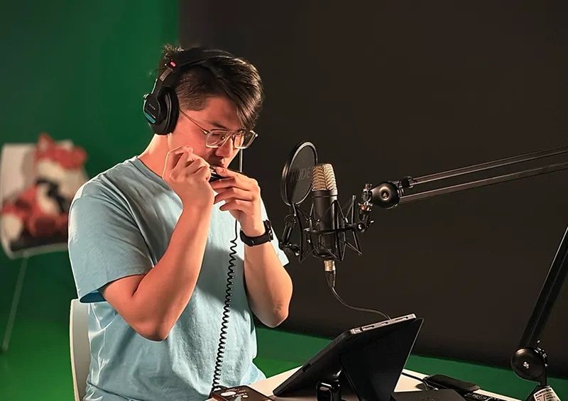

## 白幕、黑幕與綠幕

攝影棚裡常見的背景不只一種。不同背景會帶來不同的畫面效果，也會影響後續是否需要合成、去背或調色。最常見的背景可以分成四種：白幕、黑幕、綠幕與藍幕。

### 白幕：乾淨、明亮、正式，最適合一般棚拍

白色背景是最容易理解、也最常用的棚拍背景。

白幕給人的感覺乾淨、明亮、正式，很適合用在形象照、教學影片、產品介紹、社團宣傳、人物訪談、履歷照片或課程講師照。只要人物坐在中間，前方用攝影機構圖，旁邊再用燈光把臉部打亮，就可以得到很清楚、乾淨的畫面。

白幕的優點是安全、百搭、不容易出錯。它不會像綠幕一樣需要去背，也不會像黑幕一樣容易讓人物融入背景。對初學者來說，如果只是要拍一段正式的介紹影片，白幕通常是最簡單的選擇。

不過白幕也不是完全不用注意。白色背景如果沒有打光，可能會看起來灰灰的；如果人物離背景太近，影子會直接落在白幕上，畫面就會變髒。如果背景光打太強，白幕也可能過曝，讓人物邊緣變得不自然。

所以使用白幕時，要注意三件事：人物不要太貼近背景、背景亮度要均勻、人物臉部亮度要比背景更重要。拍攝時不要只追求背景很白，而是要先確保人物好看、清楚、有層次。

### 黑幕：沉穩、專注、有戲劇感，適合訪談與形象影片

白幕讓畫面明亮乾淨，黑幕則讓畫面變得沉穩、集中，甚至有一點戲劇性。黑幕很適合用在深度訪談、音樂表演、人物形象影片、科技感內容、正式談話節目，或是想讓觀眾注意力集中在人物臉部與聲音上的影片。

黑幕的優點是背景不容易干擾主體。觀眾不會被背景吸引，而是會自然把注意力放在人物身上。這也是為什麼很多訪談、紀錄片、音樂演出或專業形象影片會使用黑色背景。

但黑幕的問題是，人物很容易和背景黏在一起。尤其當人物穿深色衣服、頭髮也是深色時，如果燈光沒有處理好，整個人會像被黑背景吃掉，邊界不清楚。

因此使用黑幕時，背光非常重要。背光或輪廓光通常會放在人物後方或側後方，照亮頭髮、肩膀和身體邊緣。這道光不是為了照亮臉，而是為了讓人物從黑色背景中分離出來。

簡單來說，黑幕不是把燈關暗就好。黑幕拍得好看，關鍵在於控制光線。臉部要有足夠亮度，陰影要有層次，人物邊緣也要被勾出來。這樣黑幕才會看起來專業，而不是單純畫面太暗。

### 綠幕：最常見的去背背景，適合虛擬棚與即時合成

綠幕是虛擬攝影棚最常見的背景。

綠幕的目的不是讓觀眾看到綠色，而是讓導播軟體或後製軟體把綠色移除。這個技術通常叫做 Chroma Key，也就是色鍵去背。軟體會辨識畫面中的綠色，把綠色區域變透明，然後在後面放入新的背景。

例如新聞棚、科技感虛擬場景、簡報背景、遊戲直播畫面、品牌主視覺、動畫背景，都可以透過綠幕合成出來。

綠幕會被廣泛使用，是因為綠色通常和人的膚色差異很大，攝影機也對綠色訊號比較敏感，因此在很多數位影像流程中，綠幕去背會比較容易取得乾淨結果。

但綠幕拍攝有幾個重要規則：

1. 不要穿綠色衣服。因為軟體會把綠色移除，如果衣服、帽子、飾品或手上的物品也是綠色，它們就可能一起被去掉。

2. 人物不要太靠近綠幕。人如果離綠幕太近，影子會落在綠幕上，造成背景亮度不均。同時，綠幕反射出的綠光也可能打到人物身上，讓頭髮、肩膀和衣服邊緣出現綠邊。這種綠邊在去背時很容易變成毛邊或破洞。

3. 綠幕要均勻打光。綠幕不是越亮越好，而是要整片亮度接近。如果一邊亮、一邊暗，或中間有明顯陰影，軟體就很難一次乾淨去背。

4. 人物燈和背景燈最好分開。照人物的主光、補光、背光，應該和照綠幕的背景光分開處理。這樣人物會比較立體，綠幕也會比較均勻。

綠幕成功的關鍵不是軟體有多強，用起來都差不多。而是現場有沒有先拍乾淨。現場拍得越好，導播軟體去背就越穩定。

### 藍幕：綠幕，但是是藍色的

除了綠幕之外，還有一種常見的合成背景叫做藍幕。

主要原因是拍攝內容有時候不能使用綠幕。例如畫面中有綠色服裝、綠色道具、綠色產品、植物、軍綠色元素，或任何必須保留的綠色物體，這時如果使用綠幕，軟體可能會把這些綠色一起去掉。遇到這種情況，就可以改用藍幕。

藍幕也常用在一些電影、廣告或需要更精細控制的拍攝環境中。它的優點是比較不容易反射到人物皮膚上，對某些材質或場景會比較自然。不過藍幕通常需要更多光線，對燈光控制也有一定要求。

使用藍幕時，也要注意不能穿藍色衣服，不能拿藍色道具。尤其牛仔褲、深藍外套、藍色襯衫、藍色 Logo 都可能被軟體誤判。這一點和綠幕「不要穿綠色」是一樣的道理。

### 四種背景怎麼選？

白幕是為了乾淨呈現，黑幕是為了集中視覺，綠幕和藍幕是為了去背合成。

進棚拍攝前，只要先想清楚「最後畫面要不要換背景」，就能快速決定該使用哪一種幕。如果不需要合成，優先考慮白幕或黑幕；如果需要合成，再根據人物服裝與道具顏色，在綠幕和藍幕之間選擇。

不管是不是綠幕，拍攝的基本原則都一樣：人物要清楚，畫面要穩定，背景不能干擾主體。

---

我們今天請一位同學坐在畫面中央。攝影機架在前方，燈光從左右或前側打向人物。

這時你可以發現：當燈沒有打好時，人物臉上會有陰影；當背景沒有照亮時，白幕會變成灰色；當人太靠近背景時，影子會直接落在白幕上。

這就是為什麼前面說到人物不要緊貼背景，最好留一點距離。這樣不只可以減少影子，也可以讓畫面比較有空間感。

接著切換成黑色背景，可以明顯感覺兩種風格差很多。白底比較明亮，黑底比較沉穩。

你可以想像如果人物穿深色衣服，又坐在黑背景前，整個人會很容易融進背景裡。只要在人物後方或側後方加一盞背光，讓頭髮和肩膀邊緣出現一點亮線，人物就會從背景中分離出來。

## 燈光

攝影棚裡會看到很多燈。有些燈在天花板上，有些燈在腳架上，有些有柔光罩，有些是比較硬的光。我們來討論一下幾種基本燈光功能。

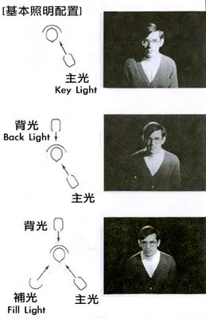

> 圖片來源：[數位影音處理: class#1銀幕裡的世界 影視美學概論](https://shudigiclass.blogspot.com/2006/03/class1.html)

第一種是主光。主光是照亮人物臉部的主要光源，通常會放在人物前方偏左或偏右的位置。主光決定畫面的主要亮度，也會決定臉部陰影的方向。如果主光太硬，臉上的陰影會很明顯；如果主光太柔，畫面會比較自然，皮膚也比較舒服。

第二種是補光。補光的作用是把主光照不到的陰影稍微補亮。例如主光從左邊打，右臉可能會太暗，這時就可以用比較弱的補光把陰影拉回來。但補光不能太強，因為補光太強會讓臉變得很平，沒有立體感。

第三種是背光，也可以叫輪廓光。背光通常從人物後方或側後方打過來，照在頭髮、肩膀或身體邊緣。背光的作用不是照亮臉，而是讓人物從背景中分離出來。拍黑背景時需要背光，拍綠幕時也很需要背光，因為它可以減少人物邊緣和背景混在一起的問題。

第四種是背景光。背景光是照背景的燈。白背景需要背景光讓白色更乾淨；綠幕需要背景光讓綠色更均勻；黑背景則通常不會把背景打太亮，否則黑色會變灰。

綠幕拍攝尤其要注意：人物燈和背景燈最好分開處理。也就是說，不要只用一兩盞燈同時照人和照綠幕。比較好的做法是用主光、補光、背光照人物，再用另外的燈把綠幕照均勻。這樣導播軟體去背時會穩定很多。

## 攝影機

攝影機負責拍到人物、背景和現場畫面，然後透過線材把畫面送到後台或導播系統。

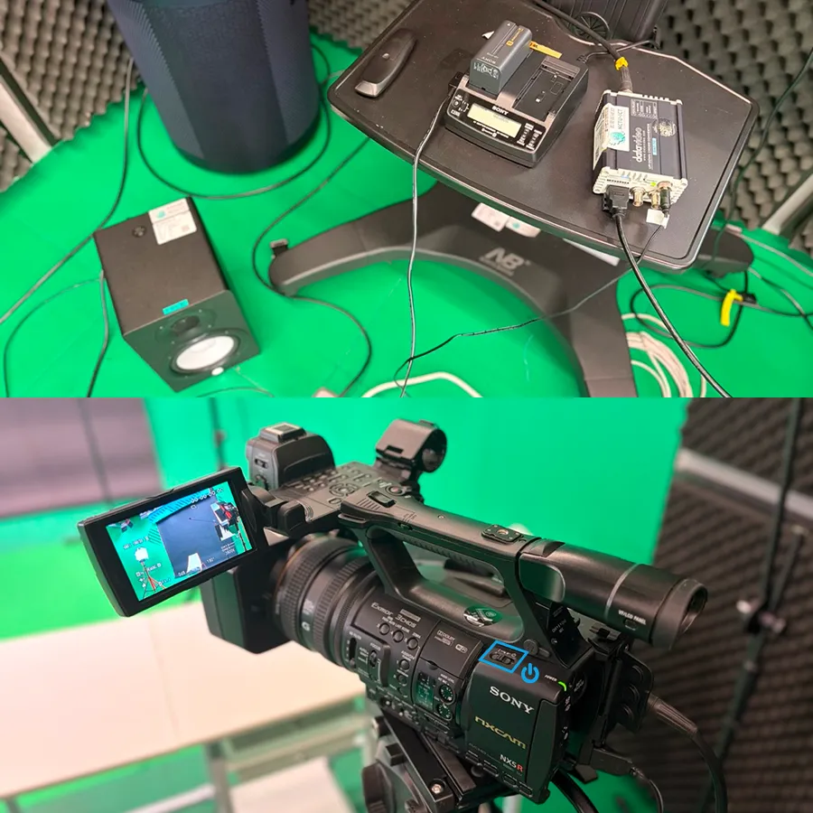

攝影棚裡面接好的有一台專業攝影機和一台 360 度旋轉鏡頭，可以用遙控器框制。

旁邊相關要接的電路有供電的電池充電器，跟導播室溝通的監聽喇叭要插插頭，以及如果想預覽效果的話可以接上右方的 HDMI 到螢幕上面。攝影機的按鈕很多但不需要動，打開電源就好了。每次電源我都找好久（

在攝影棚中，可以使用現場原本架好的攝影機，也可以使用自己的相機或攝影機。使用棚內攝影機的好處是位置通常已經固定，線路也可能已經接好，比較適合課程錄影、直播或固定機位拍攝。使用自己的相機則彈性較高，但要注意相機是否能輸出乾淨畫面。

> [!NOTE] 乾淨畫面
>
> 所謂乾淨畫面，就是相機輸出到導播機時，畫面上不要出現相機介面。例如對焦框、電池圖示、光圈快門資訊、錄影時間、格線或其他設定資訊。如果這些東西被送進導播機，最後錄影或直播時觀眾也會看到。

這裡不探討攝影技術的細節，不過攝影機設定時，要確認幾件事。

- 畫面有沒有正確輸出
- 人物有沒有對焦
- 第三，曝光是否正常
- 第四，構圖是否穩定
- 第五，畫面是否水平
- 第六，如果使用綠幕，人物和綠幕是否都在合理範圍內。

攝影機拍到的畫面會成為導播系統的一路輸入訊號。就是你電腦的攝影機的概念。導播機收到之後，才能進一步切換、去背、合成、錄影或直播。

## 導播機

導播機會接收不同來源的畫面，然後決定最後要輸出哪一個畫面。如果你用過 OBS 的話那好好理解，他就是一台實體的 OBS。

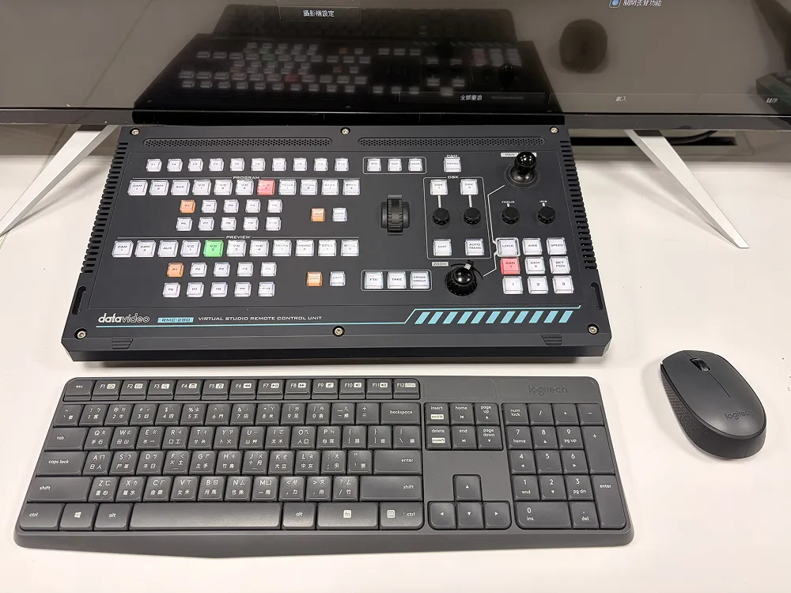

其實說這一台並不是一台硬體導播台，因為他本質上是一台 PC，插了一堆影像輸入，然後安裝了導播軟體。這叫做「軟體導播系統」或「電腦式導播台」。而前面這顆酷酷的看起來像開飛機的導播台，叫做「導播控制台」、「控制面板」，是一個如果你懶得用滑鼠點螢幕可以用實體按鈕切換的快捷鍵盤。

這些來源可能是攝影機、筆電畫面、簡報、預錄影片、綠幕去背後的畫面、Logo、字幕或虛擬背景。導播機的工作就是把這些來源管理起來，讓操作者可以選擇、切換、合成和輸出。

例如現在有一台攝影機拍講者，另一台電腦播放簡報。導播機可以讓你先播講者畫面，接著切到簡報畫面，也可以做子母畫面，讓講者和簡報同時出現。假設使用綠幕，導播軟體還可以把講者背後的綠色去掉，再套上虛擬攝影棚背景。

導播機最後輸出的畫面通常會送到錄影設備、直播系統、監看螢幕或其他後端設備。也就是說，觀眾最後看到的，不一定是某一台攝影機的原始畫面，而是導播系統處理後的最終畫面。

### Program、Preview

學導播機時，一定要理解 Program 和 Preview。不同導播機的介面可能不一樣，有些會寫 Program 和 Preview，有些會用 A/B 的概念，其實是一樣的。

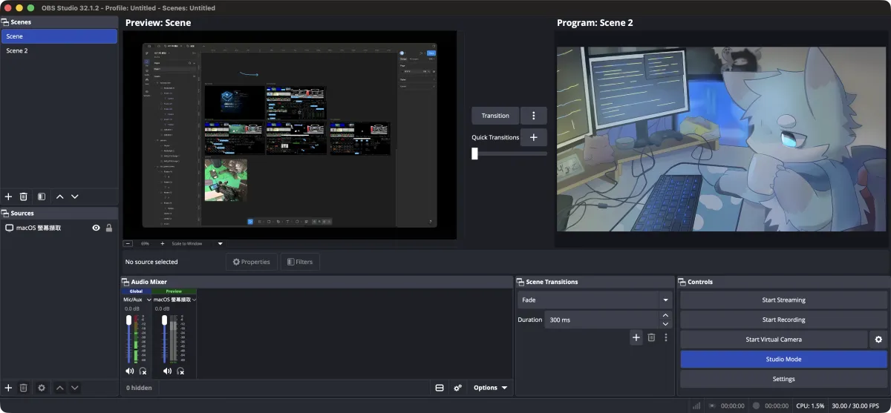

> [!NOTE] OBS Preview 顯示方式
>
> OBS 舊版本會自動顯示 Preview，新版本需要點擊右下角的工作室模式（Studio Mode）才會出現 Preview。

Program 是目前正在輸出的畫面。它是觀眾正在看到的畫面，也是錄影設備正在錄到的畫面。如果 Program 上是攝影機 1，那最後輸出去的就是攝影機 1。

Preview 是下一個準備切出的畫面。它還沒有正式輸出，只是讓導播先確認畫面是否正確。假設 Program 現在是講者畫面，Preview 可以先選成簡報畫面。導播確認簡報畫面沒問題後，再按下 Cut 或 Auto、或是推動 T-Bar，把簡報切到 Program。

切換方式通常有兩種。Cut 是直接切換，畫面會瞬間從一個來源變成另一個來源。Auto 則是自動轉場，可能是淡入淡出或其他轉場效果。正式節目不一定需要很多花俏轉場，大部分情況下，乾淨的 Cut 和簡單的 Fade 就已經足夠。

## 影像路線：從棚內、後台、到錄影

攝影機在棚內拍到人物，畫面透過線材送到後台導播機。導播機或導播軟體接收到畫面後，進行切換、去背、合成或疊圖。處理完的最終畫面，再輸出到錄影設備或直播系統。

```
攝影機 / 電腦畫面
→ 影像線路
→ 導播機或導播軟體
→ Program 最終輸出
→ 錄影 / 直播 / 監看
```

如果是綠幕虛擬攝影棚，流程則會變成：

```
攝影機拍攝人物與綠幕
→ 畫面送進導播系統
→ 使用 Chroma Key 去除綠色背景
→ 加入虛擬背景或攝影棚場景
→ 輸出最終畫面
→ 錄影或直播
```

如果錄影端沒有畫面，不一定是攝影機壞了，而可能是中間某一段訊號沒有接上。排查問題時，要從輸出端一路往前查：錄影設備有沒有收到？導播機有沒有輸出？導播機有沒有收到攝影機？攝影機本身有沒有畫面？線材有沒有接好？

我們來結合前面所說的來練習看看試著使用導播軟體做綠幕去背和虛擬攝影棚。攝影棚裡我先找一隻狐狸來協助當主持人。

## 導播軟體：從綠幕去背到虛擬攝影棚

當你把設備都打開之後會自動進到導播軟體。同軟體的介面會不同，但綠幕去背的基本概念相同。

> [!NOTE] 導播室電源
>
> 在導播室最右邊有一台電源供應器，長按紅色按鈕就會依序開啟所有設備。而電腦是走自己的線路到所以得記得自己開機。所有東西最後都會到 UPS 不斷電系統裡面，所以就算[交大有蛇蛇去咬高壓電線](https://www.nycu.edu.tw/ga/ch/app/news/view?module=headnews&id=5303&serno=388bb153-7fdf-48b9-b022-6c988b983fe5)你也來得及存檔。

我會以學校這個 2013 年的軟體，畫質直播最高 720P 錄影最高 1080P 的 TVS 2000 來做示範。雖然這個軟體有年代，但是功能還是挺豐富的。

打開之後點擊最上面的「現場節目製作」。

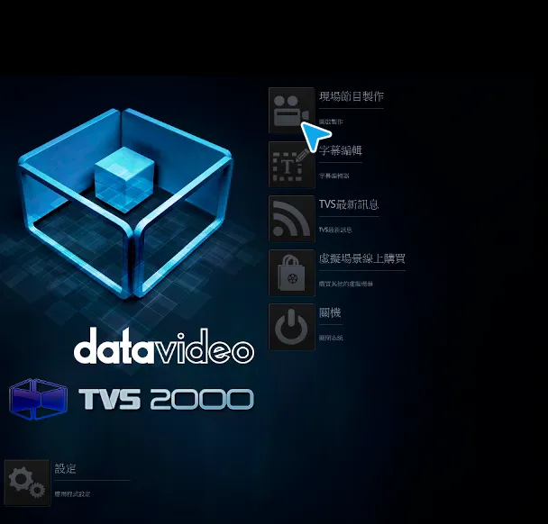

### 畫面簡介

打開之後你會看到一個非常豐富的 UI，這裡簡單介紹一下：

- 左上角都是可以使用的素材，包括圖片、影片、攝影機、文字等等
- 右上角有前面講到的 Preview 與 Program，還有一些轉場的設定按鈕
- 左中是可以選擇要顯示什麼畫面的按鈕
- 左下是調整每個畫面細節的地方
- 右下角可以對單一資源、聲音等等項目來做細節調整

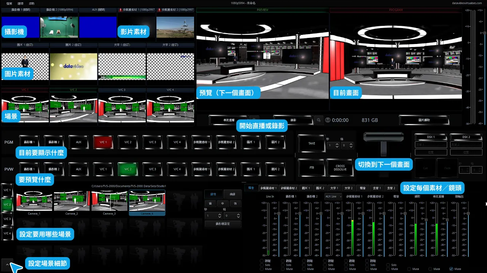

你可以看到我們能對觀眾顯示（Program）的東西包括了兩個鏡頭、虛擬攝影棚、或是我們導入的素材。

我們先點擊左下角的箭頭來切換到調整每個虛擬攝影棚細節的分頁。

> [!NOTE] 虛擬攝影棚軟體
>
> 這個軟體可以讓你自己做 3D 建模場景，也可以用內建工具來用內建模型來裝置佈局擺設你的虛擬攝影棚。這裡我們使用預設的內建虛擬攝影棚。

### 導播畫面設定

這裡我們選擇輸出（PGM）畫面成 VC/1，是一個像是新聞節目的 3D 建模場景的正面畫面。然後預覽畫面切換成攝影機 2，這是我們擺在正面的攝影機。我們先把它放到 Preview（PVW）因為這樣比較大，比較方便去背。

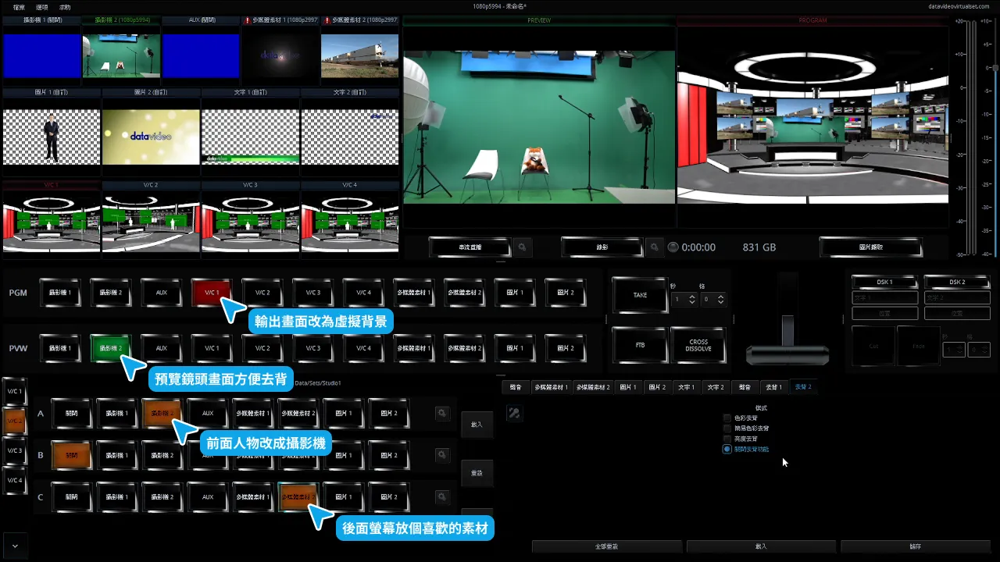

不過這樣畫面還不正確，目前攝影棚設設定的背景畫面是一個預設動畫，主持人只是一張 PNG。因此我們把畫面中的素材 ABC 切換成攝影機 2 以及選一個你喜歡的素材來投影到後面螢幕上面。

### 去除背景

現在已經有感覺了對吧！不過我們的狐狸因為身高不夠所以根本看不到。而且背景都穿幫了，左右還有很多燈具等等雜物。這時候就要使用 Chroma Key 去背。

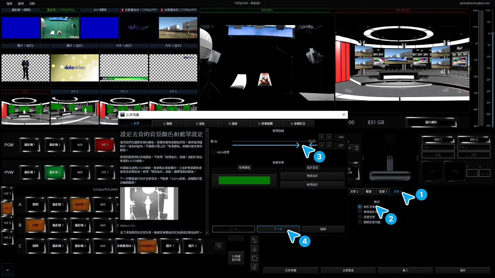

請你依序點擊：

1. 點擊右下角的去背 2。他叫做去背 2 因為我們是要去背攝影機 2。我不知道這誰設計的文案。
2. 接著請你點擊「色彩去背」，這樣就會開啟色彩去背精靈。
3. 預設就會把綠幕設定成綠色了，我們只需要左右拉動色彩範圍即可。看起來差不多乾淨，又不會破壞人物邊緣之後就可以點擊下一步。
4. 點擊下一步之後後面還有幾個參數可以調，用來處理像是頭髮邊緣等等較難處理的細節。都可以左右拉拉看。
5. 去背精靈的最後一步會讓你調整上下左右的邊界，我們可以用它來把左右的燈具或雜物切掉。

現在我們有一隻在太空中漂浮的狐狸了w

### 平移位置

最後我們要來解決狐狸椅子高度不夠的問題。在你選擇素材的橘色按鈕區右邊有一顆設定按鈕。我們點擊攝影機 2 右邊的設定按鈕（畫面被遮住，是上面那顆不是現在我藍色框的最下面的），接著你就可以點上下左右來調整位置囉！

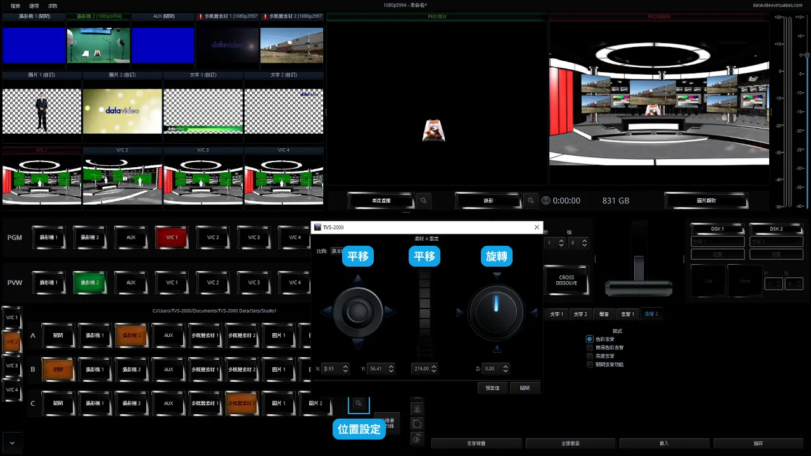

這樣我們的狐狸主播畫面就做好了，我們可以點擊右側的「圖片擷取」按鈕來拍照保存。

## 結語

綠幕虛擬攝影棚看起來很複雜，但真正要掌握的核心只有三件事。

第一，把人拍清楚。這包含背景選擇、人物位置、構圖、對焦、曝光和燈光。

第二，把聲音收清楚。這包含麥克風選擇、音量控制、聲音路線和測試錄影。

第三，把訊號送正確。這包含攝影機輸出、導播機輸入、Program/Preview 切換、綠幕去背、虛擬背景、錄影和直播輸出。

導播機只是把不同來源的畫面集中管理。綠幕只是讓軟體有辦法把背景移除。真正決定成果好不好看的，往往是最基本的現場處理：人有沒有坐對位置、燈有沒有打好、聲音有沒有測、訊號有沒有接對。

不過你也看出了學校導播機的限制，大家大多不會使用且設定不一定符合需求。因此更常見的做法是攜帶自己的攝影跟收音設備來這裡作為一個安靜收音好的拍攝地點。

當你掌握了背景、燈光、攝影機、收音和導播這幾個環節，就能開始用它製作課程、訪談、直播等等各種有趣的專案。
