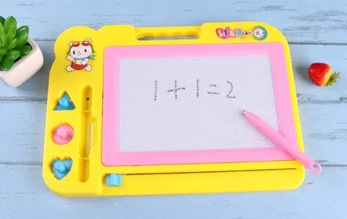
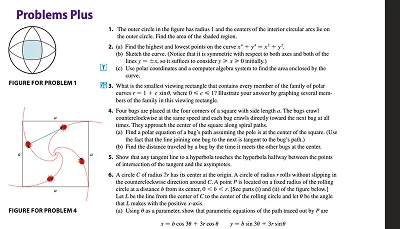

# 該買電子書閱讀器嗎？BOOX Note Air4 C 心得

你有沒有想過要買一台電子書閱讀器？想像你可以用它輕便地看書、看漫畫、看課本、讀論文，甚至寫筆記。

大一上的時候，我入手了一台定價 **$17,460** 的文石 BOOX Note Air4 C。它是一台 10.3 吋、支援感壓觸控筆的彩色電子墨水平板，算是很高階的閱讀器了。這篇文章就是我使用將近一年的心得。

## 背景

首先，我為什麼會想買這台電子書閱讀器呢？

背景是，上了大學之後所有的課本（至少在我的學校交大）基本上都是厚重的原文書。很少有人會去買紙本，大多數人會選擇~~去 [Z-Library](https://z-library.sk) 等非法影子圖書館下載~~、~~不看書~~，或是使用學長姐之間流傳的神奇 PDF，再拿 iPad 來看書、做筆記。

那麼，為什麼我會選擇電子書閱讀器，而不是 iPad 呢？

- 我的 iPad 放在家裡給家人追劇、打遊戲。
- 平常用眼太多了，希望可以稍微護眼一點。
- 我平常本來就會隨身攜帶筆電，沒有太多情況是用 iPad 會明顯比較方便或有效率。
- 大家都在用 iPad，我用電子書閱讀器看起來很酷。
- 我相信自己花了這麼多錢買電子書閱讀器之後，一定會認真讀書。

研究了一圈之後，我決定買 Note Air4 C，因為它是彩色的、支援觸控筆、螢幕大、重量輕、續航力長，而且搭載相對自由的 Android 系統。從官網上，你可以看到它遠大的願景，以及各式各樣豐富的 use case。

然後過了幾個禮拜，Air5 C 就出了。

從用了一學期後觸控筆不見、機器開始積灰塵這件事，你大概可以看出來：以上假設對我來說幾乎都不成立。

不過，這並不代表電子書閱讀器不好，而是它不一定適合每一個人。我其實有用它看完不少書，整體閱讀體驗也很不錯，只是後來大部分時間都在寫程式，比較少看書而已。

接下來，我想先介紹這台電子書閱讀器的特性和功能，最後再談談實際使用下來的心得。

## Android 系統

首先，這台電子書閱讀器本質上就是一台螢幕比較特別的 Android 平板。它內建 Google Play，可以安裝大部分的 Android App。

我可以用它讀 RSS 和網路文章、回 Discord、滑 X 看圖片，甚至看 YouTube。當然，我也用它看了幾本之前買的書，以及從電子圖書館借來的書。

這是我第一次知道淺色模式的 Discord 到底有什麼用。

YouTube 的效果其實也沒有想像中那麼糟，大概就是在看 GIF 的感覺。甚至我這台還有喇叭，也可以連接藍牙耳機。

而且在它送到的前一天，我的手機螢幕剛好壞掉，完全沒辦法使用。這台電子書閱讀器正好讓我撐了兩個禮拜，直到新手機送來。

## 「高刷」的電子紙

這台的一大亮點，是它的螢幕更新速度很快。

不過，這裡的「高刷」是相對於其他電子書閱讀器而言。畢竟大多電子書閱讀器光是換一頁，就可能要花上好幾秒。

在這裡，不得不先簡單說明一下電子紙的原理。

你有~~童年嗎？~~玩過兒童磁粉畫板嗎？就是那種可以拿一支尾端有磁鐵的筆在上面畫畫，或是用不同形狀的磁鐵蓋出圖案，最後再拉動底下的撥桿，把整個畫面清除掉的玩具。

> 圖片來源：[easygoo.com.tw](https://www.easygoo.com.tw/products/兒童磁粉畫板)

電子紙的概念有點類似，只是它是透過電壓控制微小的黑白粒子，改變這些粒子的位置，讓畫面呈現黑色或白色。

那彩色電子紙又是怎麼做的呢？簡單來說，就是加入多種帶有不同電性或移動特性的彩色粒子，再透過不同的電壓波形，把特定顏色的粒子移動到最上方。

不過，因為電子紙需要真的移動物理粒子，所以以目前的技術來說，不可能做到和手機螢幕一樣的高更新率。它所謂的「刷新」，是真的要把粒子重新刷過去。

這台厲害的地方，在於它可以只刷新局部區域。不過，刷新得越快，畫面通常也就刷得越不乾淨。因此，你可以切換不同模式，決定自己要的是畫面乾淨，還是反應速度快。

我通常使用預設的快速刷新模式，並設定每刷新十次，就進行一次完整的全螢幕刷新。這樣可以在畫面殘影還算能接受的情況下，不必每次都等它刷個兩秒，還讓整個畫面閃上兩下。

快速刷新時的體感，大概是 3 FPS。

用它看書其實滿舒服的。不過，它的畫面終究還是由像素組成，和真正的紙張油墨相比，細緻度當然還是有限，因此看起來會稍微有些顆粒感。但大致上不影響閱讀，習慣之後就還好。

## 手寫筆

回到我買它的主要目的：讀書。

這台觸控筆使用的是 Wacom 技術，寫起來超級爽，甚至比 iPad 還要爽很多。

不過，它的限制同樣來自電子紙。你沒有辦法很流暢地縮放、移動畫面或翻頁，操作時總是會有一種一卡一卡的感覺。雖然這台支援多工，也可以開啟多個視窗，但在這麼卡的情況下，實際上並沒有多實用。

再加上，拿來寫微積分等課本的練習題時，頁面留給計算的空間絕對不夠。而老師的簡報和考古題，通常又是零散下載下來的 PPT 或 PDF，每次都要把檔案傳進電子書閱讀器也很不方便。

所以，實際練習時，我的做法通常是用電腦開著課本 PDF，再把電子書閱讀器上的備忘錄功能當成白紙來寫。

也就是說，在真正拿來讀書時，這台電子書閱讀器最後就只剩下一個備忘錄的功能。

然後我發現，比起電子書閱讀器，「紙筆」的觸感和使用體驗，和真正的紙筆還是比較接近。

所以後來，我就直接用紙筆做筆記了。

## 護眼

電子紙在環境夠亮的情況下，可以把前光關掉。這時畫面主要靠環境光反射來顯示，看起來確實比較像紙張，眼睛也可能會覺得比較不吃力。

不過，如果你看螢幕看到眼睛發酸，那麼你真正該做的事情是休息，走出去摸點草，而不是換一個載體繼續摧殘自己的眼睛。

長時間使用螢幕容易造成眼睛不適，通常和眨眼次數下降、長時間近距離對焦、字體太小、反光、姿勢不佳，以及照明環境不好有關。換成電子書閱讀器，並不會自動解決這些問題。

如果你相信手機、電腦的藍光會直接傷害眼睛，那出門時可千萬不要看天空，那裡的藍光強多了。

不過，使用電子書閱讀器確實會帶來一種比較舒服的感覺。只是對我來說，這種舒服有一部分是心理上的，而操作卡頓帶來的躁感，往往還超過了它。

## 總結

看到這裡，你大概也會明白：電子書閱讀器其實不是一個適合拿來和平板正面比較的東西。它們面對的是不同的需求，也陪伴著截然不同的生活方式。

電子書閱讀器並不適合當成主要的筆記工具，也不適合拿來大量書寫、計算或做練習題。它沒有平板的流暢、鮮豔與萬能，甚至在許多時候，還會顯得笨拙而遲緩。

但它確實是一個很好的……電子書閱讀器。

> 喔，還有一個可以一直放在桌上、幾乎不耗電的行事曆、日曆，以及電子相框。

所以，我最誠實的建議，是先找一位擁有電子書閱讀器的朋友，向他借來用上一兩個星期。

不要只在展示間摸五分鐘，也不要只看網路上的規格和評測。試著真正和它生活一段時間：帶它上課、帶它通勤，在睡前翻幾頁書，也看看幾天之後，你還會不會主動把它拿起來。

如果你發現自己真的喜歡這樣的閱讀方式，也真的因此讀了更多書，那麼，歡迎你買一台電子書閱讀器。

至於我，這一次確實付了一筆不小的學費。

當時最新款的 iPad 搭配教育優惠，只需要 **$9,800**；即使漲價到了現在，也只要 **$14,200**。而我買下這台裝置，實際花了 **$15,780**，後來還得再花 **$2,180**，重新買一支筆。

我用更高的價格，買到了一台效能更差、記憶體更少，螢幕色彩和解析度也遜色許多的 Android 平板。

若只從規格、價格和理性的角度來看，這或許是一筆很難替自己辯護的消費。可是如今，它就安靜地躺在書桌正前方。

螢幕上輪流出現過去的照片，提醒著我那些已經走遠，卻沒有真正消失的日子。它不再只是一台買貴了、效能也不夠好的機器，而更像是一扇很小的窗，替我留住一些差點被時間帶走的人、風景和回憶。

所以，我仍然希望，在未來許多平凡的午後和寂靜的夜裡，它可以繼續待在那裡。除了替我保管曾經走過的日子，也在我忘記閱讀、忘記停下腳步的時候，輕輕提醒我：這個世界上，還有很多故事尚未讀完。你的期末考也沒讀完。

如果有一天，回頭望去，我真的因為它而多讀了幾本書、多記住了一些文字，也多陪伴了幾段原本會被匆忙錯過的時光。

那麼，這筆昂貴的學費，或許就不算白白付出了。
