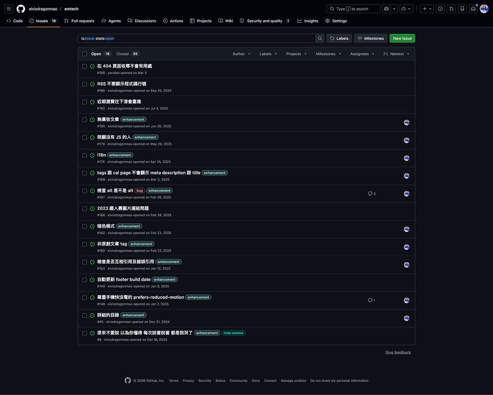
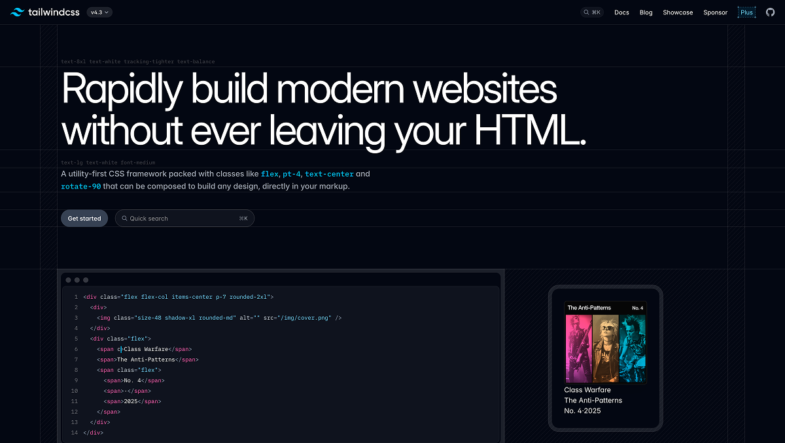
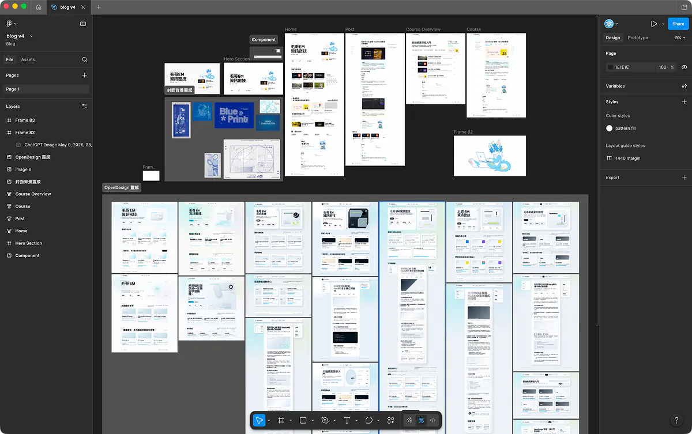
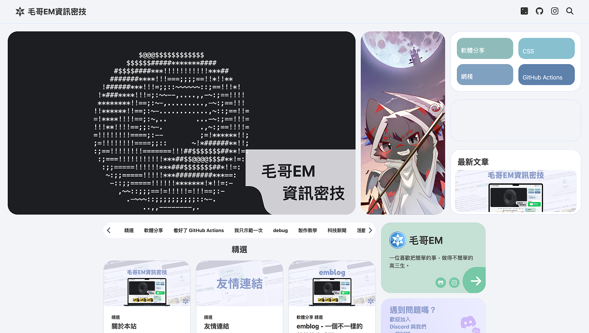
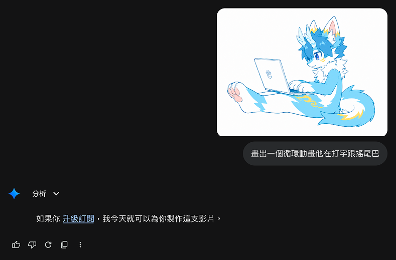
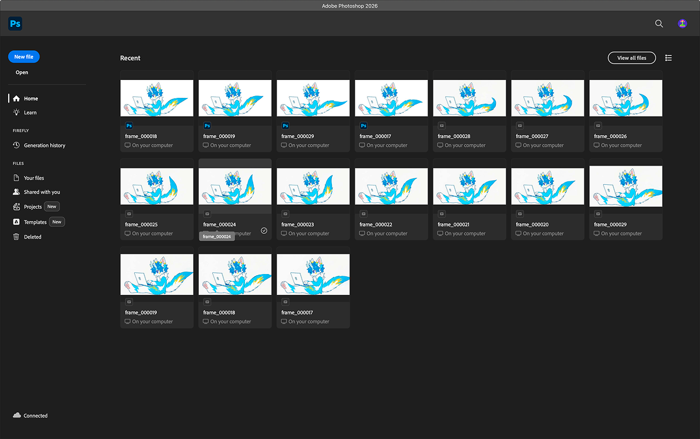
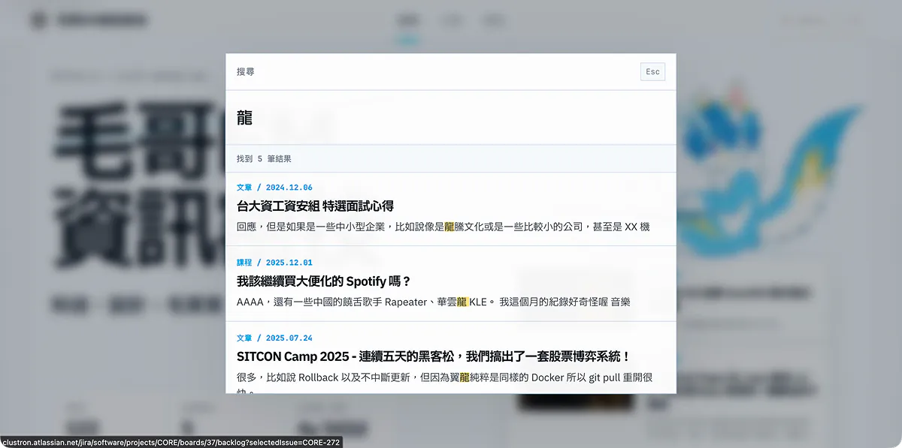
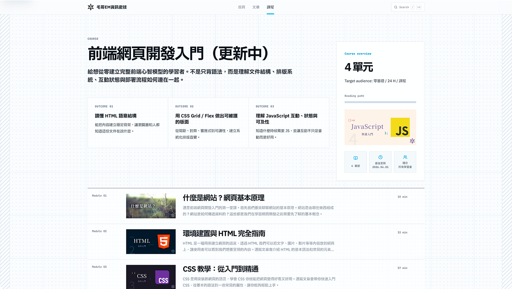

# 毛哥EM資訊密技 2026：重造了個毛茸茸的大輪子！

毛哥EM 資訊密技馬上要滿五歲了，~~而昨天我也剛滿 19 歲！~~ 今天完成了第四版網頁的開發。這次總共耗時了整整五天的時間。用了更好用的工具和架構，同時也加入了很多新功能。讓我們一起來看看吧！

## 為什麼又又又要重造輪子？

毛哥EM 資訊密技曾經經歷過三個版本：

- 第一個版本是在國中疫情期間使用 [Google Blogger](https://www.blogger.com) 做的，就是簡單套了個模板稍微改改顏色。記得當時為了塞某些設計，還用了 iframe。
- 第二個版本撐到了高一暑假，是使用 [Hugo](https://gohugo.io/) 做的。穩定快速好用，不過因為想要設計自己的網頁，然後做成 SPA 有流暢的動畫以及更多效果。但是覺得要研究 Hugo 太麻煩了所以後來就離開了。

> 不就是個靜態網頁生成器嘛，Markdown 轉 HTML 塞進模板不就好了。

然後痛苦就開始了。好吧應該說痛苦沒結束過。

- 第三個版本是我自己用 Node.js 寫的靜態部落格生成器 [emblog](https://emtech.cc/p/emblog/)。它很輕、很快，也有很多奇怪但我很喜歡的小細節，像文章轉場、往下滑接續下一篇、圖片主色背景、右側目錄和近期瀏覽。

其實到第三個版本的時候我已經意識到我已經自己寫了個 SPA 框架了。設計時很多東西互相串聯得很精細，但是也較難以擴充。所以這次我決定換一個更適合內容網站的框架。

而更具體來說我遇到了幾個問題：

1. 部落格只有對於文章來做設計，沒辦法支援像是課程或是系列文這種希望能照順序看，能看到進度的內容型態。

2. 就像剛才講的，部落格的架構魔法偏多（雖然我應該還記得怎麼運作），功能不是很好擴充。
   - 整個部落格生成器是一個叫做 [`emblog.js`](https://github.com/elvisdragonmao/emtech/blob/de1691056d210fd43571377d7e2c90f4cb0a85a7/emblog/generate.js) 的檔案喔！

3. ~~卡片我懶得解~~



4. ~~這網站放了一年半我看膩了~~

所以就來重造輪子了。

架構上很簡單：

- 網頁使用 Astro 來當作框架，裡面老樣子，基本上所有東西自己寫。
- 留言自己寫了一套簡單的系統，跑在 Cloudflare Workers 上，資料存在 Cloudflare D1 裡面。

我從浪漫的「我想自己做一個部落格框架」，所有 UI、路由、Markdown 轉換、互動和生成流程都自己來；轉向了比較務實的把該交給成熟工具的地方交出去，然後把時間花在內容體驗、課程架構、留言系統和維護性上。shadcn 雖然 Build 的速度明顯慢很多但整體還是值得的。

## 設計

### 尋找靈感

首先其實設計先花了我近兩天的時間。要做當然要做點酷的，絕對不能像 Tailwind UI、或 shadecn 簡潔加點漸層。我希望他能夠很乾淨，但是又很有個性。簡單的配色、清晰的層次、明確的視覺語言，但又可以很有趣。

靈感主要來自 Tailwind CSS 新的官網，覺得很漂亮。想要做出有點工業風、極簡風，但又有點草稿、藍圖感，最後就變成了現在這樣的設計。



中間有嘗試先使用剛出來的 OpenDesign 來幫我生一些 UI 驗證我的想法，不過燒了一堆 Token 生了一堆 AI Slop 之後還是回到了 Figma 自己畫的版本。

現在有 AI 很好的地方是可以快速的驗證腦中的想法，可以確認這個方向對不對。不會花了幾個小時做出來之後才發現設計方向錯了。同時因為 Codex 的前端能力跟中文理解能力都爛得一匹，所以常常能炸出新風格給我靈感。



### 龍龍

其實在設計前一版本的部落格時就想放龍龍了。原本放甜甜圈的地方其實是想要放一些會動的圖。不過後來沒錢委圖也沒空畫所以就割到現在了。



那麼現在封面的那張畫是怎麼來的呢？其實是我丟了幾張我的照片給 ChatGPT 生的。

不過過程沒那麼簡單。雖然現在 GPT 生圖的能力已經很驚艷了，沒想到偏日系點的獸圖現在也可以生得那麼好了。但我還是改了好幾次 prompt 微調了好幾次才看起來比較合理。

接下來是動畫。GPT 的 Sora 沒了所以當然第一時間想到的是 Gemini 的 Veo，不過：



所以接下來我就花了一個小時在網路上找 AI 生影片工具。但是全部都是要錢，或是用爛模型生一個畫質很低的。最後還是用了第一次生的影片，不過它的問題是生的影片搖晃的時候尾巴有被切到。所以只好用 ffmpeg 轉成 PNG，然後一張張丟進 Photoshop 補尾巴，去背。（感覺花的時間是不是其實跟自己畫差不多了...）



### 開發

開發上面面對太過複雜的畫面和特效 GPT 5.5 和 Sonnet 都看圖看不懂，講話說明也聽不懂。所以雖然第一個 prompt 架構就大致出來了，但是還是花了許多時間手工雕細節，還有再下近百個 prompt。

過程大概就是這樣，花幾天熬夜找資料、丟 Skills、罵 Codex。說好的網頁工程師都要被 AI 取代了呢？怎麼連個靜態部落格都寫不好。

## 專案架構

### 整體架構

來講講專案架構吧。因為現在有了留言系統的微後端所以 Repo 改成了 pnpm monorepo 的架構，同時東西全部上 TypeScript。

```txt
apps/
├── blog
└── comments-worker

packages/
└── comments-shared
```

- `apps/blog` 是 Astro 靜態網站，負責首頁、文章、課程、搜尋和前端互動。
- `apps/comments-worker` 是 Cloudflare Worker，專門處理留言 API、GitHub OAuth、審核、D1 資料庫、Turnstile 驗證、速率限制和 Discord 通知。
- `packages/comments-shared` 放前後端都會用到的共用邏輯，例如留言型別、Email hash、Gravatar URL、HTML escape、留言清理和簡單 spam 判斷。

部署就是靜態網頁、後端、資料庫全部丟到 Cloudflare。爽。

### Astro 前端

文章方面同樣是一篇文章一個 folder，抓 `index.md` 當內文，圖片也都放裡面，`thumbnail.webp` 當縮圖。

```txt
apps/blog/src/content/post/my-post/
├── index.md
└── thumbnail.webp
```

不過差別是在 `src/content` 有 `post` 跟 `course` 兩個資料夾，course 裡面會再把每個課程或系列文做分類。

Frontmatter 的 schema，日期、標籤、分類、草稿狀態和 description 都會被統一整理。有 Astro 和套件處理起來輕鬆多了。不過整個部落格實際上使用的套件只有 Astro、搜尋、還有 Lucide Icon：

```js
"dependencies": {
  "@lucide/astro": "^1.14.0",
  "astro": "^6.3.1",
  "astro-pagefind": "^2.0.0",
  "simple-icons": "^16.19.0"
},
```

無縫頁面切換的 SPA 當然是要有的！不過這部分我就直接交給 Astro View Transition 做簡單的 Fade In 效果了。簡單乾淨。

## 搜尋支援內文

這次的搜尋我沒有手寫而是使用 Pagefind。本來有先手寫一個版本，但是如果要做到靜態網頁全內文搜尋必須得先下載一大包搜尋資料，而 Pagefind 會對內文做好 index，可以做到比較接近一個內容網站該有的搜尋體驗。



搜尋支援文章和課程內文，也會顯示類型、日期、標題和摘要。快捷鍵也當然有：`/` 或 `Ctrl/Command + K` 都可以打開搜尋。

## 課程系統

這是整個網站最主要更新的目的。



文章是一篇一篇分散的，課程則是有順序、有章節、有進度的系列內容。每個課程有自己的 `course.json`，裡面定義標題、描述、縮圖、排序、重點成果和章節順序。每個 lesson 一樣是 Markdown 像是一篇篇文章。

課程頁會產生：

- 課程 overview
- outcomes
- 模組列表
- 每章閱讀時間
- 上一章 / 下一章
- 回課程首頁
- 側邊章節導覽
- 閱讀完成進度

閱讀完成是存在 localStorage，不需要帳號。讀者看到一章底部時，網站會記錄這章已完成，側邊欄也會出現完成符號。

> 登入後記錄進度功能再等等之後有空再說...

這樣就可以輕鬆的一個系列一直讀下去囉！

## 留言系統

留言區是這次另一個大工程。

考慮到想要有好的效能，架構也乾淨一點，我沒有使用第三方留言服務。朋友 Yoru 有問我為什麼不用 giscus，因為我覺得它好慢，而且等於是要授權第三方服務以你的身份留言，不是很安全。

為此我簡單做了一個 `comments-worker`。它跑在 Cloudflare Workers，上面接 D1 資料庫。

> D1 是 Cloudflare 提供的免費 serverless 類似 SQLite 的服務。

功能包含：

- 匿名留言
- 顯示名稱留言
- Email Gravatar 頭像
- GitHub 登入留言
- 巢狀回覆
- Turnstile 防機器人
- IP hash 和 User-Agent hash
- 速率限制
- spam 判斷
- 管理員審核
- Discord 新留言通知

這樣網頁仍然是靜態網站，但留言是完整的動態功能。登入狀態用 Worker API 查，留言列表也是依照目前頁面路徑讀 D1。匿名留言還是可以用，想要 GitHub 驗證也可以登入。加入裝置、瀏覽器、地區標籤這個功能的靈感來自 [张洪Heo](https://zhheo.com/) 的 blog。除了看出 spam 以外~~還可以製造宗教戰爭~~挺有趣的。

後台也有一個簡單的頁面可以管理留言，有新留言時會用 Discord Webhook 通知。

## 結語

終於做完了。自己還算蠻滿意的。首頁封面空空怪怪的是因為還不知道放什麼，但就先這樣吧。如果有什麼建議歡迎跟我說。

好累，我要去睡了。
