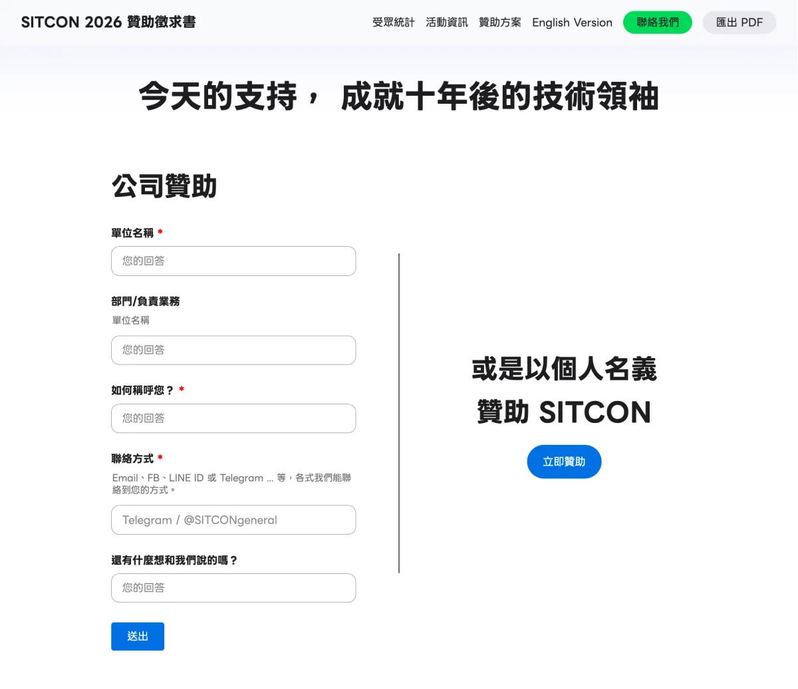
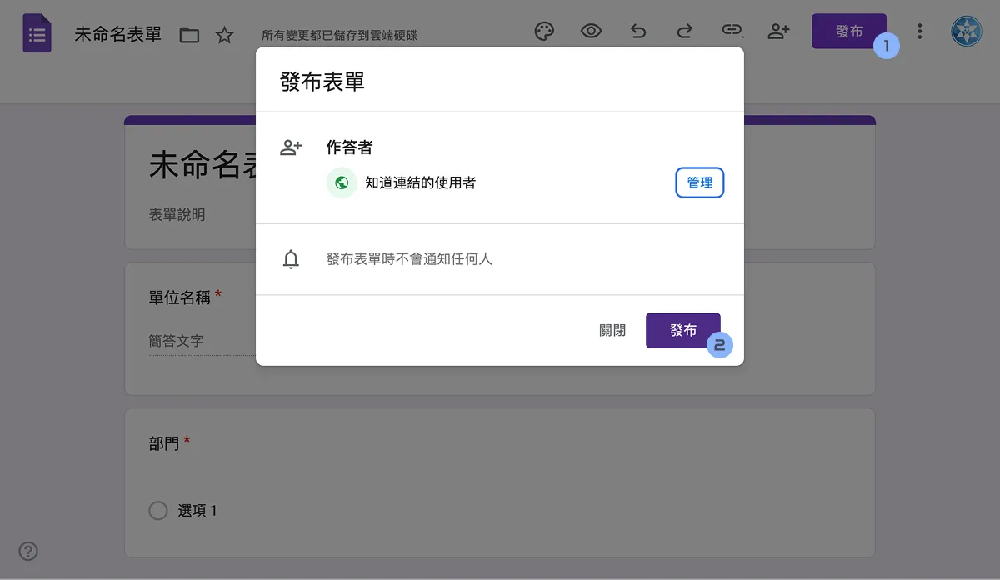
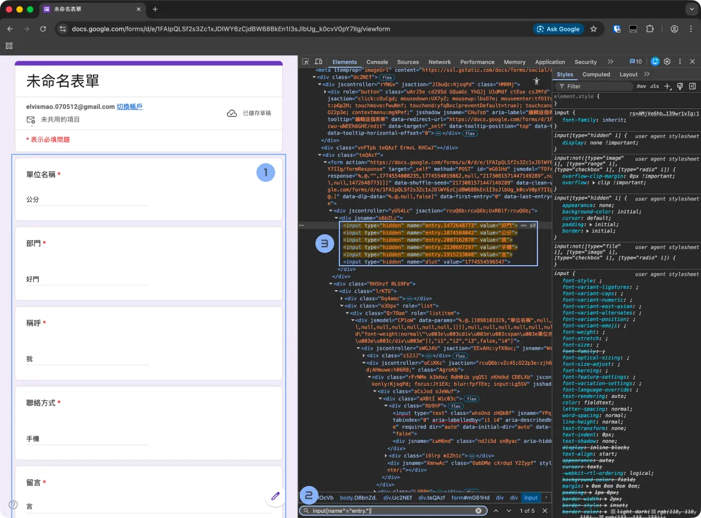
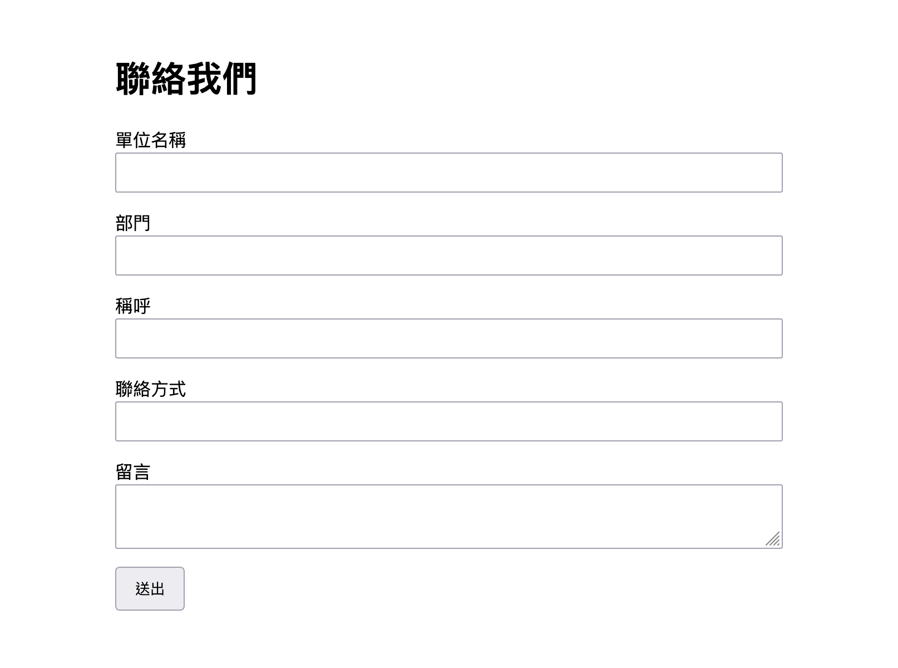

# 嫌 Google Forms 太醜？拿它當表單後端吧！

有時候你想在你的靜態網頁中放一個表單，但是如果為此你需要租個虛擬機、寫個後端、開個資料庫、還要擔心被網路攻擊...這實在是太麻煩了。但是放個 Google 表單又千篇壹律沒什麼品味。這時其實你可以把 Google Forms 當作表單的後端，回覆還可以自動儲存到 Google Sheets，只要在前端寫一點 JavaScript。網頁不管部署在 GitHub Pages、Netlify、Vercel、Zeabur、任何前端網頁都行。

## 為什麼不用 Google Forms？

我最近會用到這個是因為我們今年 SITCON 的贊助徵求書是網頁版的，可以搜集有興趣的聯絡廠商的聯絡方式。



## 步驟一：建立 Google 表單

[新增一個空白 Google 表單](https://docs.google.com/forms/u/0/create?usp=dot_new)然後建立幾個問題，以我們的例子就是：

- 單位名稱
- 部門
- 稱呼
- 聯絡方式
- 留言

不用花時間選字體設計樣式描述，畢竟我們不會用 Google Forms 的前端介面，這些只是為了儲存資料的欄位而已。接著進行發布。



---

## 步驟二：找到欄位 ID

Google Form 的每個問題都有一個編號（`entry.XXXXXXXX`），這是送資料時要用的。

找法如下：

> 不建議使用 Safari，因為它的開發者工具不太好用，也不好開。

1. 打開開發者工具（`F12` 或是 `Ctrl`+`Shift`+`I`）開啟檢查器
2. 填寫一些表單內容等一下方便好找。
3. 在搜尋欄尋找 `input[name^="entry."]`，這樣就會列出所有 Google Form 的欄位了。

4. 把這些欄位的 `entry.xxxxx` 編號抄下來

例如：

```
單位名稱 → entry.1867519928
部門 → entry.363990418
稱呼 → entry.1660888396
聯絡方式 → entry.1209239304
留言 → entry.65159086
```



> Google Forms 會不定期更新網頁，所以 HTML 架構可能稍微不同。像是之前就是直接 `<input type="text" name="entry.1867519928" />`。最簡單的方式其實是直接填一份表單，打開開發者工具查看 Network 的 POST 請求，裡面就會有送出的資料和對應的 `entry.xxxxx` 編號了。

---

## 步驟三：撰寫 HTML 表單

在你的網站專案中建立一個檔案 `index.html`：

```html
<!DOCTYPE html>
<html lang="zh-Hant">
	<head>
		<meta charset="UTF-8" />
		<title>靜態表單示範</title>
		<style>
			body {
				font-family: sans-serif;
				max-width: 600px;
				margin: 3rem auto;
			}
			label {
				display: block;
				margin-top: 1rem;
			}
			input,
			textarea {
				width: 100%;
				padding: 0.5rem;
			}
			button {
				margin-top: 1rem;
				padding: 0.5rem 1rem;
			}
			span#form-message {
				display: block;
				margin-top: 0.5rem;
				color: red;
			}
		</style>
	</head>
	<body>
		<h1>聯絡我們</h1>

		<form id="contact-form">
			<label>
				單位名稱
				<input name="organization" required />
			</label>
			<label>
				部門
				<input name="department" />
			</label>
			<label>
				稱呼
				<input name="name" required />
			</label>
			<label>
				聯絡方式
				<input name="contact" required />
			</label>
			<label>
				留言
				<textarea name="message"></textarea>
			</label>

			<button type="submit" id="submit">送出</button>
			<span id="form-message"></span>
		</form>

		<script src="form.js"></script>
	</body>
</html>
```



---

## 步驟四：撰寫 `form.js`

建立 `form.js`（放同一資料夾），請你自行修改 `apiUrl` 和 `entryMap` 的內容：

```js
const apiUrl = "https://docs.google.com/forms/d/e/xxxx/formResponse";

const form = document.getElementById("contact-form");
const submitButton = document.getElementById("submit");
const messageElement = document.getElementById("form-message");

// 對應 Google Form 欄位
const entryMap = {
	organization: "entry.1867519928",
	department: "entry.363990418",
	name: "entry.1660888396",
	contact: "entry.1209239304",
	message: "entry.65159086"
};

form.addEventListener("submit", event => {
	event.preventDefault();
	messageElement.textContent = "";

	// 組成 Google Form 的資料格式
	const formData = new FormData();
	Object.entries(entryMap).forEach(([key, entryKey]) => {
		const value = form.querySelector(`[name="${key}"]`).value;
		formData.append(entryKey, value);
	});

	submitButton.disabled = true;
	submitButton.textContent = "送出中…";

	fetch(apiUrl, {
		method: "POST",
		mode: "no-cors", // 避免 CORS 錯誤
		body: formData
	})
		.then(() => {
			form.reset();
			messageElement.textContent = "✅ 已成功送出，感謝您的填寫！";
		})
		.catch(err => {
			console.error("Submit error:", err);
			messageElement.textContent = "⚠️ 發生錯誤，請稍後再試。";
		})
		.finally(() => {
			submitButton.disabled = false;
			submitButton.textContent = "送出";
		});
});
```

邏輯相信你能看懂，Google 就只是收單純的表單格式而已。

---

## 步驟五：部署上去！

你可以把這個網頁：

- 放在 GitHub Pages
- 或直接丟到 Netlify / Zeabur / Vercel

開啟網址後測試：

1. 填寫表單
2. 點送出
3. 前往 Google 表單，回應頁就會看到資料進去了

## 總結

這種方式雖然簡單，但非常實用：

- 不用架伺服器
- 不用額外帳號
- 送出的資料都進 Google Sheets，自動統計

適合簡單的個人網站、社團報名頁、贊助表單、意見回饋。不過限制除了哪天 Google Forms 改版之外，也需要注意一下表單沒有任何填寫限制，可能需要注意垃圾訊息或是有人在裡面輸入 Excel 公式之類的。
