# 如何用 CSS 裝飾 HackMD 書本模式側邊欄

HackMD 是一個免費好用的線上即時連線 Markdown 編輯器。他有一個書本模式（Book Mode）來讓你把一堆檔案和連結組織起來成一個目錄。效果像這樣：

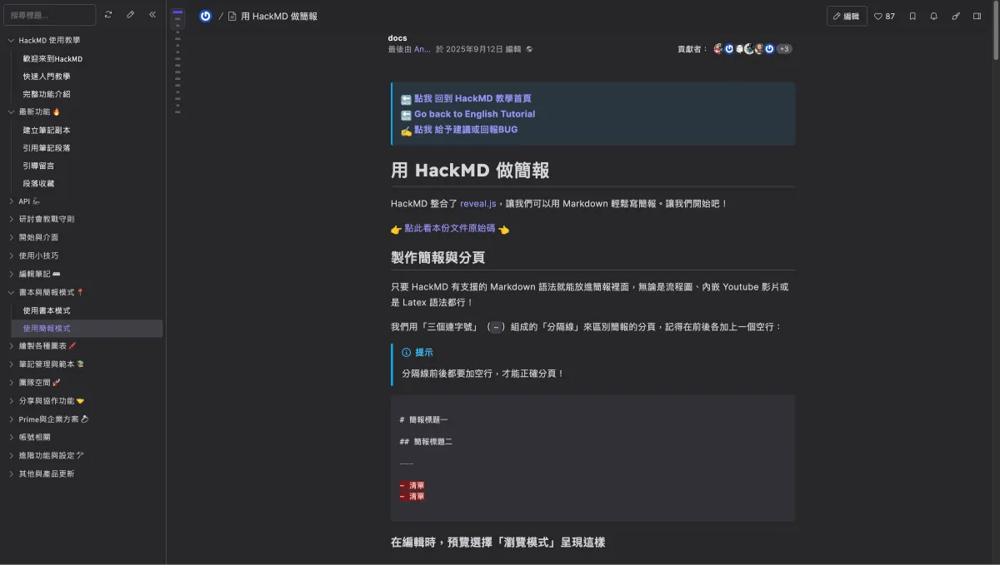

網站：<https://hackmd.io/c/tutorials-tw/%2Fs%2Fhow-to-create-slide-deck-tw>

雖然 HackMD 的預設樣式已經很不錯，不過我們可以寫 CSS 來自訂側邊欄的外觀。SITCON 學生計算機年會的 HackMD 共筆每年的側邊欄都會根據主題做一些裝飾，讓整個網站看起來更有特色。

以今年為例，身為 SITCON 的開發組成員今年有負責進行 HackMD 共筆的設計與開發，所以就來寫一篇文章分享一下我們是怎麼做的，以及一些裝飾的技巧。

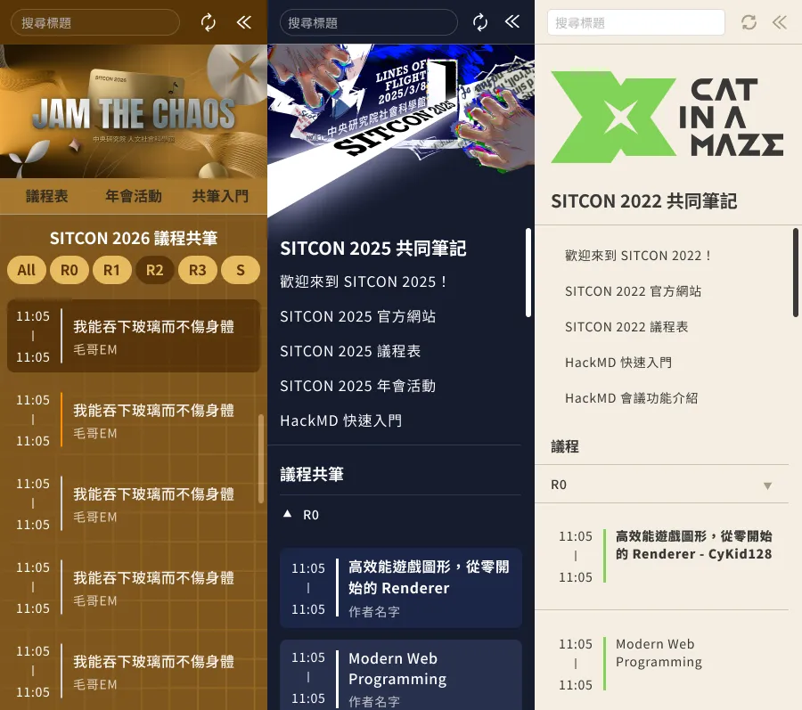

> [!NOTE]
>
> 什麼是共筆？
>
> 幫每個議程都開一份 HackMD 的共編文件，讓大家可以一起把這場議程的筆記整理上去。SITCON 學生計算機年會的共筆可以參考：[SITCON 2026](https://hackmd.io/@SITCON/2026/)、[SITCON 2025](https://hackmd.io/@SITCON/2025/)、[SITCON 2022](https://hackmd.io/@SITCON/2022/) 等等。

因為有 HackMD 自己的預設樣式所以並不是特別好編輯，因此這裡會介紹一些簡單的 CSS 技巧，以及提供一些靈感來幫助你裝飾 HackMD 書本模式的側邊欄。

## 如何使用 HackMD 書本模式

首先我們要先創一個筆記，這個筆記雖然看起來是筆記，但他其實是一個目錄頁面。這裡們新增一個頁面，添加一些想放的連結。

```markdown
# 書本模式範例

## SITCON

- [連結一](https://hackmd.io/@SITCON/H1l3jk7jkl)

- [連結二](https://hackmd.io/@SITCON/BkAJyZs9Wx)

## 毛哥EM

- [毛哥EM資訊密技](https://emtech.cc)
```

然後在右上角點選分享，並切換到「書本模式」。最後點擊預覽就可以查看書本模式的效果了。注意連結不要貼到編輯連結要貼預覽連結喔！

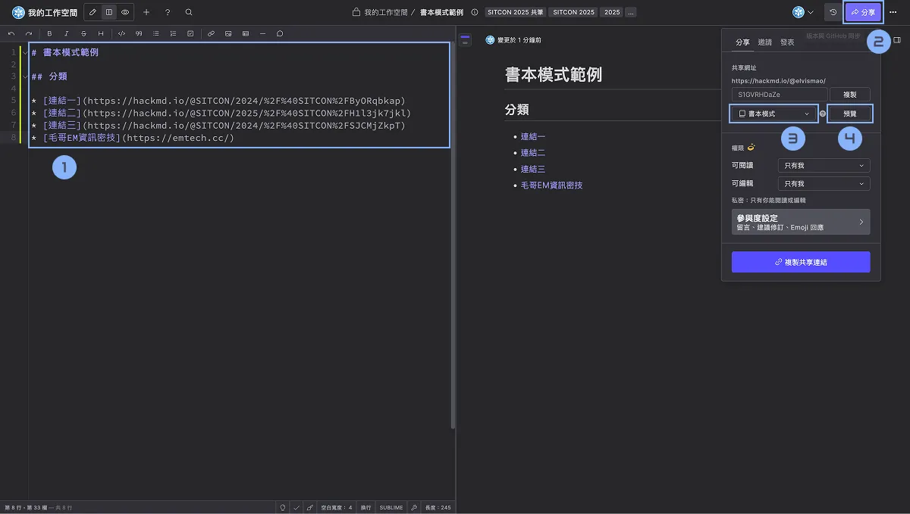

效果看起來長這樣，連結會被放在側邊欄，點擊連結就會在右邊的內容區域顯示對應的內容。你會發現他會把標題當作資料夾，把列表裡面的連結當作子項目，這樣就可以很方便地組織你的文件做出分頁的效果。

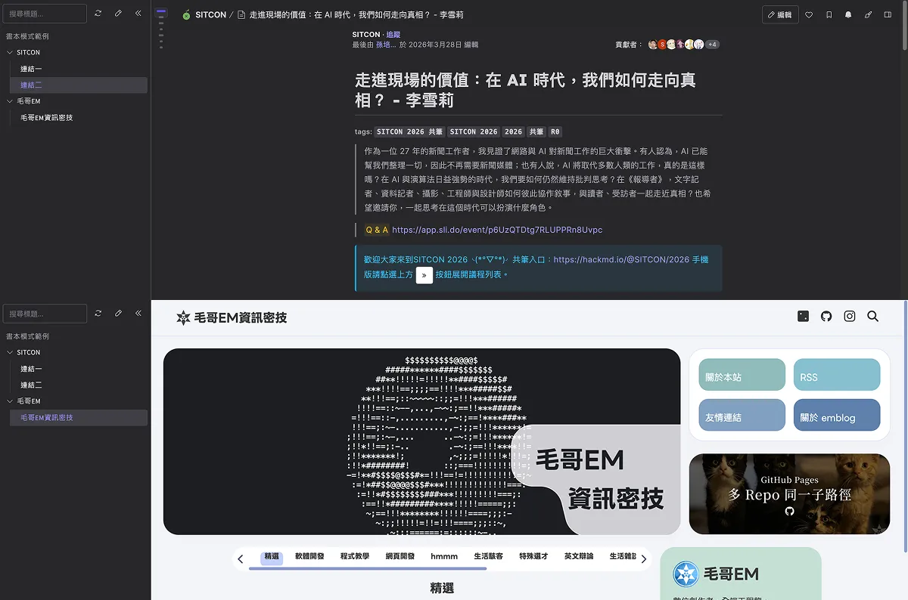

那麼我們就可以開始裝飾側邊欄了！

## 如何使用 CSS 裝飾側邊欄

那我們要怎麼寫 CSS 呢？直接寫一個 `<style>` 標籤放在筆記裡面就可以了。HackMD 會把這段 CSS 應用到整個頁面上。

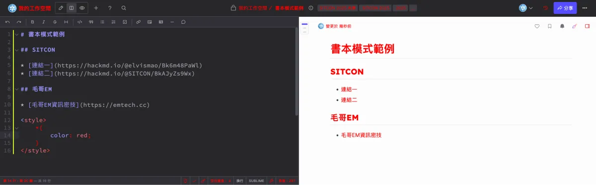

嗯對就是這麼暴力。所以我好像也不用多說什麼了，就是打開開發者工具看看 HackMD 的 HTML 結構，找到側邊欄的元素，然後寫 CSS 來修改他的樣式就好了。

## 裝飾技巧分享

那接下來我就來分享幾個裝飾的方法吧！

### 修改顏色

先來個基本的改顏色。需要注意一下 CSS 權重的問題喔！推薦可以使用 Firefox 的 Dev Tools 可以輕鬆 filter CSS 規則，找到 HackMD 把你的 CSS 規則覆蓋掉的原因。或是要直接使用 `!important` 來強制覆蓋 HackMD 的預設樣式。

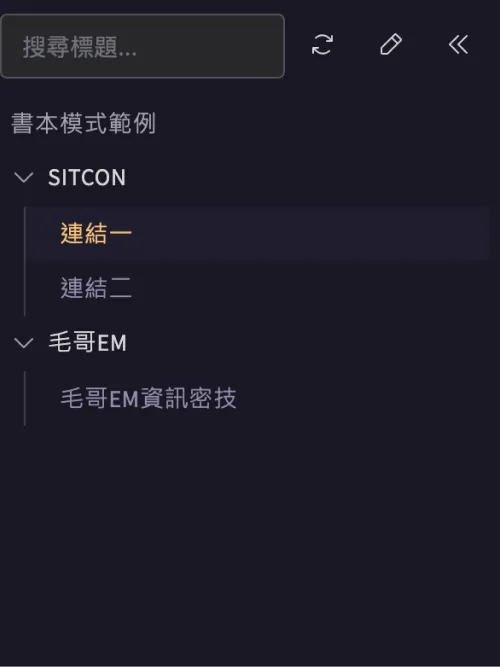

```css
.summary {
	background-color: #191724;
	color: #191724;
	font-size: 2rem;
	font-family: FusionPixelFont12px;
}

.summary .nav > li > a {
	color: #908caa;
}

.summary .nav-pills > li.active > a,
.summary .nav > li > a:focus,
.summary .nav > li > a:hover {
	background-color: #1f1d2e;
	color: #e0def4;
}

.summary .nav-pills > li.active > a:hover,
.summary .nav-pills > li.active > a:focus {
	background-color: #26233a;
	color: #f6c177;
}
```

### 修改字體

以前還可以在 CSS 寫字體 Import，但現在不行了。以 emfont 為例：

```css
@import url("https://font.emtech.cc/css/GenKiGothicTW");

.summary {
	font-family: GenKiGothicTW, sans-serif;
}
```

### 插入圖片

有兩種方式。如果你在中間直接添加圖片的話側邊欄會把它 filter 掉。但是如果他出現在超連結裡的顯示文字的話就會留著：

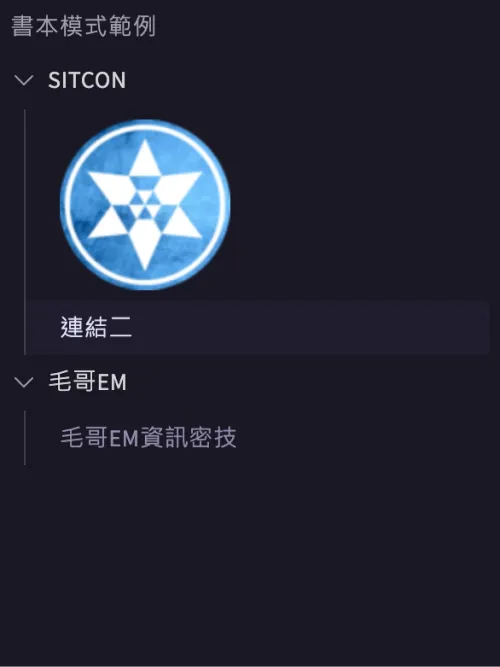

```markdown
- [連結一 ](https://hackmd.io/@elvismao/Bk6m48PaWl)
```

不過這樣位置就挺被限制住的。就像有的人喜歡偽娘勝過女生一樣，使用偽元素就更自由優雅了：

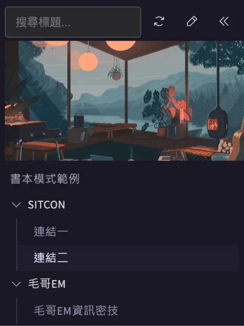

```css
.summary:before {
	content: "";
	display: block;
	width: 100%;
	aspect-ratio: 2 / 1;
	background-image: url("https://i.imgur.com/Wl2D0h0.webp");
	background-size: cover;
}
```

### 動畫

基本上作為一個側邊欄通常是不會有動畫的啦，不過是也可以。

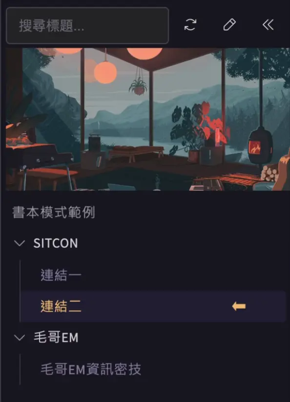

```css
.active::after {
	content: "⬅︎";
	position: absolute;
	right: 10%;
	top: 50%;
	transform: translate(0%, -60%);
	animation: point 0.5s alternate infinite linear;
	color: #f6c177;
	font-size: 24px;
}

@keyframes point {
	to {
		transform: translate(-100%, -60%);
	}
}
```

### 我可以插入哪些 HTML 元素？

好接下來是比較進階的了。我們可以使用的元素（至少一我測試下來）能使用的很多，這裡我測試了一下 HackMD 能使用的 HTML 元素來給你參考：

<https://hackmd.io/@elvismao/H1_hsuxuWl>

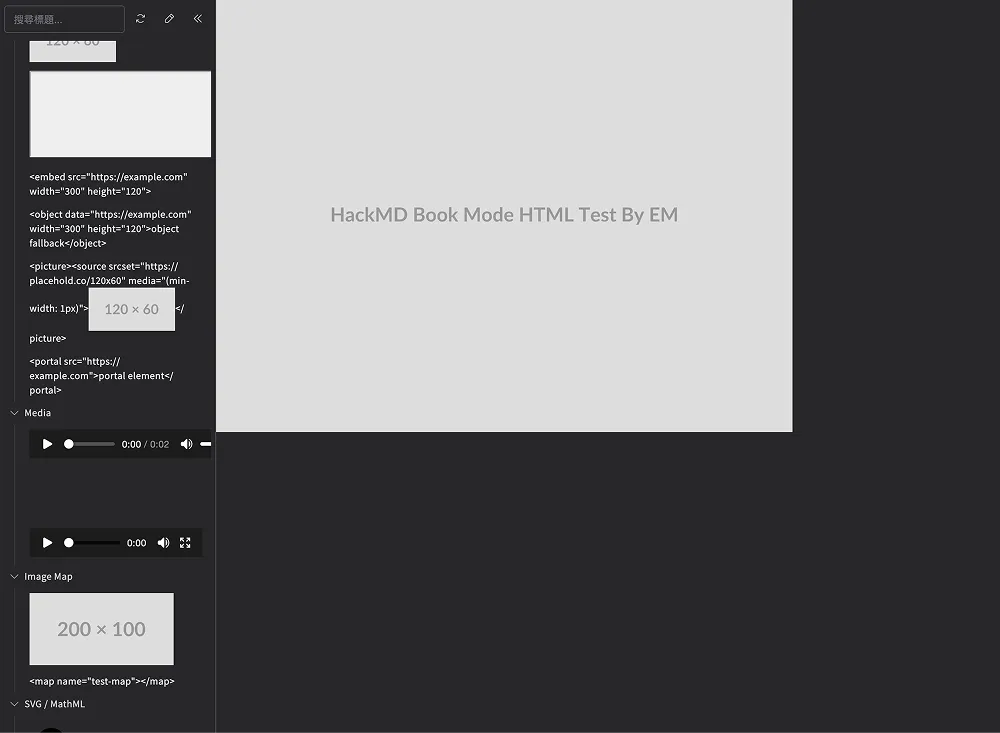

不過如果只是外觀樣式的話那我們用 `<div>` 然後 CSS 不就好了，所以我們希望做的是一些酷酷的互動效果。那麼有種兩操作：

### 使用 Checkbox

Checkbox 應該是 HackMD 裡面唯一可以用點擊來儲存狀態的 HTML 元素了。那麼我們就可以利用這個特性來做一些互動效果，比如說製作一個 Filter，顯示或隱藏某些連結。

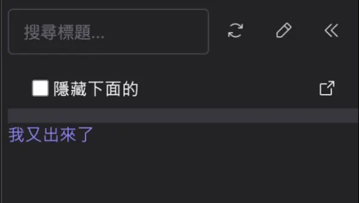

```markdown
- [<input type="checkbox"> 隱藏下面的](#)

- [<div class="filter">我又出來了</div>](https://example.com)

<style>
.summary .nav > li > a[href="#"]{
    pointer-event: none;
}

#summary:has(input:checked) .filter{
    display: none;
}
</style>
```

這裡的範例很簡單，你可使用 Label 來連結到 Checkbox，然後把勾選框隱藏掉就可以弄的更好看自由的排版了。

以上的範例在這裡：<https://hackmd.io/@elvismao/S1GVRHDaZe>

### 使用 iframe

我們可以乾脆直接放個 iframe 進去，甚至可以直接在裡面 alert 東西 prompt 東西。這裡我直接放個 CodePen 隨便找的 Flappy Bird 吧。

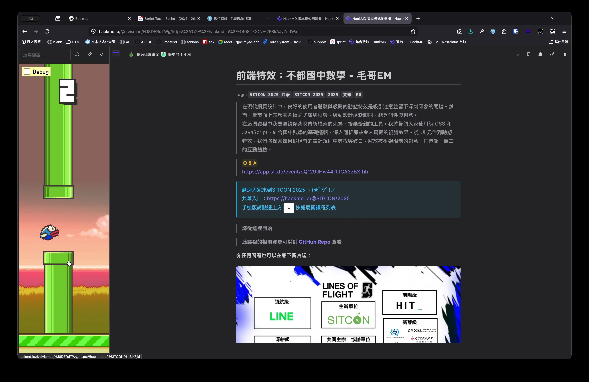

範例連結：<https://hackmd.io/@elvismao/HJ8DERdTWg/>

```markdown
- [<iframe src="https://codepen.io/Maseone/full/vYBdGP"></iframe>](https://hackmd.io/@SITCON/H1l3jk7jkl)

<style>
    #summary{
        margin-top: 0;
        padding-bottom: 0;
        
    }
    
    #summary, #summary ul, #summary li, .summary .nav > li > a{
        display: flex;
        align-item: stretch;
    }
    
    .summary .nav > li > a{
        padding: 0;
    }
    
    iframe{
        border: none;
        margin-top: -53px;
    }
</style>
```

### 自訂滾動條

也是單純簡單的 CSS：

```css
/* Chrome / Edge / Safari */
#summary > ul:last-of-type::-webkit-scrollbar {
	width: 6px;
}

#summary > ul:last-of-type::-webkit-scrollbar-track {
	background: transparent;
}

#summary > ul:last-of-type::-webkit-scrollbar-thumb {
	background-color: #b98f54;
	border-radius: 999px;
}

#summary > ul:last-of-type::-webkit-scrollbar-thumb:hover {
	background-color: #b98f54;
}
```

### 根據時間變化顏色

我們甚至可以做出 highlight 當前時段議程的效果。雖然我們不能直接在 HackMD 裡面寫 JavaScript 來獲取當前時間，不過我們可以用外部算好當前時間對應顏色，生成一張 1x1 的圖片，然後在 HackMD 裡面用 CSS 把這張圖片當作背景色來使用。這樣就可以根據時間變化顏色了。

簡單寫了一個 API，網址語法像這樣：

```ini
https://hackmd.sitcon.org/?s=12:00&e=20:00&d=D4D4D4&c=FF9000
```

Repo 在這裡：[sitcon-tw/2026-hackmd](https://github.com/sitcon-tw/2026-hackmd)。我是使用 Cloudflare Workers 來實作的。同時把所有項目都參數化這樣大家都可以使用也方便調整。

實際語法是先設定 CSS 變數來設定好時間抓圖片

```html
<a href="/4TlWoe2RQUmm-rBPavTROg" style='--a: url("https://hackmd.sitcon.org/?s=12:00&e=13:00&d=D4D4D4&c=FF9000")'></a>
```

然後再用 CSS 把這個圖片當作背景色來使用：

```css
#summary > ul:last-of-type a::after {
	content: "";
	display: block;
	width: 2px;
	background-image: var(--a);
}
```

## SITCON 2026 的 HackMD 共筆

今年 SITCON 2026 我的排版設計跟過往都不太一樣。覺得以往都是維持 HackMD 預設以會議廳作為分類不太優雅，希望篩選應該是可以放在最上面的，不然在下面的會議廳需要滾動很久。比較核心的語法是完全不用他的標題分類，連接都在最上面來最小化 HackMD 預設樣式的影響。

```html
<li>
	<a href="/4TlWoe2RQUmm-rBPavTROg" data-room="R0" style='--a: url("https://hackmd.sitcon.org/?s=12:00&e=13:00&d=D4D4D4&c=FF9000")'>
		<div class="time">
			12:45
			<br />
			|
			<br />
			13:25
		</div>
		<div class="title">
			<div>我能吞下玻璃而不傷身體</div>
			<div>
				毛哥EM
				<span>R0</span>
			</div>
		</div>
	</a>
</li>
```

底下就是一點點複雜的 CSS：

```css
#summary:has(.filter-container > div:nth-of-type(1) input:checked) > ul:last-of-type li:has(a[data-room="R0"]),
#summary:has(.filter-container > div:nth-of-type(2) input:checked) > ul:last-of-type li:has(a[data-room="R1"]),
#summary:has(.filter-container > div:nth-of-type(3) input:checked) > ul:last-of-type li:has(a[data-room="R2"]),
#summary:has(.filter-container > div:nth-of-type(4) input:checked) > ul:last-of-type li:has(a[data-room="R3"]),
#summary:has(.filter-container > div:nth-of-type(5) input:checked) > ul:last-of-type li:has(a[data-room="S"]),
#summary:not(:has(.filter-container input:checked)) > ul:last-of-type li {
	display: block;
}
```

同時還有使用上面的那些技巧進行裝飾。

原始碼可以參考：<https://hackmd.io/4jAeIIewROm9mJeARzVcaQ?both>

## 總結

不過 HackMD 書本模式真的是一個十分開放，讓我們可以發揮各種創意的好地方。同時因為平台以及預設樣式不可移除的關係，AI 不好進行協作，更加的考驗技術與創意。

希望這篇文章能給你一些靈感，讓你也能把 HackMD 的書本模式側邊欄裝飾得更好看。
