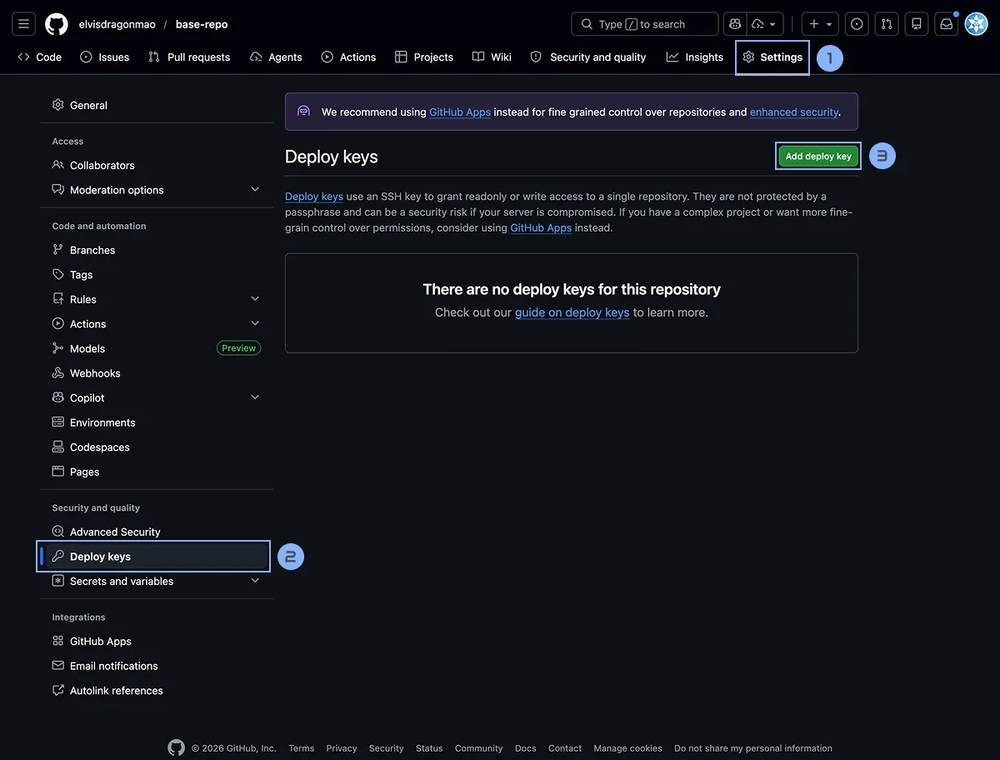
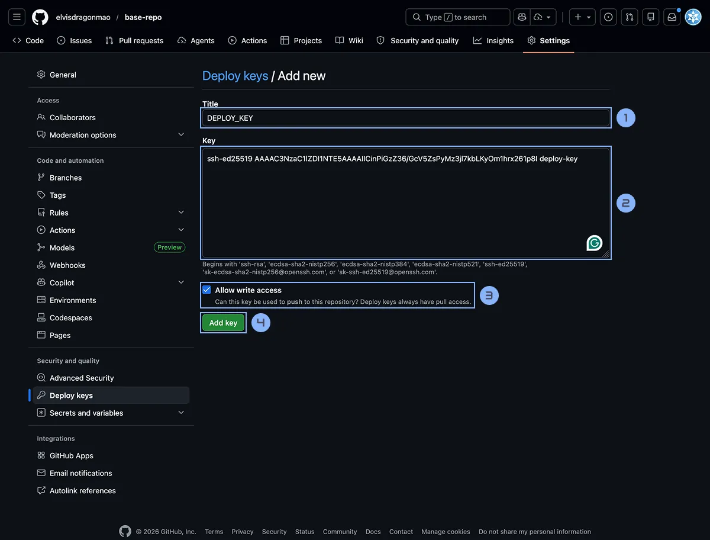
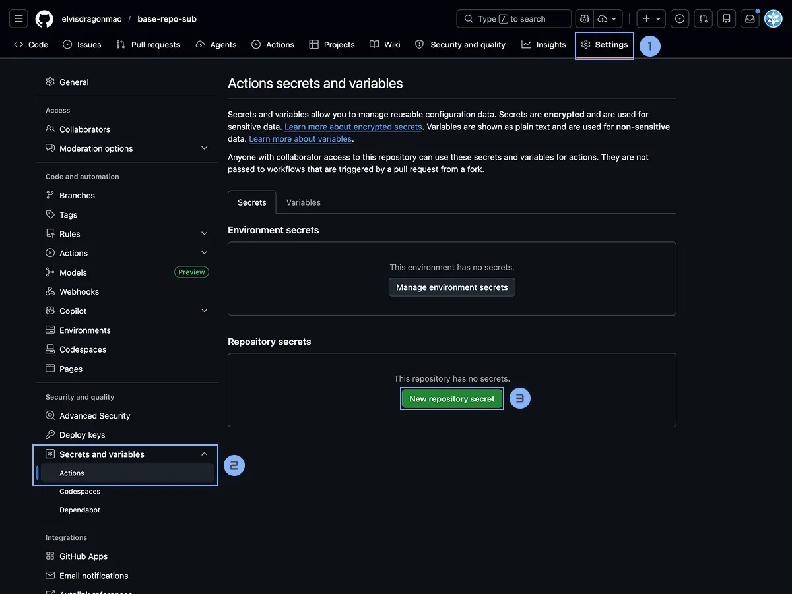
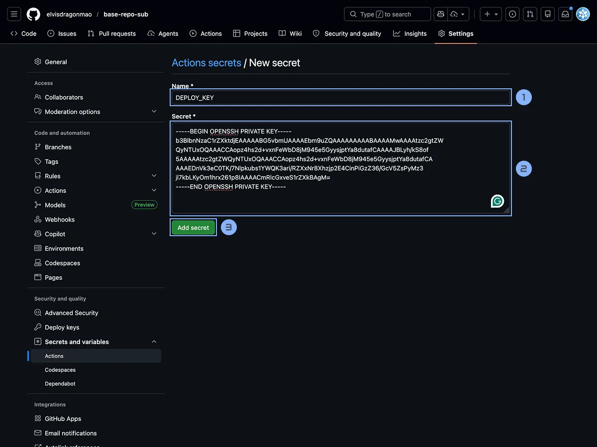
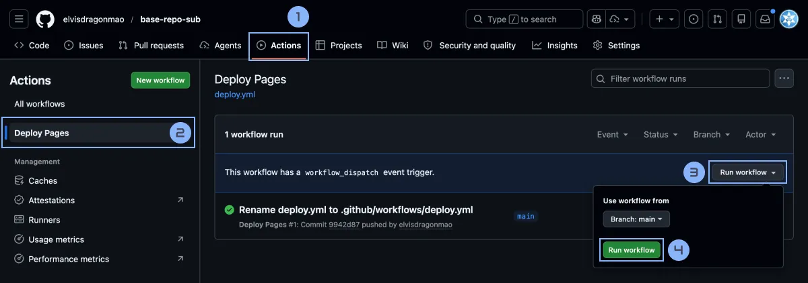

# 把 GitHub Pages 從 /repo 變成 /a/b：用多個 Repo 管理同一個網站的子路徑

GitHub Pages 讓我們可以輕鬆地把一個 Repo 變成一個網站。他支援以下兩種方式：

1. 建立一個名叫 `username.github.io` 的 Repo，然後把網站內容放在這個 Repo 裡面。這樣網站就會出現在 `https://username.github.io/`。
2. 把任意一個 Repo 設定成 GitHub Pages，然後把網站內容放在這個 Repo 裡面。這樣網站就會出現在 `https://username.github.io/repo/`。

但是在 SITCON 學生計算機年會的官網我們遇到了一個問題，我們每年都有很多子網站：

- `https://sitcon.org/2026/`：年會主網站 - Astro
- `https://sitcon.org/2026/cfp/`：徵稿網站 - Astro
- `https://sitcon.org/2026/cfs/`：贊助徵求書 - Astro
- `https://sitcon.org/2026/landing/`：工人召募頁面 - Next.js
- `https://sitcon.org/2026/closing/`：本來的閉幕動畫 - 原本只有 Vite 變成 Astro

這些網頁都是完全不同的架構與設計，甚至是使用的框架都不一樣。混在一起管理會非常麻煩，每次 clone 跟部署都會很久（尤其是官網有一堆生成縮圖的步驟），權限管理跟卡片管理也很痛苦。

但是 GitHub Pages 的限制讓我們只能把網站放在 `/repo/` 這樣的子路徑裡面，無法直接放在 `/a/b/` 這樣的子路徑裡面。那我們要怎麼辦呢？

## 步驟一：創建 /a Repo

這裡我創建了一個 Repo 叫做 [`base-repo`](https://github.com/elvisdragonmao/base-repo)，然後放一個簡單的 HTML 網頁在裡面。這個 Repo 就是我們要放在 `/a/` 這個子路徑裡面的網站內容了。

`dist/index.html`：

```html
<!doctype html>
<html>
	<head>
		<meta charset="UTF-8" />
		<meta name="viewport" content="width=device-width, initial-scale=1.0" />
		<title>父頁面</title>
	</head>
	<body>
		<h1>父頁面</h1>
	</body>
</html>
```

## 步驟二：創建 /a/b Repo

接著我們再開一個 Repo 叫做 [`base-repo-sub`](https://github.com/elvisdragonmao/base-repo-sub)，這個 Repo 就是我們要放在 `/a/b/` 這個子路徑裡面的網站內容了。在裡面我也放點 HTML。

```html
<!doctype html>
<html>
	<head>
		<meta charset="UTF-8" />
		<meta name="viewport" content="width=device-width, initial-scale=1.0" />
		<title>子頁面</title>
	</head>
	<body style="background-color: black; color: white;">
		<h1>子頁面</h1>
	</body>
</html>
```

## 步驟三：設定 GitHub Actions

猜到了嗎？我們可以利用 GitHub Actions 來自動把 `base-repo-sub` 的內容部署到 `base-repo` 這個 Repo 的 `/sub/` 路徑下。這樣我們就可以在 `base-repo` Repo 裡面管理所有的子網站了。

因為我們在 Repo `base-repo` 也是有自己的網頁內容，所以我在 `base-repo` 這個 Repo 底下建立了一個叫做 `gh-pages` 的 branch，專門用來放置從其他 Repo 部署過來的子網站內容。這樣我們就可以在 `base-repo` 這個 Repo 裡面管理所有的子網站了。

請你載 `base-repo-sub` 這個 Repo 裡面建立一個 `.github/workflows/deploy.yml` 的檔案，然後把以下的內容貼上去：

```yml
name: Deploy Pages

on:
  push:
    branches: [main]
  workflow_dispatch:

jobs:
  build-and-deploy:
    runs-on: ubuntu-latest
    steps:
      - name: Checkout repo
        uses: actions/checkout@v5

      # 如果你需要的話：
      # - name: Setup pnpm
      #   uses: pnpm/action-setup@v5

      # - name: Setup Node.js
      #   uses: actions/setup-node@v6
      #   with:
      #     node-version: 22
      #     cache: "pnpm"

      # - name: Install dependencies
      #   run: pnpm install --frozen-lockfile

      # - name: Install & Build
      #   run: pnpm build

      - name: Deploy to main repo
        uses: peaceiris/actions-gh-pages@v4
        with:
          deploy_key: ${{ secrets.DEPLOY_KEY }}
          external_repository: elvisdragonmao/base-repo
          publish_branch: gh-pages
          publish_dir: ./ # 或是 ./dist
          destination_dir: sub # 這裡是你想要部署到的子路徑
```

> 如果你的網站需要 build 的話，你可以把上面註解掉的部分打開，然後根據你的專案需求來修改安裝跟 build 的步驟。

## 步驟四：設定 Deploy Key

不過這樣 push 上去會跑失敗，因為 GitHub Actions 內建提供的 `GITHUB_TOKEN` 是沒有權限去操作其他 Repo 的，所以我們需要自己產生一個 `base-repo` 的 Deploy Key，然後把這個 Deploy Key 加到 `base-repo-sub` 這個 Repo 的環境變數裡面。

### 生成 Deploy Key

請你先在你的電腦上使用以下的指令來生成一個新的 SSH Key，或是你也可以使用線上的生成器：[8gwifi.org/sshfunctions.jsp](https://8gwifi.org/sshfunctions.jsp)。

```bash
ssh-keygen -t ed25519 -C "deploy-key" -f deploy_key
```

當他問你 `Enter passphrase for "deploy_key"` 直接按 enter 保持空白即可。接著你會發現你在當前的目錄創建了 兩個檔案：`deploy_key`（私鑰）和 `deploy_key.pub`（公鑰）。

### 把 Deploy Key 加到 `base-repo` Repo

接著你要把剛剛生成的 Deploy Key 的公鑰（`deploy_key.pub`）加到 `base-repo` 這個 Repo 的 Deploy Key 裡面，並且給它寫入權限。

進到 Settings -> Deploy Keys -> Add deploy key，然後把 `deploy_key.pub` 的內容貼上去，勾選 `Allow write access`，最後按下 `Add key` 就完成了。 

記得要勾選 Allow write access，這樣這個 Deploy Key 才有權限去操作 `base-repo` 這個 Repo。



### 把 Deploy Key 加到 GitHub Actions 的 Secrets 裡面

最後你要把剛剛生成的 Deploy Key 的私鑰（`deploy_key`）的內容複製到 `base-repo-sub` 這個 Repo 的 GitHub Actions 的 Secrets 裡面，命名為 `DEPLOY_KEY`。



進到 `base-repo-sub` Repo 的 Settings -> Secrets and variables -> Actions -> New repository secret，然後把 `deploy_key` 的內容貼上去，名字填 `DEPLOY_KEY`，最後按下 `Add secret` 就完成了。



這樣你就完成了設定，當你 push 你的 `base-repo-sub` Repo 的 `main` branch 的時候，GitHub Actions 就會自動把 `base-repo-sub` Repo 的內容部署到 `base-repo` Repo 的 `/sub/` 路徑下囉！

[開啟部署後的 `/sub/` 範例頁](https://elvisdragonmao.github.io/base-repo/sub/)

### 重新執行 GitHub Actions

如果你剛才是先設定 GitHub Actions 的話，你需要回到 `base-repo-sub` 這個 Repo 的 Actions 頁面，然後手動重新執行剛剛的 Workflow，這樣他才會使用到你剛剛設定的 Deploy Key。



## 步驟五：部署主網站

最後如果你想要把 `base-repo` 這個 Repo 的內容也部署到 GitHub Pages 上的話，你可以在 `base-repo` 這個 Repo 裡面建立一個 `.github/workflows/deploy.yml` 的檔案，然後把以下的內容貼上去：

```yml
name: Deploy Pages

on:
  push:
    branches:
      - main
  workflow_dispatch:

permissions:
  contents: write
  pages: write
  id-token: write
  actions: write

jobs:
  build-and-deploy:
    runs-on: ubuntu-latest
    steps:
      - name: Checkout repo
        uses: actions/checkout@v5

      - name: Deploy into gh-pages
        run: |
          git fetch origin gh-pages || true
          git worktree add ../gh-pages gh-pages || git checkout --orphan gh-pages

          # 清空你不需要的舊檔案
          rm -rf ../gh-pages/_astro ../gh-pages/_next

          # 複製新的網頁
          cp -r dist/* ../gh-pages/ # 根據你的需求調整資料夾

          cd ../gh-pages
          git add .
          git config user.name "github-actions[bot]"
          git config user.email "github-actions[bot]@users.noreply.github.com"
          git commit -m "chore: Deploy main site" || echo "No changes to commit"
          git push origin gh-pages
```

哇賽這裡怎麼就變得這麼麻煩得手動操作 Git 了？原因是因為如果我們直接用 `peaceiris/actions-gh-pages` 這個 Action 的話，因為我們首頁在根目錄，所以會把所有東西全部都清掉（包涵 `/sub/` 這個子路徑裡面的內容）。但是我們只有想要清掉首頁主 Repo 裡面不需要的檔案而已，所以我們就只能自己寫腳本來操作 Git，把我們需要的檔案複製過去，然後 commit 跟 push 上去。

記得要自己調整裡面 Build 的指令以及要傳的資料夾喔！

> [!NOTE] Worktree 是什麼
>
> Worktree 是 Git 內建功能幫你複製貼上整個 Repo 資料夾（但是共用 .git）讓你可以編輯兩個 branch，方便我們搬檔案到另一個 branch。

## 總結

其實在 [SITCON 2026 的 Repo](https://github.com/sitcon-tw/2026) 你可以看到我把事情搞得比較複雜。像是我是搬到 `build` 這個 branch 裡面，部署還用自己寫 GitHub Actions 而不是 Deploy From Branch 所以多寫了很多複雜的東西。記得當時研究這個也是花了好多時間，不過後來在進行各專案的開發時候就非常方便了。每個網站開始時也可以重新決定要使用哪個框架，網頁架構要怎麼寫，要用哪個套件。輕量又好管理。
