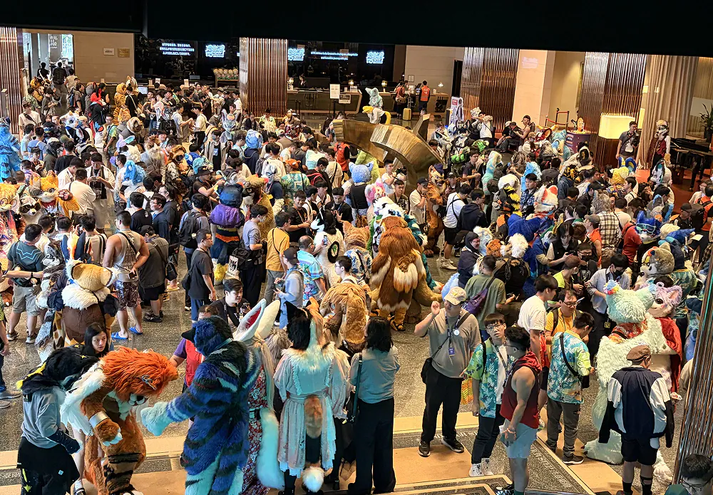
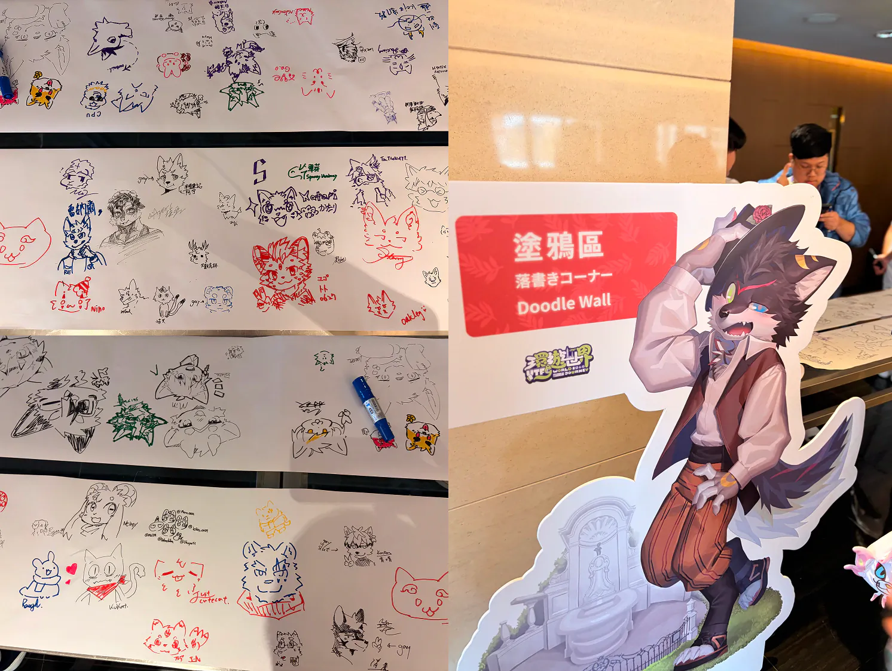
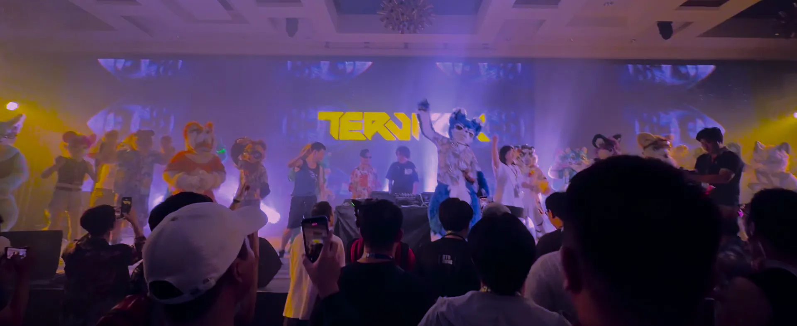
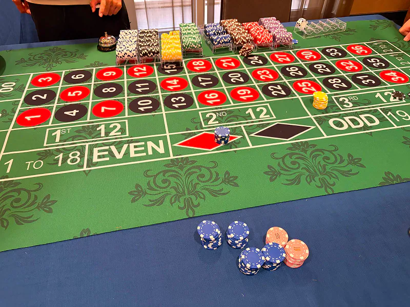

# UTFG 2026 心得：人生第一場獸聚

這是我從國二到現在要大二，六年以來第一次參加獸聚。

> [!NOTE]
>
> ## 什麼是獸迷文化？
>
> 延伸閱讀：[甚麼是獸迷文化 (Furry)？認識不獸控制的獸圈](https://emtech.cc/p/furry-intro/)

這六年裡，人生發生了很多轉折。很多事情不是我當時有能力理解的，也不是我能夠好好承受的。一路上有離別、有孤單、有壓力，也有很多只能自己吞下去、一個人走過的時候。

是這個圈子讓我知道，世界上還是有可愛的東西。  
還是有溫柔的人。  
還是有值得期待的相遇。  
還是有一些光，會在我快要忘記怎麼快樂的時候，默默亮著。

所以這次 UTFG 對我來說，不只是第一次參加活動而已。更像是我終於走進了那個陪我長大的世界。

這次我見到了很多一路上在網路另一端陪著我走過來的人。也許只是曾經偶爾互動過的朋友，也許是其實根本不記得我的毛毛，也許是我仰慕很久很久的繪師。

但對我來說，見到大家的感覺不只是「終於見到偶像了」，而是一群在我最難過的時候，曾經用作品、文字、角色、互動，甚至只是存在本身，默默救過我的人。

走進會場、看到大廳的毛毛時真的像夢一樣。明明是第一次在現實中見到，卻又覺得每一個身影都那麼熟悉。

那種感覺很奇妙。  
像是心裡缺很久的一塊拼圖，突然被補上了。  
也像是腦中那些原本只存在於螢幕裡的 2D 角色，終於在現實中被完整建模、被賦予重量、溫度和生命。

我原本以為自己是個大 E 人，結果一開始竟然完全不知所措。比跟教授面試還可怕。

我可以過去找他拍照嗎？  
我應該說什麼？  
我會不會做錯什麼？

但後來我才發現，大家都比我想像中還要可愛、還要親近、還要溫柔。

超愛每一位主動抱上來的毛毛。即使只是短短幾分鐘的互動，也能很深地感覺到，每一套毛裝背後都有一個可愛、獨特，而且很努力把愛分享給大家的靈魂。

喔然後我以前真的沒想過吸毛會是真的從空氣中吸到一堆毛（

還有一件我沒想到的事情是，毛毛身上的風扇聲，竟然會讓我覺得很溫馨、很平靜。原因是因為我平常很常待在有伺服器機櫃、機器風扇聲很吵地方，所以當我聽到那些聲音的時候，反而有一種很奇怪的安心感。

一點都不吵。反而像是回到家一樣。  
像是聽見每一隻毛毛靈魂裡小小的心跳。

> 看其他遊客帶著小孩困惑的經過大廳 Check-in 真有趣w

## UTFG 活動

這次 UTFG 的活動內容也真的非常棒。從報到櫃檯工作人員穿著超好看的機組人員背心時，魔法就開始了。

超棒的議程軌、超好玩的主題活動、讓我從 10 一路堵到 250 的主題活動，還有身為乖學生第一次參加這麼嗨的 DJ Party。還有讓我意識到自己其實比想像中保守很多的毛裝未滿，以及各種超棒的表演。

### 拉斯維加斯

其中一個主題活動（大地遊戲）叫做拉斯維加斯，而拉斯維加斯，當然裡面就是賭博。

進去可以拿 10 枚籌碼，然後可以去玩各種賭博遊戲。有德州撲克、搖骰子、輪盤等等。離開如果有 100 枚可以得到最高的大地遊戲點數獎勵。破產 20 分鐘之後可以重新拿籌碼。

我發現我並不喜歡賭博，要一直做明知道期望值是負的的事情很痛苦。不過為了拿到點數我還是算了一下機率，第一局就都先 All in，破產幾次之後拿了 250 籌碼走。

我也很喜歡活動中出現的那些小插曲。不管是表演中的突發狀況，還是系統上的小 Bug，甚至是訊號干擾我反而都覺得很可愛（不對沒有，訊號干擾很可惡）。因為實在太真實了，都是辦活動年會時遇過的爛問題。

不過大家的熱情也沒有因此下降，反而讓整場活動變得更有生命力。那些不完美，讓這場活動更加完美。

也要特別感謝半夜被我莫名其妙打擾聽我胡鬧的大助、橙色、PT、普洱，真的很抱歉也很謝謝你們。

也超級感謝願意臨時收留照顧我的 [Riley](https://github.com/rileychh/)、[Chris](https://github.com/chris1004tw)、跟[白龍](https://whitedragon.life/)。

--

活動結束後的晚上，我第一次真正體會到什麼叫做場後憂鬱。

一開始我只是坐在旅館對面的星巴克工作，卻突然覺得很焦慮、身體很不舒服。後來越想越難過。

魔法結束了。而我又要回去讀書、工作、處理各種生活爛事。一邊寫程式一邊在心裡咒罵資本主義。

那天晚上還有一場很大的社團聚會。平常的我應該會很自然地去社交，但那天我第一次因為看到太多人而感到害怕。怎麼都是人類。我只想自己在旁邊吃飯。

後來[蓋蓋](https://skyhong.tw/)跟我說，他完全懂那種感覺。就像每次打完一款很長、很投入的遊戲之後，你和遊戲裡的角色一起走過了一百個小時，你知道他們的故事、知道他們的個性、知道他們經歷過什麼。他們就像真的陪你生活過的朋友。

可是當結局結束之後，畫面暗下來，只剩下你一個人。

你知道一切都結束了。
你也知道，自己再也不會有第一次見到他們時的那種感動了。

所以你只能不斷重播 OST，不斷重看結局，想要再靠近一點那個曾經讓你那麼感動的世界。

但也很謝謝晚上一起吃飯的朋友們，慢慢把我從那種情緒裡拉出來。

這次活動讓我發現，我已經好久沒有真正放鬆了。好久沒有真正把工作、壓力、責任那些沈重的東西放下，好好地玩，好好地笑。我才發現，原來真正開心到露齒笑的我，比平常那種習慣性的禮貌微笑可愛多了。

所以，真的很謝謝 UTFG。  
謝謝所有工作人員。  
謝謝所有毛毛。  
謝謝所有朋友們。  
謝謝你們帶我一起搭上這班航班，完成這趟環遊世界的旅程。

對很多人來說，這也許只是一年當中的其中一場定期聚。  
但對我來說，這是我等了六年，終於透過~~我糟糕的理財觀念~~抵達的一個地方。