# CSS 教學：從入門到精通

上次我們談到了網頁的基本原理，以及怎麼寫 HTML。我們說到一個網頁通常是由 HTML、CSS 和 JavaScript 所組成。HTML 是骨架、CSS 是用來裝飾、而 JavaScript 可以讓他動起來。而今天我們就要來談談 CSS。

## 環境建設

首先你可以使用 VS Code 打開上禮拜的資料夾，或是創建一個新的。

> macOS 快捷鍵：`Ctrl` + `O` Windows: `Ctrl+K` 然後按 `Ctrl+O`


一樣創一個 HTML 檔，然後點擊 `!`、`Tab` 。


請你先創建一個 `<h1>` 標題，並建立一個元素叫做 `<style>`

```html
<!doctype html>
<html lang="en">
	<head>
		<meta charset="UTF-8" />
		<meta name="viewport" content="width=device-width, initial-scale=1.0" />
		<title>Document</title>
	</head>
	<body>
		<h1>我是標題</h1>
		<style></style>
	</body>
</html>
```

等一下我們的 CSS 就寫在 `<style>` 之間。準備好了嗎？點擊右下角的 Go Live 來開啟瀏覽器開始寫 CSS 吧！

{{notice}}

### 小提示

建議你可以把 VS Code 放螢幕左側（ `Windows` + `←` / Mac: `🌐` + `⌃` + `←` )，瀏覽器放右邊

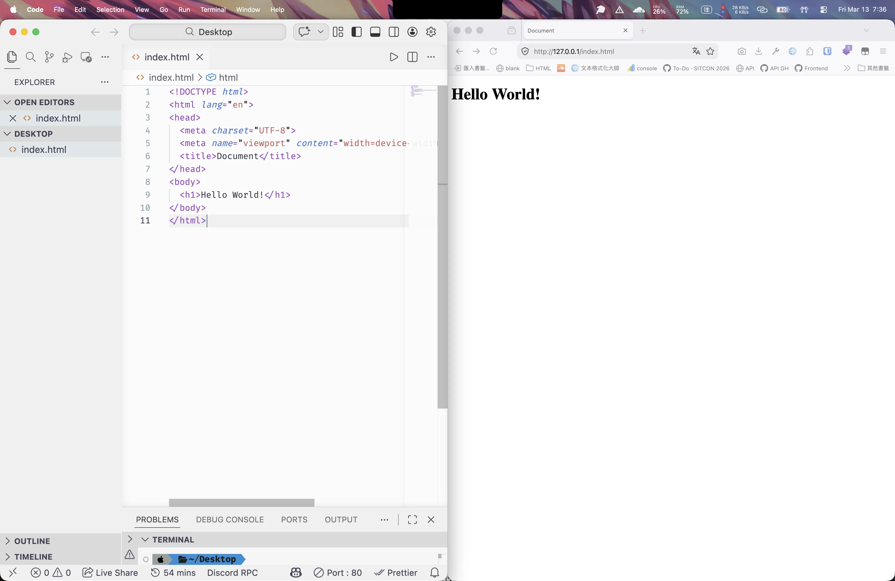

{{noticed}}

## 簡單的 CSS

如果你想讓這個標題變成藍色的話你可以這樣打 CSS：

```css
h1 {
	color: blue;
}
```

這樣就可以了，你可以試試看改成其他顏色，例如紅色、綠色、黃色等等。或是你把滑鼠放上去你會發現你可以直接選顏色。

我們來看一下 CSS 的結構。h1 是選擇器，代表我們要選擇要改的元素，而 color 是屬性，代表…我們要改變的屬性。blue 是屬性質，代表我們要改成的值。

```css
選擇器 {
	屬性: 屬性值;
}
```

## 選擇器

選擇器有很多種，我們來看一下最常用的幾種。

- ID 選擇器：比如說 `` 可以用 `#logo` 來選擇
- 元素選擇器：比如說`h1`就是選擇所有的 `<h1>` 元素
- 後代選擇器：比如說 `nav a`就是選擇所有 `<nav>` 裡面的 `<a>` 元素
- 親代選擇器：比如說 `ol > li` 就是選擇所有 `<ol>` 裡面的 `<li>` 元素。而如果是 `<ol>` 裡的 `<li>` 裡的 `<li>` 就不會被選到。
- 群組選擇器：比如說 `nav, a`就是選擇所有 `<nav>` 還有 `<a>`。
- 相鄰兄弟：比如說 `h1 + p`就是選擇 `<h1>` 正後方的那一個 `<p>` 元素
- 一般兄弟：比如說 `h1 ~ p`就是選擇 `<h1>` 後面的所有 `<p>` 元素
- 屬性選擇器：比如說 `a[href="https://x.com"]`就是選擇所有連結到 X 首頁的 a 元素
  - 屬性網址包含某字是使用星號：`a[href*="tuts"]` (比如說 [nettuts.com](http://nettuts.com/)、[net.tutsplus.com](http://net.tutsplus.com/)、[tutsplus.com](http://tutsplus.com/))
  - 屬性開頭是使用上箭頭 caret 符號：`a[href^="http"]`
  - 屬性結尾是使用錢符號：`[href$=".webp"]`

### 權重

當有兩行 CSS 指令是在描述同一個元素，那們瀏覽器要聽誰的呢？這個時候我們就會看權重。有兩個規則。

#### 權重越高，就越有權力

> 你女朋友說你很醜，早餐店阿姨說你是帥哥，那麼你應該很醜，因為女朋友永遠是對的，權重比較重。

權重從高到低分別是：

- ID 選擇器
- 類別選擇器、屬性選擇器、偽類選擇器 (如：`root`)
- 元素選擇器、偽元素選擇器
- 任何元素選擇符沒有權級

記得是可以相加的喔，這裡有一個[計算機](https://specificity.keegan.st/)可以玩玩看，你的 Visual Studio Code 也會提示。\

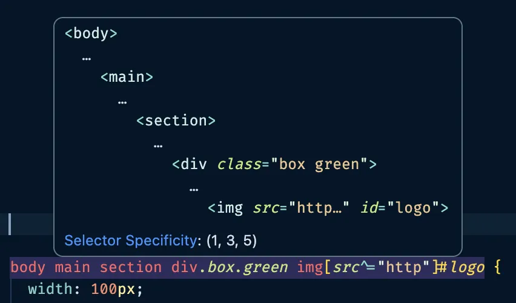

如果你想要強迫讓你的樣式宣告比較有權力，你可以使用`!important` 驚嘆號尖叫。是這個方法不是很好，因為到最後你很有可能會所有地方都在尖叫，除了程式很吵很亂以外你會更難再蓋過去。但是如果真的沒辦法讓你的樣式權重更高的話，你可以考慮使用這個方法。

#### 權重如果相等，後寫的樣式宣告會蓋過先前的樣式宣告

就像你女朋友在剛交往時說她很愛你，但是後來你變得很醜，所以她就不愛你了。那麼他不愛你了，因為要以後面的為主。

## 各種單位

接下來我們來看一下各種單位。CSS 有很多種單位，我們來看一下常見的幾種。

### 顏色

今天假設你想表示紅色，你可以使用以下幾種方式，都是一樣的效果：

```css
h1 {
	color: red; /* 顏色名稱 */
	color: #ff0000; /* 16 進位 HEX 碼 */
	color: rgb(255, 0, 0);
	color: rgba(255, 0, 0, 1); /* RBG 加上 A 透明度 */
	color: hsl(0, 100%, 50%); /* HSL 分別代表色相、飽和度、亮度 */
	color: hsla(0, 100%, 50%, 1); /* HSL 加上 A 透明度 */
	color: color(display-p3 1 0 0 / 1); /* 使用 color 可以顯示 RGB 不能表示的顏色 */
}
```

最常見就是使用 Hex 碼，可以從設計圖中直接複製。

### 大小

接下來是大小單位

```css
h1 {
	font-size: 100px; /* px 是像素 */
	font-size: 10rem; /* rem 是相對於根元素的字體大小 */
	font-size: 10em; /* em 是相對於父元素的字體大小 */
	font-size: 10vw; /* 10vw 是相對於螢幕寬度 10% */
	font-size: 10vh; /* 10vh 是相對於螢幕高度的 10% */
	font-size: 10vmin; /* vmin 是相對於螢幕寬度和高度比較小的百分比 */
	font-size: 10vmax; /* vmax 是相對於螢幕寬度和高度比較大的百分比 */
	font-size: 10%;
}
```

百分比在不同時候的意思不太一樣，但原則上就是你想的那樣...

- width 跟 height 的%基準是父層
- line-height 以本身文字行高為基準

接下來我們來有效率的一次認識所有常用的 CSS 語法吧

## 文字裝飾

語法直接全上！

```css
h1 {
	color: red; /* 顏色 */
	font-size: 32px; /* 字體大小 */
	letter-spacing: 10px; /* 字體間距 */
	line-height: 1.5; /* 行高，通常會用數字代表正常高的倍數 */
	font-weight: 500; /* 字體粗細，數字最大 1000，越大越重，預設 400 */
	text-decoration: underline; /* 底線，最長是用 none 來把超連結醜醜的底線移除 */
	font-style: italic; /* 斜體 */
	opacity: 0.5; /*不透明度*/
	text-align: center; /*文字對齊方向*/
	font-family: arial, sans-serif; /*字體，如果第一個沒有就依序往後*/
}
```

### font-weight

font-weight 是字體粗細，有以下幾種寫法，不過還是最常用數字。

```css
/* 關鍵字 */
font-weight: normal;
font-weight: bold;

/* 比較級關鍵字 */
font-weight: lighter;
font-weight: bolder;

/* 絕對的數值 */
font-weight: 100;
font-weight: 400; /* 正常 */
font-weight: 700; /* 粗 */
font-weight: 900;
```

### text-decoration

text-decoration 是裝飾文字，有以下幾種寫法：

```css
text-decoration: underline; /* 底線 */
text-decoration: overline red; /* 上線並且是紅色 */
text-decoration: none; /* 沒有裝飾 */
text-decoration-color: #ff00ff; /* 裝飾的顏色 */
```

## 背景

### background-color 背景顏色

background-color 是背景顏色。

```css
background-color: #ff0000;
```

### Width / Height

我們把它用在一個 `div` 看看，我們先指定他的寬高然後設定背景顏色：

```html
<div></div>
```

```css
div {
	background-color: burlywood;
	width: 200px;
	height: 200px;
}
```

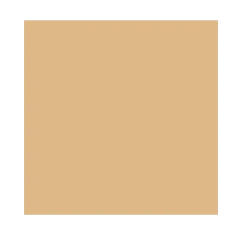

### background-image 背景圖片

background-image 是背景圖片，可以用 url() 來指定圖片位置。連結可以是相對位置或是絕對位置。

> 複習：[相對路徑與絕對路徑](https://www.notion.so/3247dadd8040807d88adee7ae363141e?pvs=21)

```css
background-image: url("vscode-browser-layout.webp");
background-repeat: no-repeat;
background-size: cover; /* 寬填滿 */
background-size: contain; /* 高填滿 */

background-position: top left;
background-position: 20% 40%; /* 從左上開始算 */

background-attachment: scroll; /* 不動但可以往下滾 */
background-attachment: fixed; /* 卡住不動 */
background-attachment: local; /* 一起動 */

/* 縮寫 */
background: no-repeat url("vscode-browser-layout.webp");
```

> background 是上面所有東西的縮寫，語法可以參考：[MDN](https://developer.mozilla.org/zh-CN/docs/Web/CSS/Reference/Properties/background)。

### gradient 漸層

語法可以直接寫多個顏色，在空白後寫佔的比例。

```css
background: linear-gradient(#333, #333 50%, #eee 75%, #333 75%);
```

這個比例可能跟你想像的不太一漾，漸層開始的位置是 0%，漸層結束的地方是 100%。你寫的百分比代表你寫的位置的顏色，顏色間會自動平分，如果沒有寫就會自動平分。

前面可以加入關鍵字表示漸層方向。12 點是 0 度，順時針旋轉前進。

```css
background: linear-gradient(#e66465, #9198e5);
background: linear-gradient(0.25turn, #3f87a6, #ebf8e1, #f69d3c);
background: linear-gradient(217deg, rgba(255, 0, 0, 0.8), rgba(255, 0, 0, 0) 70.71%);
```

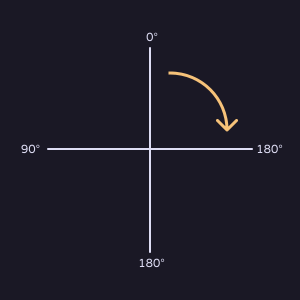

除了 `linear-gradient` 線性漸層以外還有圓形裡到外的漸層 `radial-gradient` 和旋轉放射漸 `conic-gradient`。詳細用法可以參考：[MDN](https://developer.mozilla.org/en-US/docs/Web/CSS/Guides/Images/Using_gradients)

## border 邊框

可以個別指定或是使用 border 一次指定所有的：

```css
border-top: solid 10px red;
border-bottom: solid 10px red;
border-left: solid 10px red;
border-right: solid 10px red;

border-style: solid; /* 花邊，Solid 是預設的直線 */
border-width: 10px; /* 寬度 */
border-color: #00ff00; /*邊框顏色 */
border: solid 10px red; /* 縮寫，四邊都紅色的 */
```

## border-radius 圓角

單位可以是半徑或著是百分比。如果有兩格值就是上下和左右，四個就是上右下左。

```css
border-radius: 50%;
border-radius: 16px;

border-radius: 四個角;
border-radius: 左上右下 右上左下;
border-radius: 左上 右上 右下 左下;
border-top-left-radius: 10%;
```

例如：

```html
<div></div>
```

```css
div {
	background-color: burlywood;
	width: 200px;
	height: 200px;
	border-radius: 16px;
	margin: 5rem;
}
```

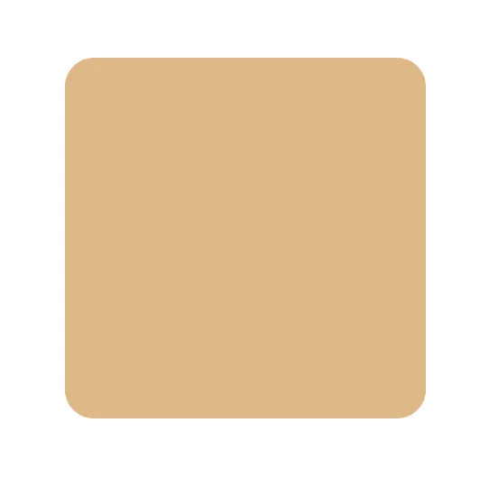

木頭重複利用，環保。

如果你是一個正方形，寬高是 200，那麼給你每邊 100px 的圓角或是 50% 的圓角就會變成圓形：

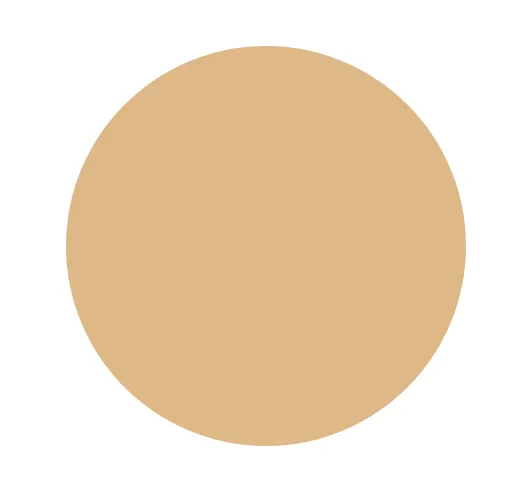

> 如果設定超過寬度一半的圓角，如 9999px，就會被設定成容器的一半最大能的圓角。

## margin 外距

兩個元素之間的距離。

```html
<div></div>
<div></div>
```

```css
div {
	background-color: burlywood;
	width: 100px;
	height: 100px;
	margin: 16px;
}
```

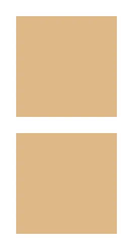

同樣可以設定單邊或是多邊：

```css
div {
	margin: 16px; /* 全部 16px */
	margin: 16px 32px; /* 上下 16px，左右 32px */
	margin: 16px 32px 24px; /* 上 16px，左右 32px，下 24px */
	margin-top: 16px;
	margin-bottom: 16px;
	margin-left: 16px;
	margin-right: 16px;
}
```

## padding 內距

容器與裡面元素的距離。

```html
<div>DARLING🫂HOLD MY HAND💅🏻👋🏻🥵‼️</div>
<div id="box">📢NOTHING🚫BEATS A JET2✈️ HOLIDAY 🔥🔛🔝🔝</div>
```

```css
div {
	background-color: lightblue;
	margin: 32px 16px;
}

#box {
	padding: 16px;
}
```

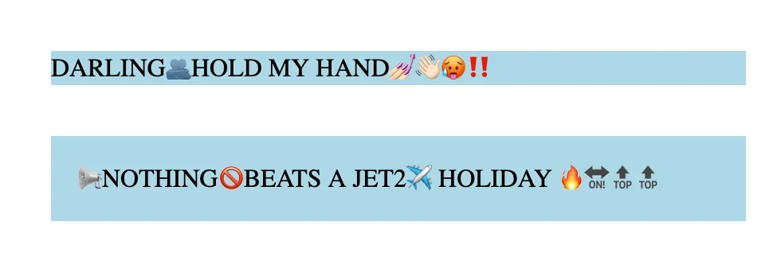

## box-sizing 地獄門有多大呢？

這是一個幾乘幾的地獄門呢？

](minecraft-nether-portal.webp)

如果你覺得這是一個 2x3 的地獄門，恭喜你是一個合格的 CSS！我們來測試看看：

```html
<div></div>
<br />
<div id="box"></div>
```

```css
div {
	width: 100px;
	height: 100px;
	background-color: purple;
}

#box {
	border: 20px solid black;
}
```

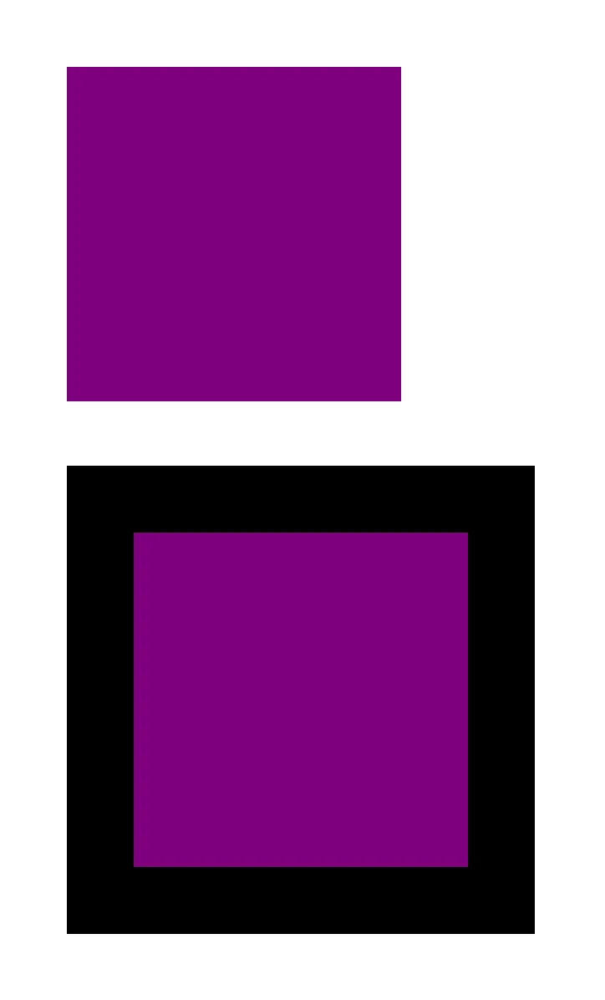

你可以看到明明兩個正方形都是長寬 100px。但是底下的正方形很明顯超出去了。原因是因為他沒把邊框算進去。這樣會讓我們在進行排版時很痛苦，很不直覺。所以我們通常會指定說「當你在算箱子的大小的時候請你把 border 也算進去」，具體語法是： `box-sizing:border-box`。

```css
box-sizing: content-box; /* 只算內容 */
box-sizing: border-box; /* 包含邊框 */
```

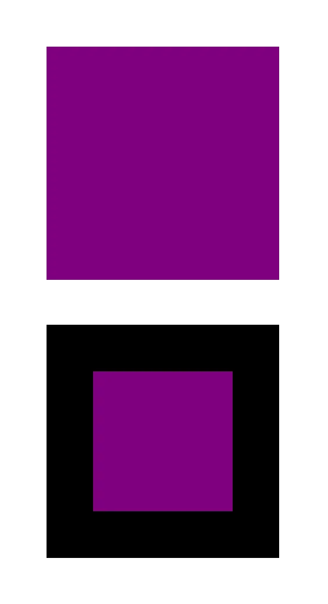

### outline

outline 位置在 border 的外面一圈，不佔用元素的任何空間。outline 不能設定單邊的樣式，它一定是圍繞整圈呈現的。

```html
AAAA
<br />
BBBB
<div id="box"></div>
```

```css
#box {
	width: 100px;
	height: 100px;
	background-color: lightblue;
	border: 20px solid lightgreen;
	outline: 20px solid lightcoral;
}
```

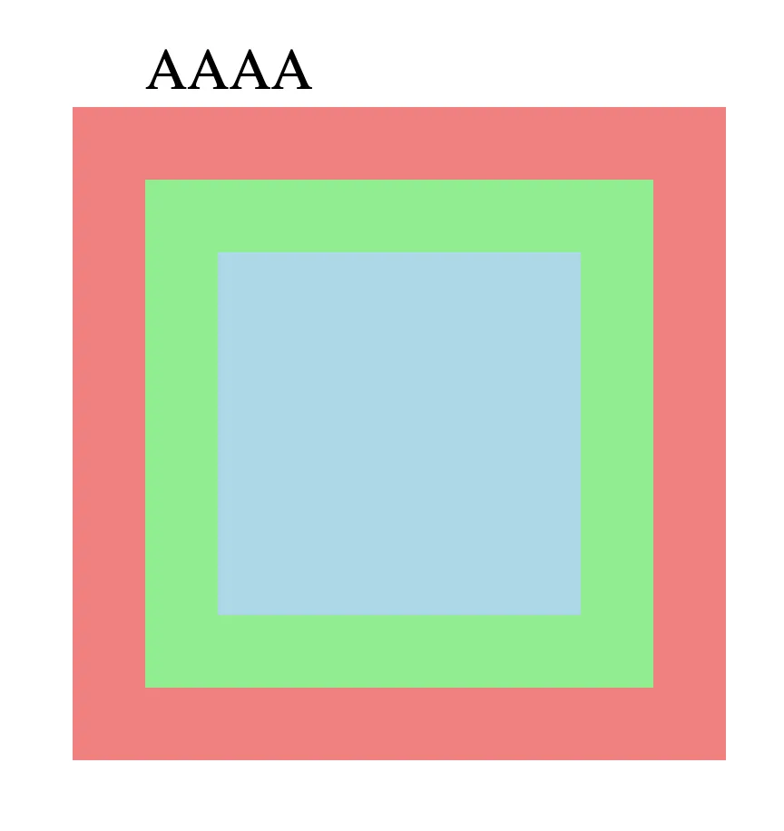

## display 你要怎麼佈局

Display 可以控制元素怎麼排。

### 區塊元素與行內元素

HTML 元素可以分為兩種，一種是區塊元素，比如說 `<h1>`、 `<p>` 這種前後都會自動換行的，也有像是 `<b>`（粗體）、 `<i>` （斜體）這種放在文字之間不會換行的。前者叫做「區塊元素」、後者叫做「行內元素」。

不過我們可以更改元素的顯示方式。最常見的例子就是其實圖片 `` 預設是一個行內元素，因此圖片會跟文字擠在一起。

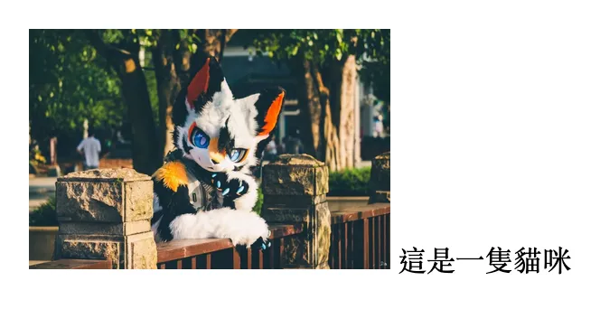

這時我們只需要設定 `display: block` 即可讓他自己佔滿一排。

```css
img {
	display: block;
}
```

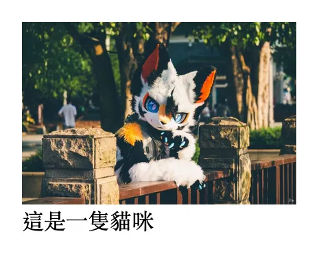

`inline` 因為跟著文字左到右排，因此不能指定自己的長寬， `padding` 也只能設定左右。這時我們可以使用 `display: inline-block` 來保持像 block 一樣的特性，但一樣從左到右排。

整理一下：

- `inline`: 像文字一樣左到右上到下，不能決定寬高
- `block`：佔滿`<body>`整排，下一個東西會換行
- `contents`: 只有 contents area 的 box，只顯示內容文字
- `inline-block`: 保持像 block 一樣的特性（可以設長寬等等）但一樣從左到右排
- `none`：整個東西隱藏不顯示，甚至空間都不佔用

> 如果使用 inline-block(像是 `a` 或 `li` )，標籤之間會有空白字元約 4~5px。

我們也可以把一個元素設定成一個佈局的環境，控制裡面的東西要怎麼排。常見的如：

- `display: flex`：裡面東西依序左到右或上到下排列。
- `display: grid`：裡面的東西像表格一樣整齊排列。

## Flexbox 超好用的容器

這是今天課程當中比較困難的部分。flexbox 非常強大，只要你學會他你幾乎就能排出任何版面。

我們先創個盒子裡面塞幾個 `<div>`。

```html
<section>
	<div></div>
	<div></div>
	<div></div>
	<div></div>
</section>
```

{{notice}}

emmet 語法

輸入 `section>div*4` 然後點 `Tab`，底下註解也都是 emmet 縮寫

{{noticed}}

```css
section {
	background: #191d88; /* bg #191d88 */
	padding: 5px; /* p5 */
}

div {
	width: 100px; /* w100 */
	height: 100px; /* h100 */
	background: #ffc436; /* bg #ffc436 */
	margin: 20px; /* m20 */
}
```

因為 `div` 是區塊元素 (`display: block`) 所以元素都會換行，而這很重要因為這樣我們才能設定他的寬高。

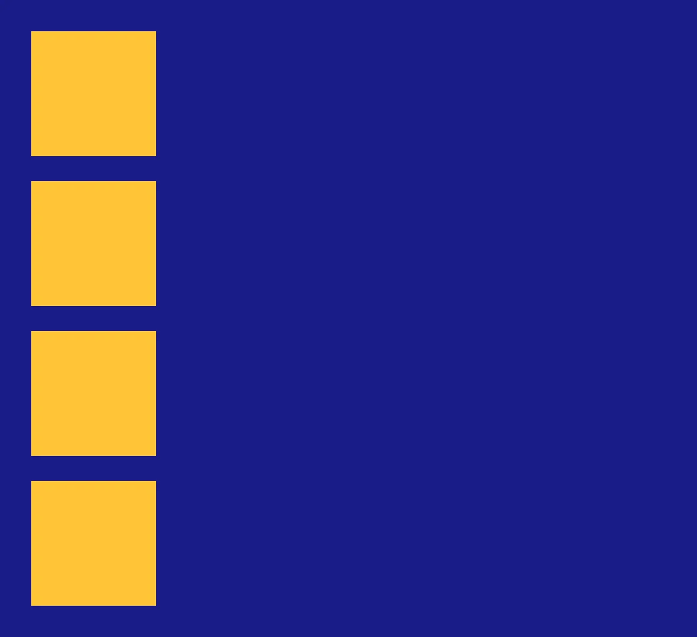

但如果我們在外容器加上 `display: flex` 就可以讓他們並排。

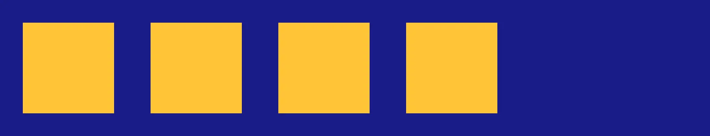

```css
section {
	background: #191d88; /* bg #191d88 *
	padding: 5px; /* p5 */
	display: flex; /* df */
}
```

我們把外面包著大家的藍色元素叫做外容器，裡面黃色正方形叫做內容器。我們可以在外容器的 CSS 設定裡面的東西怎麼排。

### 排序方向 **flex-direction**

方塊們預設是左到右，我們也可以改成右到左，或是垂直排列。比如說我設成 `row-reverse` 就會從右到左排。

> _好啦講明確一點其實是跟著文字排，文字是左寫到右時就是左到右。_

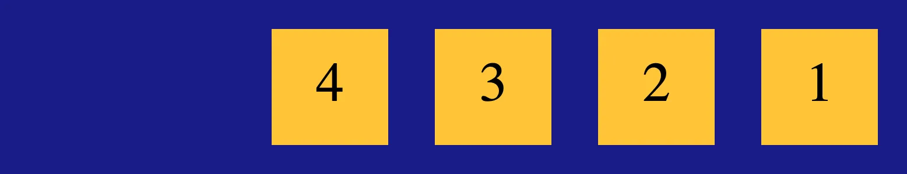

```css
section {
	flex-direction: row; /* 預設左到右 */
	flex-direction: row-reverse; /* 右到左 */
	flex-direction: column; /* 上到下 */
	flex-direction: column-reverse; /* 下到上 */
}
```

### 超過換行 **flex-wrap**

如果不設定的話瀏覽器會硬擠成一排。你看正方形都被壓成長方形了。

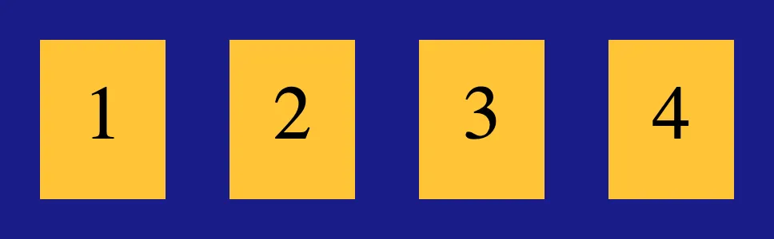

你可以加上 `flex-wrap: wrap` 來解放他。

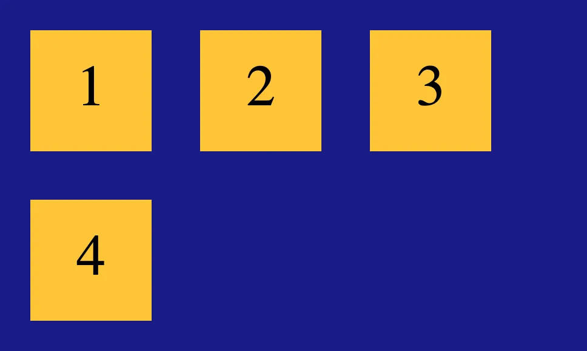

```css
flex-wrap: nowrap; /* 不換行 */
flex-wrap: wrap; /* 太寬換行 */
flex-wrap: wrap-reverse; /* 換行但從下到上排 */
```

### flex-flow

這是 `flex-direction` 和 `flex-wrap` 的縮寫。其實我從來不用。

```css
.flex-container {
	flex-flow: < "flex-direction" > || < "flex-wrap" >;
}
```

### 水平對齊 **justify-content**

元素要對齊哪裡。注意如果你設定 `flex-direction: column;` 就是垂直對齊方向。

```css
justify-content: flex-start; /* 靠左 */
justify-content: flex-end; /* 靠右 */
justify-content: center; /* 置中 */
justify-content: space-between; /* 水平均分 */
justify-content: space-around; /* 水平環繞均分 */
```

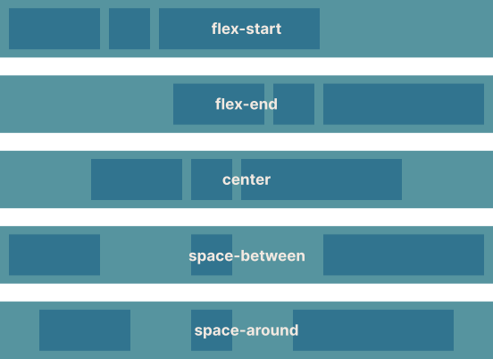

### 垂直對齊 **align-items**

和上面一樣只是變成垂直的。如果你設定 `flex-direction: column;` 就是水平方向。

`flex-start` 靠開始位置、 `flex-end` 靠結束位置、 `center` 置中、 `strech` 延伸拉到一樣高、 `base-line` 會找文字的位置對齊。

### **多行對齊 align-content**

是上一個屬性的多行版本。

> 注意 `stretch` 在元素高度被限制的情況下不會正常伸展。

```css
align-content: flex-start | flex-end | center | space-between | space-around | stretch;
```

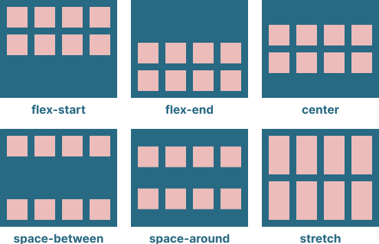

圖：毛哥EM

### 我不喜歡乖乖排隊 align-items

我們可以使用 **`align-self`** 設定單獨一個元素的特別往另一邊靠。很少用的屬性。語法可以參考 MDN：https://developer.mozilla.org/zh-CN/docs/Web/CSS/Reference/Properties/align-self

### 剩下的空間給誰？flex-grow

我們也可以設定假設排完有多的空間要給誰。剩下空間方給他幾份，預設值為 `0`，如果設定為 0 則不會縮放，1 以上就是根據比例來平分。

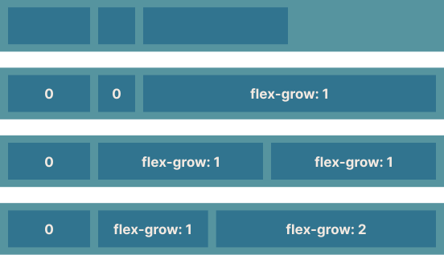

### 沒空間壓榨誰？flex-shink

flex-shrink 則反之，當空間分配還不足時的目前元件的收縮性，預設值為 `1`，所以才會遇到最前面不設定可以換行所有人都被擠爆的問題。如果設定為 0 則不會縮放。

### flex-basis 你怎麼看我

剛才提到 `flex-shink` 跟 `flex-grow` 可以拿來分配剩餘的空間，但是我們要怎麼知道剩多少呢？要先扣掉已經用了的嘛。這時候當然是把大家的 `width` 扣一扣。但是我們可以使用 `flex-basis` 來說：

> 「雖然我只有 5 公分，但請把我當作 30 公分來排。」

```css
flex-basis: 30cm;
```

> 喔對了前面沒有提到你可以使用單位 cm 對吧？沒錯，不過大家螢幕畫質都很高會放大畫面，所以 1px 不一定是真的 1px。1cm 本質上其實只是 37.8px。這個單位通常在印刷時使用。

### Order

你可以使用 **`order`** 屬性來設定順序，前到後放入整數，支援負值。

```css
order: -1 /* 放到最前面 */
order: 1 /* 放到最後面 */
order: 5 /* 如果有 1 的話就是放到他後面 */
```

如果你不熟悉 flex 的話你可以到 [**Flexbox Froggy**](https://flexboxfroggy.com/#zh-tw) 這個網站，用遊戲的方式了解 flex。(然後提示是可以直接按，不用慢慢輸入喔)

## 中場練習

你也可以使用今天所學到的語法複製一個 Google 的網頁。重點在排版所以按鍵的陰影和顏色可以直接打開開發者工具查看喔。我先做了一個範例提供大家參考，也能實現搜尋功能。如果有任何問題也歡迎留言。

> [範例網站](https://sysh-tech-volunteer.github.io/Web-Design-Camp/practice/google.html) | [原檔 HTML](https://github.com/SYSH-Tech-Volunteer/Web-Design-Camp/blob/main/practice/google.html) | [原檔 CSS](https://github.com/SYSH-Tech-Volunteer/Web-Design-Camp/blob/main/practice/google.css)

## Position 東西放哪

目前我們東西排放的都很整齊，根據我們設定的規則依序排列。不過有時候我們不希望東西好好排（in flow）。舉一個例子是我希望網站右下角隨時有一顆客服按鈕，或是上牌的選單永遠固定住。


這時候我們就可以設定東西要放在哪。既然是放在哪這個語法就叫做 `position`。

## 語法

```css
position: 屬性;
```

## Static - 該怎樣就怎樣

預設屬性，該在哪裡在哪裡，區塊元素佔整排，行內元素繼續往右。

通常不需要特別設定，除非我們有其他的 CSS 把 position 改成別的你想要改回來。

## Relative - 解鎖偏移

設定成 relative 的元素可以解鎖使用 top, bottom, left, right 屬性，讓它看起來往某個地方移動一點點。但是還是佔據原本的位置。

```html
<div></div>
<div id="purple"></div>
```

```css
body {
	margin: 0;
	padding: 10px;
}
div {
	width: 100px;
	height: 100px;
	background: #56949f;
	margin: 10px;
}
#purple {
	background: #ebbcba;
	position: relative;
	left: 30px;
	top: -50px;
}
```

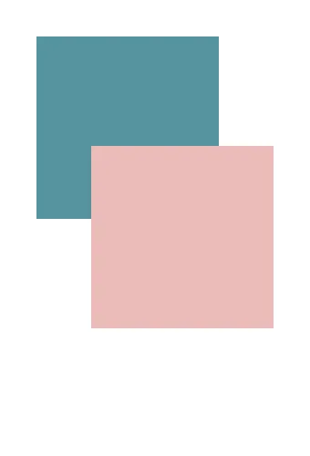

方塊往左上角推了

## Absolute - 在哪都行

設定成 absolute 的元素你一樣可以使用 top, bottom, left, right 屬性來定位元素，但是會變成像是一張貼紙一樣貼在網頁上，原本的位置不在佔據。定位的參考點是外面最靠近的 `position: relative` 或是 `position:absolute` 元素。

有點難理解對吧，我們來看看這個範例：

比如說這樣：

```css
<div class="container">
	<div class="purple"></div>
	<div class="green"></div>
</div>
```

```css
body {
	margin: 0;
}

.container {
	background-color: #e0def4;
	margin-top: 130px;
}
.green,
.purple {
	width: 100px;
	height: 100px;
	background: #56949f;
}
.purple {
	background: #ebbcba;
	position: absolute;
	left: 30px;
	top: -0px;
}
```

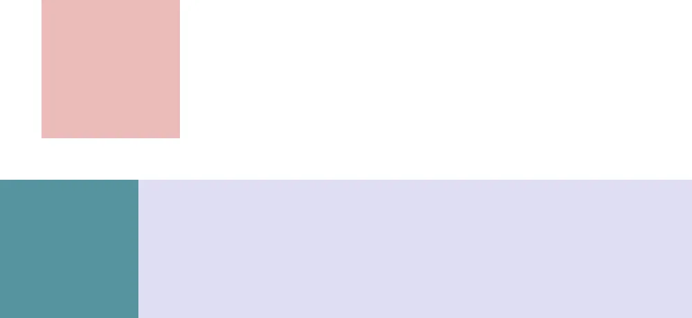

可以觀察到幾件事：

- 紫色 `<div>` 因為設定了 `margin-top` 所以上面有一些空白區域。
- 粉紅色方塊根據 HTML 在紫色方塊裡面，但是他因為 `position: absolute;` 所以逃到畫面最上面，左邊偏移 30px 了。

所以你可以看到紅色現在的定位點是整個 `<body>` 畫面。如果我們幫 `.container` 加上 `position: relative` 呢？

```css
.container {
	background-color: #e0def4;
	margin-top: 130px;
	position: relative;
}
```

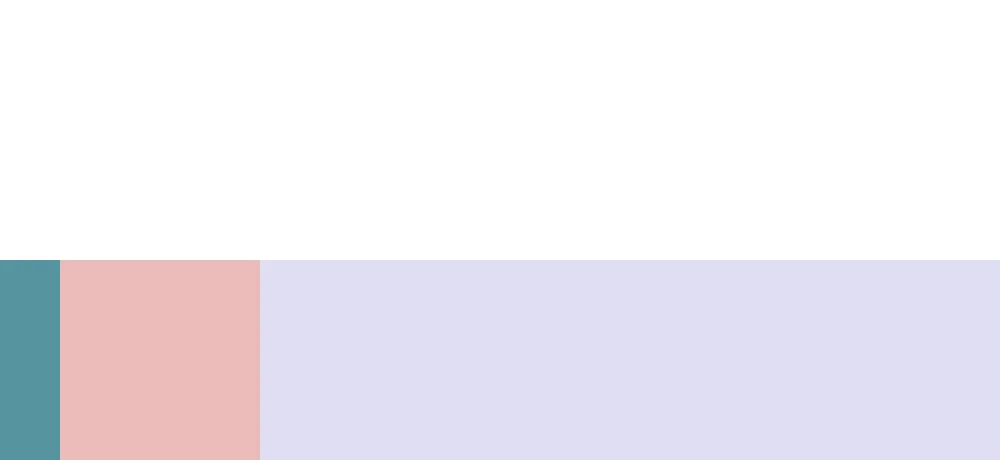

這時我們粉紅色的正方形就是以紫色 container 的左上角作為定位點開始做偏移了。

## Fixed - 卡在畫面上

剛才的粉紅色方塊我們滾輪往下滾他就會跟著滾下去了，那如果我們希望能做一個固定在上面的選單呢？

設定 Fixed 的元素會直接以螢幕的左上角為定位點進行定位，並且無論怎麼滾動畫面都會待在哪裡。最常見的使用時機是網頁右下角回到最上面的按鈕，或者是煩人的分享按鈕。

```html
<nav>
	<h1>我的網站</h1>
</nav>
```

```css
body {
	height: 200vh;
	background: #56949f;
}

nav {
	width: 100%;
	height: 100px;
	background: #e0def4;
	position: fixed;
	top: 0;
	left: 0;
}
```

[Screen Recording 2026-03-23 at 11.30.08 AM.webp](position-fixed-demo.webp)

## Sticky

我們有時候希望某些東西固定在一個地方，但是只有在那個 section。

```html
<h1>我的網站</h1>
<p>
	Lorem, ipsum dolor sit amet consectetur adipisicing elit. Sequi doloribus maiores sunt, repudiandae voluptates illo. Rerum voluptas, minima repellat laudantium ducimus nostrum soluta veniam
	aspernatur maiores perspiciatis, ab, omnis vel!
</p>

<section>
	<div>
		<p>
			Lorem, ipsum dolor sit amet consectetur adipisicing elit. Sequi doloribus maiores sunt, repudiandae voluptates illo. Rerum voluptas, minima repellat laudantium ducimus nostrum soluta veniam
			aspernatur maiores perspiciatis, ab, omnis vel!
		</p>
	</div>
	<ul>
		<h2>Section 1</h2>
	</ul>
</section>
<p>
	Lorem, ipsum dolor sit amet consectetur adipisicing elit. Sequi doloribus maiores sunt, repudiandae voluptates illo. Rerum voluptas, minima repellat laudantium ducimus nostrum soluta veniam
	aspernatur maiores perspiciatis, ab, omnis vel!
</p>
```

```css
section {
	display: flex;
	position: relative;
}

h2 {
	flex-shrink: 0;
	position: sticky;
	top: 0;
}
```

[Screen Recording 2026-03-23 at 2.42.56 PM.webp](position-sticky-demo.webp)

{{notice}}

### Lorem Ipsum 是什麼？

這段咒語不是任何語言，是個方便進行平面設計和網頁開發的佔位符假文。字母頻率與現代英語接近，可以方便排版但是不會受內文影響。比如說我在裡面打一段笑話可能會讓你笑一下~~誤以為~~網頁開發是很快樂的事。

{{noticed}}

## 範例

來一個範例讓大家分辨它們不同的效果

[https://codepen.io/elvismao/pen/rNoYOKZ](https://codepen.io/elvismao/pen/rNoYOKZ)

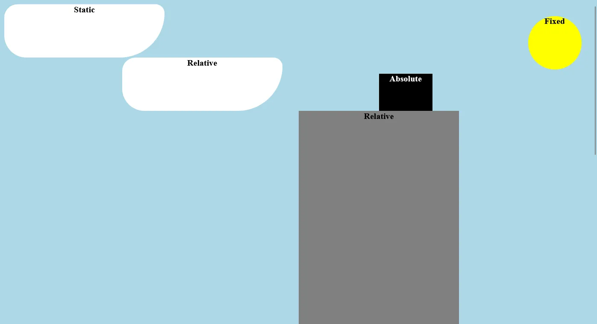

```html
<div class="sun">Fixed</div>
<div class="cloud">Static</div>
<div class="cloud relative">Relative</div>
<div class="building">
	Relative
	<div class="roof">Absolute</div>
</div>
```

```css
body {
	background: lightblue;
	text-align: center;
	font-weight: 800;
}
.sun {
	width: 100px;
	height: 100px;
	background: yellow;
	border-radius: 50%;
	position: fixed;
	right: 30px;
	top: 30px;
}
.cloud {
	width: 300px;
	height: 100px;
	left: 20%;
	background: white;
	border-radius: 30px 20px 100px 50px;
}
.relative {
	position: relative;
}
.building {
	width: 300px;
	height: 1000px;
	background: gray;
	position: relative;
	left: 50%;
}
.roof {
	position: absolute;
	top: 0;
	left: 50%;
	width: 100px;
	height: 70px;
	background: #000;
	margin-top: -70px;
	color: #fff;
}
```

在這裡你可以看到

- 太陽設定為 `fixed`，所以就算滾輪滾動也不會改變位置。
- 第一朵雲因為沒有設定 `position`，所以就是預設的 `static`，所以它會在原本的位置。雖然他有設定 `left: 20%;` 但是因為他是 `static` 所以沒有效果。
- 第二朵雲設定為 `relative`，所以他會在原本的位置，但是可以使用 `top, bottom, left, right` 來偏移位置。
- 建築物設定為 `relative`，所以他會在原本的位置，我們使用 `right` 來偏移到正中間。可以看到它是元素左邊在最中間，因為對齊點是左上角。
- 裡面的黑色屋頂設定為 `absolute`，所以他會以外面的 `relative` 為對齊點，並且不佔據原本的位置。我們使用 `top: 0; left: 50%;` 來定位他，但這樣會讓他在建築物裡面，因此我們可以使用 `margin-top: -70px;` 來把他拉上去。

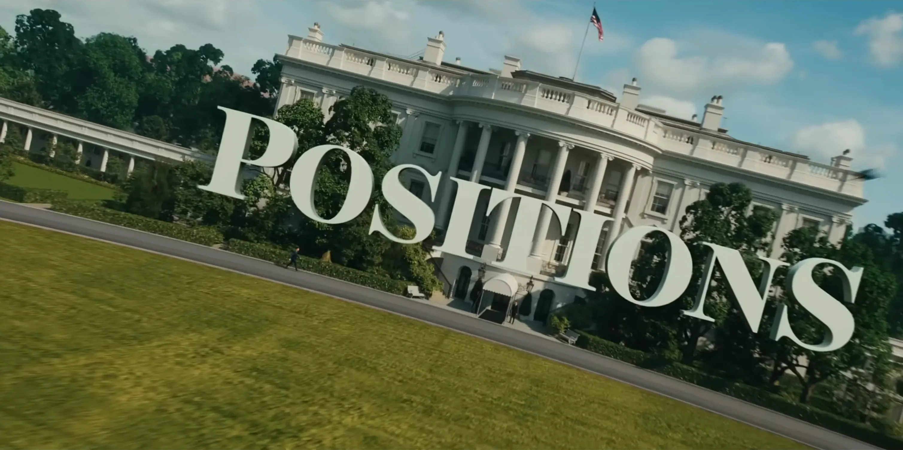

## Transform

原本位置佔著，但是可以做出各種效果如 rotate 旋轉。

```css
transform: rotate(90deg);
```

### Transform: translate

可以把東西偏移。

```css
transform: translate(往右偏移多少, 往下偏移多少);
transform: translateX(往右偏移多少);
transform: translateY(往下偏移多少);
```

單位值為多少就平移多少，然後 transform 支援負值：

```css
.translate {
	background-color: pink;
	transform: translate(100px, -50px);
}
```

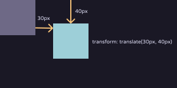

translate 的百分比基準是自己的 width 跟 height，可以改變元素定位的參考位置，最常見的是把參考點變成元素正中間，方便定位。

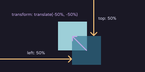

來一個推方塊範例：

```css
.outer {
	position: relative;
}

img {
	position: absolute;
	top: 50%;
	left: 50%;
}
```

就做到水平跟垂直置中的效果啦（當然用 `display: flex` 也可以達到置中的效果。）

## :hover & :active

`:hover` 是當滑鼠滑過元素的時候會觸發的狀態，`:active` 是當元素被點擊的時候會觸發的狀態。比如說我們這裡設定超連結的顏色，當滑過的時候變紅色，點擊的時候變綠色。

```css
a {
	color: blue;
}

a:hover {
	color: red;
}

a:active {
	color: green;
}
```

<a href="#transition 轉場" id="myLink">這是一個超連結</a>

<style>
	#myLink {
		color: blue;
	}

	#myLink:hover {
		color: red;
	}

	#myLink:active {
		color: green;
	}
</style>

## transition 轉場

當元素因為各種原因改變屬性質，比如說 JavaScript 改的或著是因為元素被點擊等等。會在指定時間平滑的切換過去，做出簡單的動畫。

```css
transition: 屬性 轉換時間 延遲執行動畫的時間 速度;

transition:all .3s 0s ease; // 設定全部 0.3 秒轉換 沒有延遲 ease 為預設值
transition: padding .3s 0s, background-color 1s 1s; // 可以各別設定，用逗號分開，並用延遲時間設定出現的先後順序
```

任何屬性都可以設定 transition，比如說文字段落滑過要變色也可以。

## overflow

假設元素超過了容器的大小，這時候我們可以使用 overflow 屬性來決定要怎麼處理。最常用的是 hidden 隱藏、auto 自動還有 scroll，也就是顯示滾動軸。

```css
overflow: visible; /* 可突出 */
overflow: hidden;
overflow: scroll;
overflow: auto;
overflow: hidden visible; /* 同時設定 x, y */
```

## Media

Media 可以告訴瀏覽器在不同的螢幕大小該如何呈現。這個是基本的語法。

```css
@media screen and (條件) and (條件) ... {
}
```

語法有很多不同的寫法，最常見就是：

```css
@media (max-width: 600px) {
	h1 {
		font-size: 2rem;
	}
}
```

他的意思是說假設螢幕寬度小於 600 像素，那麼大標題就要以正常字體的兩倍大顯示。

---

以上是一些常見的 CSS 語法。當然還有很多其他的屬性和用法，不過透過以上的語法已經能夠做出絕大部分的網頁了，歡迎大家繼續探索！
