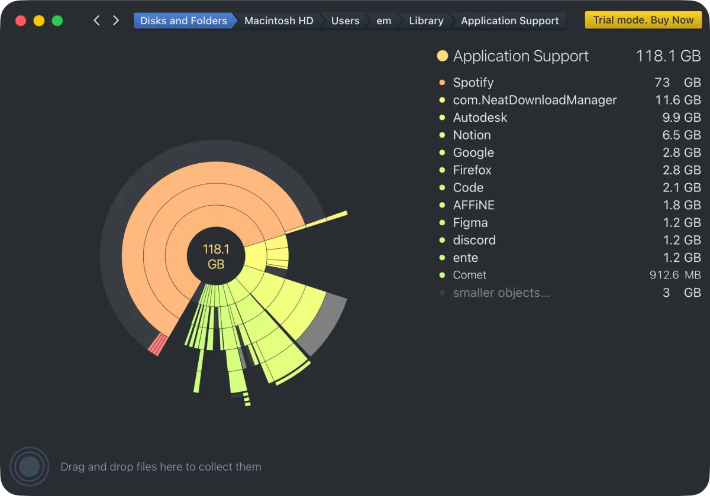
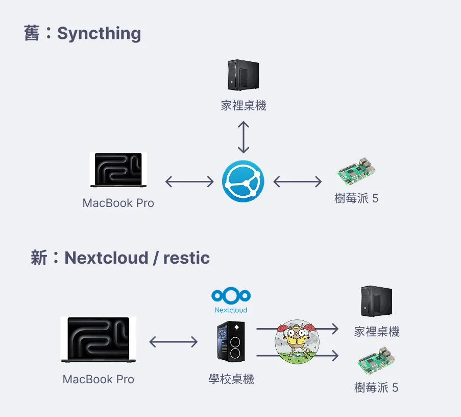
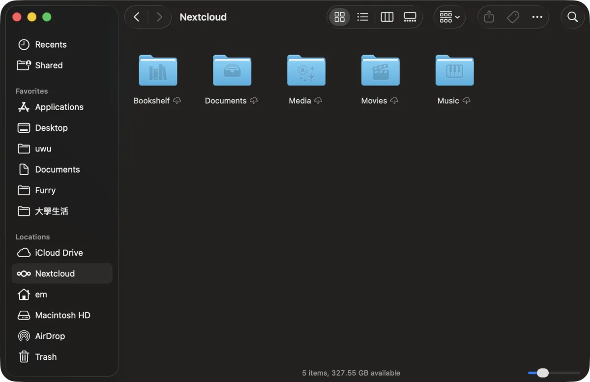

# 難道只有我在把桌面當桌面嗎？

> 這篇文章來自我的電子報 Hmmm，同時也是參與 BlogBlog 同樂會第二期的內容，如果你也想交個朋友歡迎可以 [來這裡](https://elvismao.com/zh-Hant/hmmm/) 訂閱！

今天是 2/28，算是個國定假日，該快樂嗎（？這種日子都挺尷尬的。

上個月我停了一個月的電子報，原因是正好所有事情都做到一半，不知道能寫什麼。然後不想硬擠一篇文章出來煩大家所以就沒寫了。今年一月我第一次體驗到什麼叫做年末加班，寒假平日都還是在學校工作和水學分（有一些簡單有趣的課程），每天都好多事好累。你要問我每天做完了什麼我也說不清楚，但就是一直工作。不過畢竟都是大專案所以之後應該會有不少可以分享的。

然後我才完全忘記我本來想要參加入侵全台音樂課的好和弦 Wiwi 的 [BlogBlog 同樂會](https://blogblog.club/party)了啊！這是一個很神奇的地下交流活動（？每個月會有一個主題然後大家會在自己的部落格上面分享。雖然不太該意外，但是發現上個月有 150 人參與還是蠻驚奇的。

> 喔同時也非常感謝 Wiwi 幫我分享[我的部落格](https://emtech.cc/)和免費開源的網頁字體服務 [emfont](https://font.emtech.cc/)！

今天要來講講我怎麼管理我的電腦檔案。

會想講這個主題的背景是我的 MacBook 硬碟又滿了。我原本以為 512GB 很多，因為從小我用的是 16GB 的 iPad Air 2 到高中的。高中學校筆電應該也才 128 或是 256。

我自認為應該是還算會好好整理檔案筆電的人，因此距離上次重灌可能才過幾個月就又滿了蠻意外的。因此我第一次玩玩看這種 GUI 的分析工具（以往都是伺服器空間不夠所以是用終端機看看）

分析之後主要滿的有幾個原因：

- 現在我的檔案是用 Syncthing 在我的筆電、樹莓派、跟家裡的桌機做同步，裡面放著從我國小一年級到大學的所有報告。然後裡面固然會免不了有一些大檔案。
- 上了大學有些老師會提供課程預錄影片，也都放在筆電。
- 我的 Spotify 開啟無損音質下載喜歡的歌曲，而這 2714 首歌佔走了 73GB 的空間。
- 各種軟體也都有各種各樣的快取。

上一次我的硬碟滿了是因為我幫我的 Ableton Live 下載了非常多的音色，而這些高品質取樣都非常的佔空間。還有就是我可能為了跑了某個東西就安裝了一個程式語言的套件，安裝起來很輕鬆就是一行指令但是他通常都藏在電腦的深處。

這樣的情況下其實我要整理好跟我直接重灌差不多了。

而從小用那台 16G iPad Air 2 我就有每個月重灌的習慣，所以我的解法也是如此。不過這次我得從架構上的做出一些改變。

Syncthing 做到的事情其實只有在不同的裝置之間幫我進行同步，沒有做到實質意義上面的備份。意思是說比如說我其中一台電腦中毒了檔案被加密。我所有的裝置如果有連上網就會貼心的幫我一起同步加密。

桌機跟樹莓派是有所有檔案上 Syncthing，但是筆電當然就沒辦法了。（雖然有同步的也已經超級大了），因此我想要從樹莓派拿檔案時都是透過 SMB。SMB 的問題是每次打開一個資料夾都要重新讀取一次，然後連線也非常不穩定，動不動就需要重連，而且速度非常慢。

同時正好我最近撿了一台報廢的第八代 i7 桌機（可惡比家裡的桌機還好）還有幾張不錯的 1080、1080Ti 顯卡，所以也想說把資料從外接 6T 硬碟的樹莓派搬遷到我的這台桌機上面。

而這個過程就挺痛苦的，TL;DR 是：

- 桌機雖然跟樹莓派的物理距離是約一公尺，但是其實他們分別在兩個不同社團的內網裡面。因此實際傳輸的方式是樹莓派用 WireGuard VPN 過去再用 rsync 傳。
  - 他們的內網範圍重疊衝突。
- 我要傳的資料應該有個 TB，因為包括我媽手機照片的備份。
- 我有的路徑指令後面加了 / 有的沒有，所以很多東西應該複製了兩次。
- 檔案傳過去整理一下就好了，痛苦的是照片我是架設在 ente。
  - 高中時他還沒有現在這麼好用可以直接 docker compose，所以我之前是很多黑魔法東拼西湊弄起來的。
  - 既然到新機器了就希望用現在正規的方式部署，這樣才能更新版本。
  - 然後就是各種 MinIO 傳輸備份，加密金鑰丟哪，當時是怎麼跑起來的問題。
- 喔還發生一件事是我傳檔案才發現 mount 不知道從什麼時候跑掉了，所以傳一傳我的系統 SSD（a.k.a C 槽）就被灌爆了。

如果你懂網路，你應該知道這挺痛苦；如果你不懂網路，讀完這段你應該已經很痛苦了。

---

但這一切我覺得很值得，Nextcloud 非常好用。他用起來跟雲端硬碟一樣，然後存取檔案都很快很方便。一些常用的檔案我也跟 Syncthing 一樣有做雙向同步，本地隨時都有。反正現在用了一個多禮拜，就看我這剩下的三百多 GB 可以撐多久囉！

Nextcloud 其實還有很多其他的有趣功能我有順手架起來，但目前沒有感覺特別吸引人或是我有其他替代了，所以可能之後無聊來玩看看吧。

## 桌面

好啦講了這麼久終於回到桌面了。

我覺得我使用桌面的方式跟身邊遇到的人都不一樣，很希望可以找到一樣的人。或是可以透過這篇文章來傳教（？

我覺得桌面顧名思義就是你的桌面，他應該只會出現當下你在使用的東西。

什麼你說你的桌面很亂？好吧我不在乎，反正我的桌面使用方式邏輯如下：

- 首先請你選一張或是多張喜歡的桌布輪播。你總不會希望你喜歡的人或動物臉上面堆滿你的期末報告吧。
- 檔案應該放在資料夾整理好，不應該有任何長期放在桌面的東西。
  - 打開檔案總管 Win+E、Finder 我是設定成 `F3` 打開桌面／`Cmd` + `'` 打開預設位置。沒有很麻煩。

那麼桌面應該要保持清空嗎？不不不。桌面是你的工作區，記憶體的概念。我會把我所有東西的下載路徑都設定在桌面，這樣有幾個好處。

- 我要使用這些素材的時候很方便。`Win` + `D` 或是 macOS 四跟手指頭往外撥就可以去桌面複製或拖檔案來用了。
- 通常下載來的東西用完一次就不用了，如果藏在下載資料夾一定會越積越多，放在桌面通常放一點點就受不了想清了。

以前使用 Windows 時我還會把轉檔的工具放在桌面，把圖片拖曳到那個 exe 上面就會自動完成轉檔（我有寫好規則如看到 PNG 轉乘 WebP、看到 MKV 轉成 MP4 等等）。但 MacBook 可以用 Automator 設定服務和快捷鍵所以現在也不需要了。

> 延伸閱讀：[macOS 快速把圖片轉成 WebP、影片轉成 GIF](https://emtech.cc/p/mac-2webp/)

## Ramd0m

- 我以往都會想要在超連結文字中間前後加上一個空白，但是我發現這還蠻中斷閱讀思緒的所以先拿掉好了。
- [YouTube - Write in Go (Fall 2014)](https://www.youtube.com/watch?v=LJvEIjRBSDA)：頌讚程式語言 Go 的一首歌，有成功說服我想要學。雖然我早就想學了但之前只有研究到基本語法還沒實際做過專案。
- 這學期的選課因為第一次忘記、第二次從八點開始整理到十點半然後才想起十點就關系統了、所以第三次只選到了兩堂課。不過很感謝主的是最後想選的課全部都有選到。主要分成三種情況：
  - 網路加選就選到。
  - 老師所有人都加。
  - 大家丟出來抽學生證加簽，三十幾個人選個位數還能抽到真的很幸運。
- 看大家都在玩 OpenClaw 但目前沒看出他有什麼特別的優勢，就是個 AI Wrapper 幫你把東西串好。聽說權限控制很難基本上得全開所以很多人出事。
  - 不過我確實感覺我需要個 AI 幫我檢查我有沒有訊息漏回，最近真的是炸到會沒注意到，這好糟糕（
  - 看了一下現在 GPU 都還是不便宜，對我需要跑多大的模型也沒概念。看起來像個無底洞選一個會想升更好的。
- 前兩天收到了一個看起來 99.9% 是詐騙的演講邀約，發現 Email 是來自一個我少數有用專屬 Email 地址註冊的一個 AI 服務帳號（我都完全忘記他是幹嘛的了）。沒想到分開 Email 真的有用，之後都這樣做好了。
- 昨天晚上睡不著覺，在研究為什麼老師上課沒有人在那種貼在臉上的 MIPRO 黏臉或是耳掛的麥克風。主要是手持式的對於程式課等需要示範，甚至是單純的演講手上要拿個麥克風其實都有點被限制住的感覺。我想像中他的音質又好，戴起來又舒服（你看都能用在舞台表演了）都在用出版社很爛的耳麥，音質爛又不穩。所以我就隨邊算了一下最便宜的價格：
  - 耳掛麥克風：1,890，還可以
  - 無線發射器：2,500
  - 接收器：6,790
  - 所以你為了上課有聲音需要花個一兩萬塊還要把一大坨設備搬過去慢慢裝，所以。嗯。也許不是最好的做法。
- 我要花這種浪費錢的還有另外一件事。我想要買黃仁勳等等大 CEO 發佈會會使用的看起來像是引爆核彈的簡報筆。

  

  > 圖片來源：[商業週刊](https://www.businessweekly.com.tw/business/blog/3015027)
  - 這東西叫做 PerfectCue，是一個要一兩萬的東西，但好像又沒那麼貴幾千就有，害我想研究看看了（X
    - PerfectCue 透過 USB 接收器被電腦辨識成「鍵盤」，所以你想拿來控制什麼都可以。
    - 這種很重要因為聽我爸說產品發佈會等等大活動大家全部都是各種無線電傳來傳去，所以如果你要用藍牙的話就會有干擾的問題。
    - 那既然是這樣那我拿我的 SDR（無線電接收器）跟對講機是不是有一樣效果（？

- 上個禮拜被 Ak 推坑 Jacob Collier。我真的很喜歡他的 [Over You](https://open.spotify.com/track/7MSZg4Km8CM7NRXTeJoANZ?si=d6d1be448bb64547)，是我很喜歡的歌曲架構和乍聽之下毫無邏輯但是很爽的一直轉調。雖然仔細分析之後沒有很複雜但是還是很讚。他的歌讓我想到 jabeau。他們都是我在社群軟體上面滑到解釋樂理或是技術的，然後他們的音樂都是那種難聽到很好聽的（？就是不是那種流行樂無腦的卡農，是那種爵士式你是可以聽出他的層次和每個和弦、音色設計的巧思的。
- 前陣子跟朋友聊天聊到就順手架了自己的通訊軟體 Matrix Synapse。很簡單 Docker 跑起來就可以安全地聊天了。開了個 server 歡迎有興趣的可以加入：[#space:matrix.elvismao.com](https://matrix.to/#/#space:matrix.elvismao.com)！

好啦以上就是這個月的 Hmmm，如果你也有什麼想分享的東西歡迎回信告訴我！下個月見囉！
