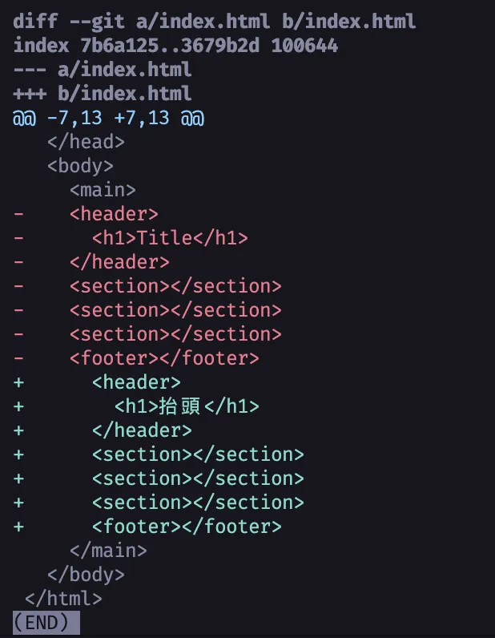

# Husky 教學 - 逼你的團隊給我 Format 完再 Commit

平常在開發時我都會使用 [Prettier](https://prettier.io/) 來幫助我格式化代碼。來統一代碼風格如一個 Tab 是幾個空白、用單引號還是雙引號等等。但有時候團隊成員可能會忘記在提交代碼前運行 Prettier，導致你的檢查（CI）可能不會過。

比如說你在所有東西外面包了一個 `<main>` 裡面的東西沒有 Tab，這時候如果還有其他人改你的 Code 就可怕了。



我明明只是把標題「Title」改成了「抬頭」，現在每一行都被我改了一遍。除了後續的人看到覺得三小以外，如果再來個 Git 的合併衝突（Merge Conflict）就精彩了。

## Git Hooks

這時候好在 Git 有內建一個功能叫做 Hooks，可以在你提交程式碼前或後執行一些腳本來幫助你自動化這些流程。比如說在你 Commit 之前自動幫你跑 Prettier 格式化代碼，這樣就不會有人忘記了。你可以自己手動編輯 `.git/hooks/pre-commit` 來設定：

```bash
#.git/hooks/pre-commit
npx prettier --write .
```

> 同時還有其他的 Hooks 可以使用，像是 `pre-push`、`post-merge` 等等，可以參考 [Git 官方文件](https://git-scm.com/docs/githooks) 來了解更多。

好我們先來最佳化一下這個指令。首先我是一個 pnpm 派的人，且我會把 Prettier 放在 `devDependencies` 裡面，所以我會改成：

```bash
#.git/hooks/pre-commit
pnpm prettier --write .
```

但這樣還有一個問題，就是這個指令會格式化整個專案，假設你的專案很大，這樣每次 Commit 都要等很久。同時一個 commit 你也不應該去亂改別人的東西。

那我們可以改成只格式化有改動的檔案：

```bash
#.git/hooks/pre-commit
pnpm prettier $(git diff --cached --name-only --diff-filter=ACMR | sed 's| |\\ |g') --write --ignore-unknown
git update-index --again
```

快速翻譯一下：

1. `git diff --cached --name-only --diff-filter=ACMR`：取得所有 `git add` 過的（staged 狀態下）被新增（A）、修改（M）、複製（C）、重命名（R）的檔案名稱。
2. `sed 's| |\\ |g'`：處理檔案名稱中有空格的情況，避免 Prettier 讀取錯誤。
3. 丟給 Prettier 去格式化這些檔案，並加上 `--ignore-unknown` 來忽略 Prettier 不支援的檔案類型。
4. `git update-index --again`：重新 add 一次剛才 add 過的檔案。

{{notice}}

### 🚫💩 lint-staged

可以看到這裡的指令開始有點長了。如果你想要添加更複雜的可以考慮使用 [lint-staged](https://github.com/lint-staged/lint-staged)。

{{noticed}}

ok 這樣就很漂亮了。但是還有一個問題。我們寫的設定放在 `.git/hooks/pre-commit` 裡面，這個檔案是放在 `.git` 目錄下的，而 `.git` 目錄不會被加入版本控制 push 上去，所以其他團隊成員無法共用這個設定。你的傻狗隊友問題還是沒被解決。

這時候我們可以再叫出一隻傻狗哈士奇 - Husky 來幫我們解決這個問題。

## Husky

Husky 會做的事是在你指定的時候（通常是 `npm install`）得時候自動幫你把 Hooks 裝到 `.git/hooks` 裡面，這樣大家只要安裝完專案的相依套件就會自動有一模一樣的 Hooks 設定。

使用方式很簡單，首先，當然，先安裝：

```bash
# 選一個你喜歡的就好了
npm install --save-dev husky
# 或是
pnpm add -D husky
# 或是
yarn add --dev husky
# 或是
bun add --dev husky
```

接下來為了省事我們可以直接打初始化指令：

```bash
npx husky init
pnpm exec husky init
bunx husky init
```

這時候你會發現你的 `package.json` 多了一個東西：

```json
{
	"scripts": {
		"prepare": "husky install"
	}
}
```

他會讓每個人安裝完相依套件後自動執行 `husky install`，這樣就會把 hooks 裝到 `.git/hooks` 裡面。

同時你會發現有一個新檔案 `.husky/pre-commit`，這就是我們的 pre-commit hook。我們把剛才的 prettier 指令放進去：

```bash
#.husky/pre-commit
pnpm prettier $(git diff --cached --name-only --diff-filter=ACMR | sed 's| |\\ |g') --write --ignore-unknown
git update-index --again
```

這樣就完成囉！現在每次有人 commit 的時候就會自動幫你格式化程式碼，且大家的設定都是一樣的。

## 總結

我們來把所有事合併成一個指令（以 pnpm 為例）：

```bash
pnpm add -D husky &&
pnpm exec husky init &&
cat > .husky/pre-commit <<'EOF'
#!/bin/sh
pnpm prettier $(git diff --cached --name-only --diff-filter=ACMR | sed 's| |\\ |g') --write --ignore-unknown
git update-index --again
EOF
chmod +x .husky/pre-commit
```

> 封面背景來自 [Reba Spike on Unsplash](https://unsplash.com/photos/white-and-brown-siberian-husky-puppy-on-green-grass-during-daytime-ISahwf9hCNg)。
