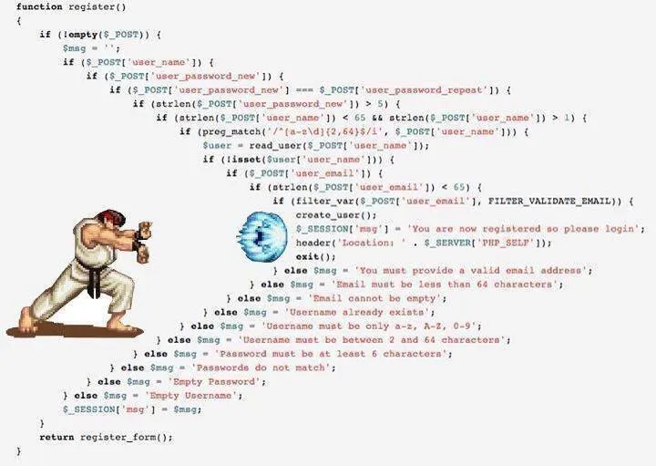

---
title:
authors: elvismao
tags: []
categories: []
date: 2026-04-02
description: 今天我們要來講 JavaScript 的非同步，從 callback、Promise 到 async/await。
draft: true
---

# 第二章：JavaScript 非同步

## 那什麼是非同步？

大家最熟悉的世界是同步的。很像二餐阿嬤飯桶排隊結帳。前一個人沒付完錢，下一個人就不能往前。

```js
console.log("A");
console.log("B");
console.log("C");
```

輸出一定是：

```js
A;
B;
C;
```

這叫做 **同步（synchronous）**。前一件事沒做完，下一件事不能開始。

但是從每天中午十二點的時候你就可以看出人很多時大家都會卡在那裡排隊，整個爆滿。在網頁上就是：你想要跟伺服器要資料，你先等使用者點按鈕，然後慢慢等檔案下載。

如果 JavaScript 什麼都傻傻的等，過程中整個畫面就會卡住。也就是你在 Windows 常常看到的「程式無回應」的狀態。

所以非同步的想法是：

- 先把慢工作交出去
- JavaScript 繼續做別的事
- 等結果回來再通知你

就像二樓的丼飯一樣，你是先拿號碼牌，去旁邊等，輪到你再叫你。

這個「先去做別的事，輪到再回來」就是非同步。

## 第一個非同步例子：setTimeout

`setTimeout` 是一個用來安排幾秒後要做的事情的函式。

```js
console.log("開始");

setTimeout(() => {
	console.log("三秒後");
}, 3000);

console.log("結束");
```

結果不是：

```js
開始;
三秒後;
結束;
```

而是：

```js
開始;
結束;
三秒後;
```

`setTimeout` 讓 JavaScript 不會卡在那裡等 3 秒，而是幫我安排一件事，3 秒後把這個函式放回來執行。

我們來看看他的語法。還記得箭頭函式嗎？他會把你丟的資料放進行執行：

```js
const fn = x => {
	console.log(x);
};

fn("Hello"); // 輸出：Hello
```

而 `setTimeout` 的第一個參數就是一個函式，第二個參數是幾毫秒後要執行。

## Promise

我們先來看看傳統非同步的寫法。當你呼叫 promise（相當於點餐）的時候，你會得到一張收據（Promise 物件）。這張收據上寫著「未來會給你結果」。

它有三種狀態：

- `pending`：還在等
- `fulfilled`：成功拿到結果
- `rejected`：失敗了

實際的寫法長這樣：

```js
const p = new Promise((resolve, reject) => {
	setTimeout(() => {
		resolve("拿到資料了");
	}, 1000);
});

p.then(result => {
	console.log(result);
});
```

### `.then()`

`.then()` 的意思是「好，等你成功之後，接著做這件事。」我們來寫一個更完整的範例。這裡我們用 fetch API 來模擬一個網路請求（下載一個網址的內容，`fetch` 本身就是是非同步的）。可以看到他依序先提出請求，等回應回來後再把它轉成 JSON，最後才把資料印出來。如果過程中有任何錯誤，就會被 `.catch()` 捕捉到。

```js
fetch("/api/user")
	.then(response => response.json())
	.then(data => {
		console.log(data);
	})
	.catch(error => {
		console.error(error);
	});
```

- `.then()` 處理成功結果
- `.catch()` 處理錯誤
- `.finally()` 不管成功失敗都會跑

## callback hell：一層一層往右飄的惡夢

你可以想像如果你的網站需要一連串的非同步工作，像是：

1. 先登入
2. 拿到使用者資料
3. 根據使用者資料拿到他的貼文

那麼每個東西都要等前一個完成才能開始，這樣就會變成一層一層大括號往右飄的程式碼：

```js
login()
	.then(user => {
		getUserData(user.id)
			.then(data => {
				getPosts(data.postsId)
					.then(posts => {
						console.log(posts);
					})
					.catch(error => {
						console.error("拿貼文失敗", error);
					});
			})
			.catch(error => {
				console.error("拿使用者資料失敗", error);
			});
	})
	.catch(error => {
		console.error("登入失敗", error);
	});
```

最後你就會做出一個波動拳，讓你的程式巢狀大括號很多層、很難讀、很難處理錯誤、很難維護。



## 2-9 async / await：把 Promise 寫得像同步

我們回顧一下剛剛 Promise 的寫法：

```js
fetch("/api/user")
	.then(response => response.json())
	.then(data => {
		console.log(data);
	})
	.catch(error => {
		console.error(error);
	});
```

其實有一個完全一樣的意思的 async/await 寫法。

```js
async function loadUser() {
	try {
		const response = await fetch("/api/user");
		const data = await response.json();
		console.log(data);
	} catch (error) {
		console.error(error);
	}
}
```

是不是有高中英文就能看懂他在幹嘛？東西變得很直覺，所有要做的事情都丟在大括號裡面。每個都會等前一步完成才會繼續往下走。

`await` 背後其實通常都是 Promise。很多瀏覽器 API / 網路請求 API 都會回傳 Promise。這種讓程式碼看起來比較好看好寫的東西就叫做「語法糖」。

這裡解釋裡面的幾個語法：

### async function

你有發現嗎？我們在函式前面加了一個 `async`。這是告訴 JavaScript 這個函式裡面會有 `await`，所以它要幫你把裡面的東西轉成 Promise 的寫法。記得裡面有使用到非同步功能的函式都要加上 `async`。

### try / catch

`try` 是「試試看這裡面會不會有錯誤」，如果有錯誤就會跳到 `catch` 裡面處理。這樣就不用每一個步驟都寫 `.catch()` 了。語法如下：

```js
try {
	// 可能會有錯誤的程式碼
} catch (error) {
	// 如果有錯誤就會來這裡
}
```

### await

`await` 的意思是「等一下，等這個 Promise 結果回來了再繼續往下走」。他會把後面的 Promise 結果拿出來放在前面。

## 2-11 什麼時候該用 `Promise.all()`？

如果兩件事 **彼此沒有相依**，就不要傻傻的一件做完再做下一件。比如說你要同時拿使用者資料和貼文資料，這兩件事是互不依賴的。

用 await 的話就會變成這樣得等使用者資料拿回來了才開始拿貼文資料：

```js
const user = await getUser();
const posts = await getPosts();
```

如果兩者互不依賴，你就可以一起派出去，等兩個都回來了再繼續往下走：

```js
const [user, posts] = await Promise.all([getUser(), getPosts()]);
```

## 練習小測驗

你覺得輸出的順序會是什麼？

```js
console.log(1);

setTimeout(() => {
	console.log(2);
}, 0);

console.log(3);
```

答案是：

```
1
3
2
```

因為 `setTimeout(..., 0)` 也不是立刻插隊執行。它只是「**最早也要等目前同步程式跑完後**」再回來。

## 什麼都可以非同步嗎？

這裡要注意，JavaScript 是一個單線程的語言，意思是他同一時間只能做一件事。就像你的大腦一樣，一次只能專注在一件事上。但是比如說我們可以一邊走路一邊聊天，有一些外包給別的器官的工作是可以同時進行的。在 JavaScript 裡面，像是網路請求、檔案讀取、計時器這些等回覆的工作就會被交給外部環境去處理，等他們完成了再回來通知 JavaScript。

{{notice}}

### worker

但是其實你說那這樣 JavaScript 不就一定跑得很慢？

對沒錯。但夠用了啦！不過如果一個人效率不夠高的話怎麼辦呢？就多聘請幾個人來幫忙啊！這就是多線程的概念了。JavaScript 的多線程是透過 Web Worker 來實現的，有興趣的話歡迎可以自行研究。

{{noticed}}

---

JavaScript 的非同步不是一個很直覺可以理解的東西，但他是非常重要的概念。理解了非同步，你就能寫出更流暢、更不會卡死、跑得更快的網頁應用程式。我們快速回顧一下：

1. JavaScript 會先跑同步程式
2. 慢工作會交給外部環境，完成後再排回來
3. callback 是「做完再叫我」
4. Promise 是「未來會給你結果的物件」
5. async/await 只是讓 Promise 更好寫，建議多使用
